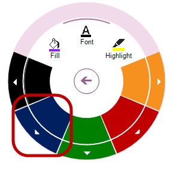
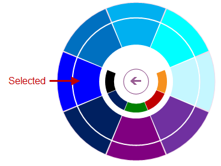
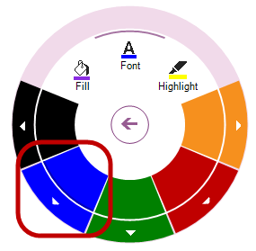
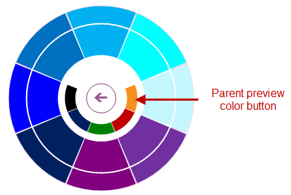

////
|metadata|
{
    "name": "winradialmenu-winradialmenu-events",
    "controlName": [],
    "tags": [],
    "guid": "78470b1a-d23d-426d-b599-c44eedfbfb07",
    "buildFlags": [],
    "createdOn": "2013-09-15T21:55:19.9259063Z"
}
|metadata|
////

= WinRadialMenu Events

== Topic Overview

=== Purpose

This topic provides an overview of the  _WinRadialMenu_   _™_   component’s common events.

[[_Ref365461034]]
== Events Summary

[options="header", cols="a,a,a"]
|====
|Event name|Description|Cancellable?

| link:{ApiPlatform}win.ultrawinradialmenu.v{ProductVersion}~infragistics.win.ultrawinradialmenu.ultraradialmenu~toolclick_ev.html[ToolClick]
|This event is triggered when a tool is clicked.
|No

| link:{ApiPlatform}win.ultrawinradialmenu.v{ProductVersion}~infragistics.win.ultrawinradialmenu.ultraradialmenu~toolcolorchanged_ev.html[ToolColorChanged]
|This event is triggered when the following actions take place: 

. Color selection is changed via the User Interface (UI), for example the Font tool exposes color tools for styling a document. Selecting a color triggers this event. 
+
. Color property is changed via code-behind as demonstrated in the following code: 
+
*In C#:*
+
[source,csharp]
var cTool = (RadialMenuColorTool)ultraRadialMenu1.CenterTool.Tools["Color"].Tools["Fill"]; 
if (cTool != null)  cTool.Color = Color.BlueViolet;
+
. ColorWell tool selection is changed. 

.Note: 
[NOTE] 
Each `ColorWell` tool contains child collection of `ColorWell` tools, and color changes propagate up the chain. For example when a child `ColorWell` tool’s selection is changed, it changes the color of the parent `ColorWell` tool. 

This can be better illustrated with the following screenshots in steps. 

On a parent `ColorWell` tool the `Blue` color tool is drilling down to the child collection of `ColorWell` tools, which consists of different shades of Blue. 

 

On a child collection of `ColorWell` tools different shade of `Blue` is selected, and this selection (below) triggers the event for the selected tool and its parent up in the chain. 

 

After a selection is made in the (above) child `ColorWell`, going back to parent menu displays the changed color on the parent menu. 

|No

| link:{ApiPlatform}win.ultrawinradialmenu.v{ProductVersion}~infragistics.win.ultrawinradialmenu.ultraradialmenu~toolcheckedchanging_ev.html[ToolCheckedChanging]
|Trigger this event by toggling a checkable tool between “checked” and “unchecked” state via the User Interface ( UI ). Disabling (`false`), the tool’s link:{ApiPlatform}win.ultrawinradialmenu.v{ProductVersion}~infragistics.win.ultrawinradialmenu.radialmenutool~checkable.html[Checkable] property precludes this event from triggering. 

This event will also be raised when changing the tool’s checked property via code-behind such as: 

*In C#:*
[source,csharp]
RadialMenuTool tool = ultraRadialMenu1.CenterTool.Tools["Copy"];
if (tool != null)  tool.Checked = true; 

|Yes

| link:{ApiPlatform}win.ultrawinradialmenu.v{ProductVersion}~infragistics.win.ultrawinradialmenu.ultraradialmenu~toolcheckedchanged_ev.html[ToolCheckedChanged]
|Executes the link:{ApiPlatform}win.ultrawinradialmenu.v{ProductVersion}~infragistics.win.ultrawinradialmenu.ultraradialmenu~toolcheckedchanging_ev.html[ToolCheckedChanging] event’s through the UI in order to commit changes triggers this event for a checkable tool. 

If the link:{ApiPlatform}win.ultrawinradialmenu.v{ProductVersion}~infragistics.win.ultrawinradialmenu.ultraradialmenu~toolcheckedchanging_ev.html[ToolCheckedChanging] event is cancelled, this event will not be triggered.
|No

| link:{ApiPlatform}win.ultrawinradialmenu.v{ProductVersion}~infragistics.win.ultrawinradialmenu.ultraradialmenu~listtoolselectedvaluechanged_ev.html[ListToolSelectedValueChanged]
|Selecting an item from a `ListTool` triggers this event. 

The item selection can be made from the drop down list, or with a keyboard arrow key by traversing up and down a list of items triggering this event with each item selection. After selecting an item pressing the Enter key commits the selection. 

This event will also be raised when an item is changed in code. For example, the following code sets a selected item, and using the second parameter (`true`) triggers the event’s execution. 

*In C#:*
[source,csharp]
var listTool = (RadialMenuListTool)ultraRadialMenu1.CenterTool.Tools["List"];
if (listTool != null)  listTool.SetSelectedValue("Item2", true);

|No

| link:{ApiPlatform}win.ultrawinradialmenu.v{ProductVersion}~infragistics.win.ultrawinradialmenu.ultraradialmenu~listtoolselectedvaluecommitted_ev.html[ListToolSelectedValueCommitted]
|This event is triggered after the link:{ApiPlatform}win.ultrawinradialmenu.v{ProductVersion}~infragistics.win.ultrawinradialmenu.ultraradialmenu~listtoolselectedvaluechanged_ev.html[ListToolSelectedValueChanged] event’s execution. 

The reason for this sequence of events is that you may select an item using the arrow key on the keyboard by moving up and down until you decide which item to select, rather than clicking on a single item on a drop-down. This triggers the link:{ApiPlatform}win.ultrawinradialmenu.v{ProductVersion}~infragistics.win.ultrawinradialmenu.ultraradialmenu~listtoolselectedvaluechanged_ev.html[ListToolSelectedValueChanged] event’s execution upon each item change. After you select an item pressing the Enter key triggers this even to be raised.
|No

| link:{ApiPlatform}win.ultrawinradialmenu.v{ProductVersion}~infragistics.win.ultrawinradialmenu.ultraradialmenu~drilldownbuttonclick_ev.html[DrillDownButtonClick]
|Clicking the tool’s drill-down button triggers this event.
|No

| link:{ApiPlatform}win.ultrawinradialmenu.v{ProductVersion}~infragistics.win.ultrawinradialmenu.ultraradialmenu~centerbuttonclick_ev.html[CenterButtonClick]
|Clicking the `RadialMenu’s` center button triggers this event. 

The following operations trigger this event’s execution. 

1. The center button on the main menu performs two functions: Expand and collapse. 

 

2. The back button (also a center button) performs a function to go back to the parent menu. 

 

3. On a `ColorWell` tool the “parent preview color button” (located in the center) also functions as a back button that triggers this event. 

|No

| link:{ApiPlatform}win.ultrawinradialmenu.v{ProductVersion}~infragistics.win.ultrawinradialmenu.ultraradialmenu~beforeperformaction_ev.html[BeforePerformAction]
|Performing a keyboard action triggers this event. The event responds to the radial menu’s link:{ApiPlatform}win.ultrawinradialmenu.v{ProductVersion}~infragistics.win.ultrawinradialmenu.ultraradialmenu~keyactionmappings.html[KeyActionMappings].
|Yes

| link:{ApiPlatform}win.ultrawinradialmenu.v{ProductVersion}~infragistics.win.ultrawinradialmenu.ultraradialmenu~afterperformaction_ev.html[AfterPerformAction]
|Completing a keyboard action triggers this event after the link:{ApiPlatform}win.ultrawinradialmenu.v{ProductVersion}~infragistics.win.ultrawinradialmenu.ultraradialmenu~beforeperformaction_ev.html[BeforePerformAction] event. If the link:{ApiPlatform}win.ultrawinradialmenu.v{ProductVersion}~infragistics.win.ultrawinradialmenu.ultraradialmenu~beforeperformaction_ev.html[BeforePerformAction] event is cancelled, this event will not be raised.
|No

|====

[[_Ref364619504]]
== Related Content

=== Topics

The following topics provide additional information related to this topic.

[options="header", cols="a,a"]
|====
|Topic|Purpose

| link:winradialmenu.html[WinRadialMenu]
|This section contains the help topics covering the _WinRadialMenu_ component.

|====