////

|metadata|
{
    "name": "winradialmenu-winradialmenu-tools",
    "controlName": [],
    "tags": [],
    "guid": "c3ce7892-4649-44bd-8a39-749606de12ed",  
    "buildFlags": [],
    "createdOn": "2013-09-15T21:51:05.3924555Z"
}
|metadata|
////

= WinRadialMenu Tools

== Topic Overview

=== Purpose

This topic provides a conceptual overview of the  _WinRadialMenu™_   component tool types.

=== Required background

The following topic is a prerequisite to understanding this topic:

[options="header", cols="a,a"]
|====
|Topic|Purpose

| link:winradialmenu.html[WinRadialMenu]
|This topic introduces the 2013 Infragistics _WinRadialMenu_ component for Windows Forms with full touch support, similar to Microsoft’s OneNote MX 2013 radial menu.

|====

=== In this topic

This topic contains the following sections:

* <<_Ref364619403,Introduction>>
* <<_Ref364619412, _WinRadialMenu_   Tool Types>>
** <<_Ref364619421,RadialMenuTool>>
** <<_Ref364619431,RadialMenuColorTool>>
** <<_Ref364619444,RadialMenuColorWellTool>>
** <<_Ref364619454,RadialMenuNumericTool>>
** <<_Ref364619460,RadialMenuNumericGaugeTool>>
** <<_Ref364619485,RadialMenuFontListTool>>
** <<_Ref364619494,RadialMenuListTool>>

* <<_Ref364619504,Related Content>>

[[_Ref364619403]]
== Introduction

=== WinRadialMenu Tools

The  _WinRadialMenu_   component presents tools and functionalities similar to the Microsoft’s  _OneNote MX 2013_   radial menu. It is not only compatible with Windows 8, but also with Windows 7 and Windows XP operating systems. You can display multiple  _WinRadialMenu_   components in your application and create a different instance of the component with different set of tools.

The following screenshot illustrates the radial menu displaying some of the tools with and without child tool.

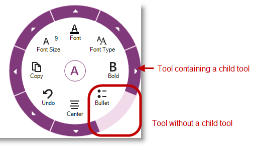

[[_Ref364619412]]
== _WinRadialMenu_   Tool Types

[[_Ref364619421]]

=== RadialMenu Tool

The link:{ApiPlatform}win.ultrawinradialmenu{ApiVersion}~infragistics.win.ultrawinradialmenu.radialmenutool_members.html[RadialMenuTool] is the base class for all radial menu tools types. Some tool types derive from link:{ApiPlatform}win.ultrawinradialmenu{ApiVersion}~infragistics.win.ultrawinradialmenu.radialmenutool_members.html[RadialMenuTool] class; others use it directly. For example, Font, Copy/Paste and Undo/Redo tools are of link:{ApiPlatform}win.ultrawinradialmenu{ApiVersion}~infragistics.win.ultrawinradialmenu.radialmenutool_members.html[RadialMenuTool] type, so are their child tools.

The following screenshot illustrates the Copy tool on the main menu, which is a descendant of the center tool.

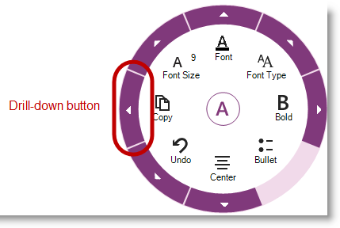

The following screenshot illustrates the Copy tool’s child tools (Copy and Paste) by clicking the Copy tool’s drill down button.

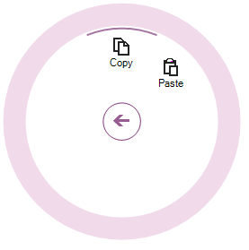

[[_Ref364619431]]

=== RadialMenu ColorTool

The link:{ApiPlatform}win.ultrawinradialmenu{ApiVersion}~infragistics.win.ultrawinradialmenu.radialmenucolortool_members.html[RadialMenuColorTool] derives from the link:{ApiPlatform}win.ultrawinradialmenu{ApiVersion}~infragistics.win.ultrawinradialmenu.radialmenutool_members.html[RadialMenuTool]. Color tools for text appearance consists of Font, Fill and Highlight. Select the appearance options by drilling into the color tool’s submenu. For example, clicking the drilldown button of the link:{ApiPlatform}win.ultrawinradialmenu{ApiVersion}~infragistics.win.ultrawinradialmenu.radialmenucolortool_members.html[RadialMenuColorTool].

The following screenshot illustrates the  _RadialMenuTool_   containing color tools.

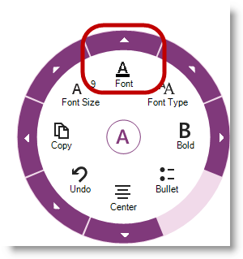

The following screenshot illustrates the `RadialMenuColorTools`.

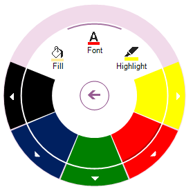

In addition to the three color tools (Font, Fill and Highlight), the link:{ApiPlatform}win.ultrawinradialmenu{ApiVersion}~infragistics.win.ultrawinradialmenu.radialmenucolortool_members.html[RadialMenuColorTool] contains color well tools for to select from available colors. Each color well consists of a collection of colors, displaying various tones of the selected color. For example, Red color tool may consist of light and dark tones of red. Those colors are of type link:{ApiPlatform}win.ultrawinradialmenu{ApiVersion}~infragistics.win.ultrawinradialmenu.radialmenucolorwelltool_members.html[RadialMenuColorWellTool].

[[_Ref364619444]]

=== RadialMenu ColorWellTool

The link:{ApiPlatform}win.ultrawinradialmenu{ApiVersion}~infragistics.win.ultrawinradialmenu.radialmenucolorwelltool_members.html[RadialMenuColorWellTool] represents collection of colors for each link:{ApiPlatform}win.ultrawinradialmenu{ApiVersion}~infragistics.win.ultrawinradialmenu.radialmenucolortool_members.html[RadialMenuColorTool] with different tones of the selected color. This hierarchy of tools can be built to be as deep as desired.

The following screenshot illustrates the color well tool menu, which displays color tones of a selected color tool.

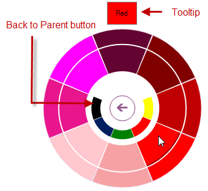

This menu also shows the parent preview area, positioned between the center button and color well tools. Those color wedges act like back buttons. Clicking on them takes you back to the parent menu, just like the back button in the center.

.Note:
[NOTE]
====
The parent preview color buttons do not make any selections.
====

Moving the mouse over a color well causes the tooltip to appear on top of the menu indicating the current color viewed (not selected) under the mouse point – not for touch monitors, because touch monitors are intended for finger touch interaction.

[[_Ref364619454]]

=== RadialMenu NumericTool

The link:{ApiPlatform}win.ultrawinradialmenu{ApiVersion}~infragistics.win.ultrawinradialmenu.radialmenunumerictool_members.html[RadialMenuNumericTool] represents a numeric values collection. It can be a list of font sizes or any other numeric collection. Similar to Microsoft’s OneNote MX 2013, use the link:{ApiPlatform}win.ultrawinradialmenu{ApiVersion}~infragistics.win.ultrawinradialmenu.radialmenunumericgaugetool_members.html[RadialMenuNumericGaugeTool] for font sizes, instead of numeric list, explained in the next section.

The following screenshot illustrates the link:{ApiPlatform}win.ultrawinradialmenu{ApiVersion}~infragistics.win.ultrawinradialmenu.radialmenunumerictool_members.html[RadialMenuNumericTool].

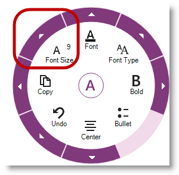

[[_Ref364619460]]

=== RadialMenu NumericGauge Tool

The link:{ApiPlatform}win.ultrawinradialmenu{ApiVersion}~infragistics.win.ultrawinradialmenu.radialmenunumericgaugetool_members.html[RadialMenuNumericGaugeTool] displays radial gauge, like a clock, with a needle and numbers displayed radially around the center button. Select the numbers by tapping (touch monitor) or left-mouse button down on the needle and moving clockwise or counterclockwise. Then clicking the back button to go back to the parent menu.

The following screenshot illustrates the link:{ApiPlatform}win.ultrawinradialmenu{ApiVersion}~infragistics.win.ultrawinradialmenu.radialmenunumericgaugetool_members.html[RadialMenuNumericGaugeTool] with a tooltip indicating the selected font size when moving the needle over the numbers along the inner ring.

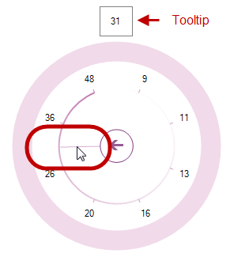

[[_Ref364619485]]

=== RadialMenu FontListTool

The link:{ApiPlatform}win.ultrawinradialmenu{ApiVersion}~infragistics.win.ultrawinradialmenu.radialmenufontlisttool_members.html[RadialMenuFontListTool] is a pre-defined list of the system fonts. You can select a font type by clicking the drilldown button that drops down containing the list of fonts. After selecting a font the list closes. This tool does not have a submenu; it can only contain a collection of items.

The following screenshot illustrates the link:{ApiPlatform}win.ultrawinradialmenu{ApiVersion}~infragistics.win.ultrawinradialmenu.radialmenufontlisttool_members.html[RadialMenuFontListTool] with dropdown list of fonts.

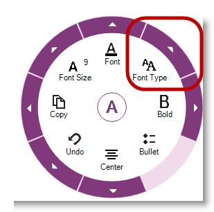

The following screenshot illustrates the RadialMenuFontListTool’s dropdown list of fonts.

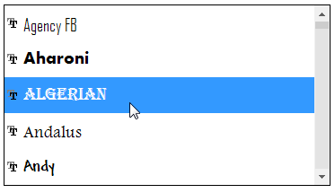

[[_Ref364619494]]

=== RadialMenu ListTool

The link:{ApiPlatform}win.ultrawinradialmenu{ApiVersion}~infragistics.win.ultrawinradialmenu.radialmenulisttool_members.html[RadialMenuListTool] is similar to the link:{ApiPlatform}win.ultrawinradialmenu{ApiVersion}~infragistics.win.ultrawinradialmenu.radialmenufontlisttool_members.html[RadialMenuFontListTool] except the pre-defined list of items. In this tool you can define your own collection of items. Selecting an item is the same as in link:{ApiPlatform}win.ultrawinradialmenu{ApiVersion}~infragistics.win.ultrawinradialmenu.radialmenufontlisttool_members.html[RadialMenuFontListTool]. Also, this tool does not have a submenu; it can only contain a collection of items.

The following screenshot illustrates the link:{ApiPlatform}win.ultrawinradialmenu{ApiVersion}~infragistics.win.ultrawinradialmenu.radialmenulisttool_members.html[RadialMenuListTool].

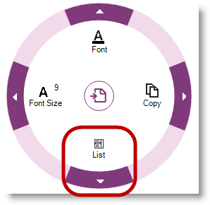

The following screenshot illustrates the RadialMenuListTool’s dropdown list of items.

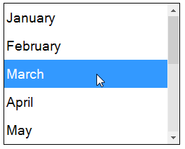

[[_Ref364619504]]
== Related Content

=== Topics

The following topics provide additional information related to this topic.

[options="header", cols="a,a"]
|====
|Topic|Purpose

| link:winradialmenu-winradialmenu-tools.html[WinRadialMenu Tools]
|The topics in this group explain how to add the radial menu tools using either the component’s designer or code-behind.

| link:winradialmenu-using-winradialmenu.html[Using WinRadialMenu]
|This section contains the list of specific help topics on how to use _WinRadialMenu_ component.

|====