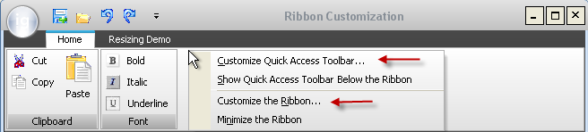

////

|metadata|
{
    "name": "winribboncustomizationprovider-about-winribboncustomizationprovider",
    "controlName": ["WinRibbonCustomizationProvider"],
    "tags": ["Editing","Extending"],
    "guid": "6a3282e7-bd77-4934-8a76-ef6532086a5c",  
    "buildFlags": [],
    "createdOn": "2011-04-26T21:12:55.9372583Z"
}
|metadata|
////

= About WinRibbonCustomizationProvider

The WinRibbonCustomizationProvider™ component enables end users to customize the link:wintoolbarsmanager-using-the-ribbon.html[ribbon layout] of the link:wintoolbarsmanager.html[WinToolbarsManager]™ component. The WinRibbonCustomizationProvider™ belongs to the Infragistics.Win.SupportDialogs assembly and implements the link:{ApiPlatform}win.ultrawintoolbars{ApiVersion}~infragistics.win.ultrawintoolbars.iribboncustomizationprovider.html[IRibbonCustomizationProvider] interface. With this interface, the user can manage and customize the appearance of the ribbon and its components.

== Implementing the WinRibbonCustomizationProvider

The UltraRibbonCustomizationProvider component needs to be assigned to the ribbon of the UltraToolbarsManager (see the code below); this adds two customization options for the ribbon to the user’s right-click context menu: Customize Quick Access Toolbar… and Customize the Ribbon… (Figure 1 below). The two options provide a user entry point for customizing the Quick Access Toolbar and the ribbon, respectively: selecting an option opens the Ribbon Customization dialog with the corresponding tab pre-selected (Refer to the Ribbon Customization Dialog topic for details).

.Note
[NOTE]
====
“UltraRibbonCustomizationProvider” is the name of the WinRibbonCustomizationProvider control as it appears in Visual Studio toolbox. The same holds true for the UltraToolbarsManager.
====

*In Visual Basic:*

----
Imports Infragistics.Win.UltraWinToolbars
Me.ultraToolbarsManager1.Ribbon.RibbonCustomizationProvider = this.ultraRibbonCustomizationProvider1
----

*In C#:*

----
using Infragistics.Win.UltraWinToolbars;
this.ultraToolbarsManager1.Ribbon.RibbonCustomizationProvider = this.ultraRibbonCustomizationProvider1;
----

Figure 1: The right-click context menu after implementing the WinRibbonCustomizationProvider - customization options are now available

== User Interaction and Usability

From the Ribbon Customization dialog, users can:

* manage ribbon tabs, groups, and tools:

** add/remove
** show/hide
** rename
** reposition

* import/export the layout of the ribbon
* reset the ribbon back to its default layout

== Related Topics

* link:winribboncustomizationprovider-using-the-ribbon-customization-dialog.html[Using the Ribbon Customization Dialog]
* link:winribboncustomizationprovider-adding-custom-tab-to-ribbon-customization-dialog.html[Adding Custom Tab to Ribbon Customization Dialog]