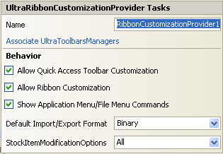

////

|metadata|
{
    "name": "winribboncustomizationprovider-smart-tag",
    "controlName": ["WinRibbonCustomizationProvider"],
    "tags": ["Design Environment","Editing"],
    "guid": "5f16d9c7-1127-4340-8963-2bb84ae311d3",  
    "buildFlags": [],
    "createdOn": "2011-05-16T15:49:09.040865Z"
}
|metadata|
////

= WinRibbonCustomizationProvider Smart Tag

In Visual Studio 2005/2008 (.NET Framework 2.0/3.5), each Infragistics Windows Forms control/component is equipped with a Smart Tag. By simply selecting the control/component, a Smart Tag anchor appears. When you click this anchor, a pop-up panel appears, providing you with quick and easy access to the most common properties and settings of the control/component.

The WinRibbonCustomizationProvider™ Smart Tag contains the name of the component, as well as the following items:

* Associate UltraToolbarsManagers – provides a dialog to select the container(s) who’s UltraToolbarsManager will be associated with this UltraRibbonCustomizationProvider.
* Behavior -- provides easy access to properties that govern how the component behaves on the form.

[options="header", cols="a,a,a"]
|====
|Behavior|Description|Corresponding Property

|Enables Quick Access Toolbar Customization
|Selecting this check box enables Quick Access Toolbar customization.
| link:infragistics4.win.supportdialogs.v{ProductVersion}~infragistics.win.supportdialogs.ribboncustomizationprovider.ultraribboncustomizationprovider~allowqatcustomization.html[AllowQATCustomization]

|Enables Ribbon Customization
|Selecting this check box enables Ribbon customization.
| link:infragistics4.win.supportdialogs.v{ProductVersion}~infragistics.win.supportdialogs.ribboncustomizationprovider.ultraribboncustomizationprovider~allowribboncustomization.html[AllowRibbonCustomization]

|Displays the Commands in the Application Menu / File Menu
|Selecting this check box displays the Application Menu / File Menu commands option in the Choose Commands From combo box list within the Customization dialog.
| link:infragistics4.win.supportdialogs.v{ProductVersion}~infragistics.win.supportdialogs.ribboncustomizationprovider.ultraribboncustomizationprovider~showapplicationmenucommands.html[ShowApplicationMenuCommands]

|Displays import/export format
|Indicates the format (XML or Binary) to be used when exporting the Ribbon.
| link:infragistics4.win.supportdialogs.v{ProductVersion}~infragistics.win.supportdialogs.ribboncustomizationprovider.ultraribboncustomizationprovider~defaultserializationformat.html[DefaultSerializationFormat]

|Displays StockItemModificationOptions
|Indicates how default tabs, Groups and Tools can be modified.
| link:infragistics4.win.supportdialogs.v{ProductVersion}~infragistics.win.supportdialogs.ribboncustomizationprovider.ultraribboncustomizationprovider~stockitemmodificationoptions.html[StockItemModificationOptions]

|====