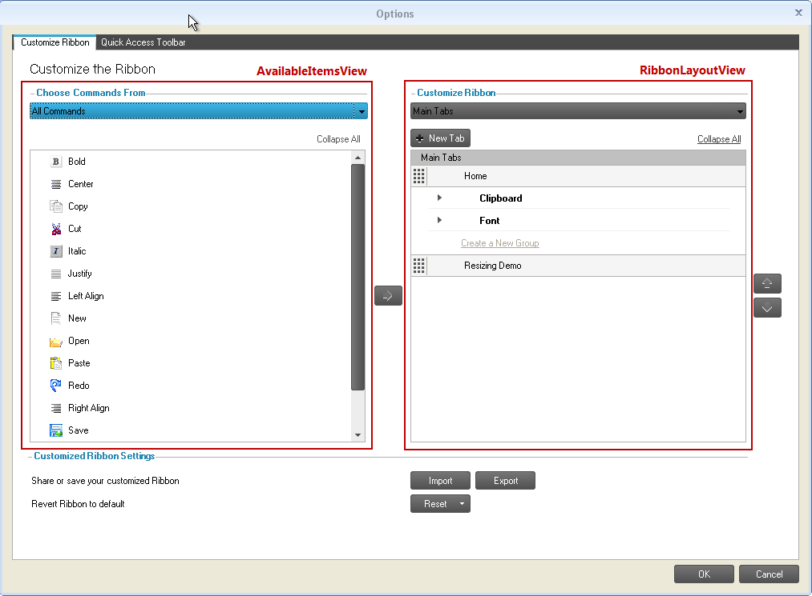
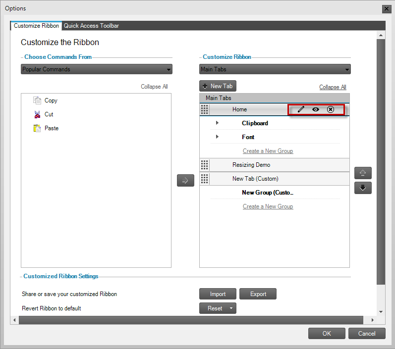
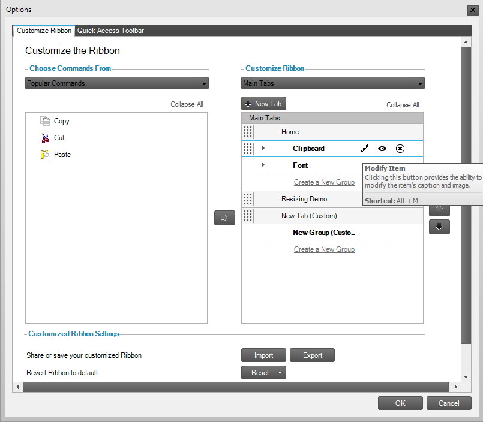
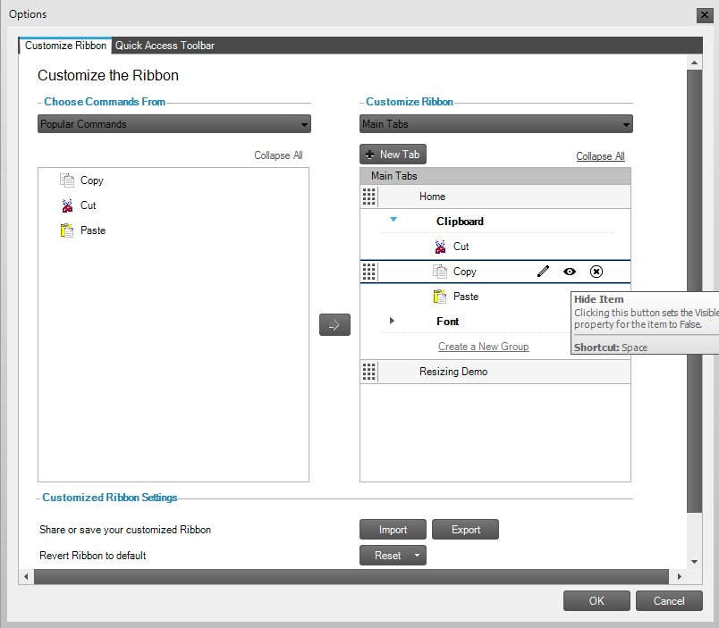

////
|metadata|
{
    "name": "winribboncustomizationprovider-using-the-ribbon-customization-dialog",
    "controlName": ["WinRibbonCustomizationProvider"],
    "tags": ["Editing","Extending","Getting Started","How Do I"],
    "guid": "366a4424-a84d-4387-88c3-fc3c48a5b4f8",
    "buildFlags": [],
    "createdOn": "2011-04-26T21:32:27.1423671Z"
}
|metadata|
////

= Using the Ribbon Customization Dialog

This topic explains the Ribbon Customization dialog, its implementation, and the end-user interactions with it.

toc::[]

== Introduction

The Ribbon Customization Dialog enables end users to customize ribbon tabs, groups and tools. It is implemented through the WinRibbonCustomizationProvider control. Once implemented, users can access through options in their right-click context menu (For details, refer to the About WinRibbonCustomizationProvider topic).

This dialog displays two tabs by default: Customize Ribbon and Quick Access Toolbar (QAT). Their corresponding customization controls are the RibbonCustomizationControl (Customize Ribbon tab) and the QATCustomizationControl (Customize Quick Access Toolbar tab). On its left, the Customize Ribbon tab lists all ultraToolbarsManager items (AvailableItemsView); on the right, it shows the ribbon’s content and structure (RibbonLayoutView) – tabs, groups, and tools:

Figure 1: The Ribbon Customization dialog, Customize Ribbon tab

.Note
[NOTE]
====
You can use the RibbonCustomizationControl and the QATCustomizationControl also in custom-created dialogs.
====

[[EnableRibbonCust]]
== Enabling Ribbon Customization

To enable customizing the existing/default/stock tabs, groups and tools, use the link:{ApiPlatform}win.supportdialogs{ApiVersion}~infragistics.win.supportdialogs.ribboncustomizationprovider.ultraribboncustomizationprovider~stockitemmodificationoptions.html[StockItemModificationOptions] property on of the UltraRibbonCustomizationProvider component. This property is of flag enumeration type: you need to specify the type of stock item modification that you want to allow for your users. By default, this property is set to None.

*In Visual Basic:*

----
Me.ultraRibbonCustomizationProvider1.StockItemModificationOptions = Infragistics.Win.SupportDialogs.RibbonCustomizationProvider.StockItemModificationOption.AllowTabModify
----

*In C#:*

----
this.ultraRibbonCustomizationProvider1.StockItemModificationOptions = Infragistics.Win.SupportDialogs.RibbonCustomizationProvider.StockItemModificationOption.AllowTabModify;
----

[[DisableRibbonCust]]
== Disabling Ribbon Customization

To disable customization of the Ribbon or the Quick Access Toolbar, use the link:{ApiPlatform}win.supportdialogs{ApiVersion}~infragistics.win.supportdialogs.ribboncustomizationprovider.ultraribboncustomizationprovider~allowribboncustomization.html[AllowRibbonCustomization] or link:{ApiPlatform}win.supportdialogs{ApiVersion}~infragistics.win.supportdialogs.ribboncustomizationprovider.ultraribboncustomizationprovider~allowqatcustomization.html[AllowQATCustomization] properties of the UltraRibbonCustomizationProvider component. Setting these properties to false will prevent the corresponding context menu option (Customize the Ribbon or Customize Quick Access Toolbar) from being available to the user.

*In Visual Basic:*

----
' Disable customization of Ribbon
Me.ultraRibbonCustomizationProvider1.AllowRibbonCustomization = False
' Disable customization of Quick Access Toolbar (QAT)
Me.ultraRibbonCustomizationProvider1.AllowQATCustomization = false
----

*In C#:*

----
// Disable customization of Ribbon
this.ultraRibbonCustomizationProvider1.AllowRibbonCustomization = false;
// Disable customization of Quick Access Toolbar (QAT)
this.ultraRibbonCustomizationProvider1.AllowQATCustomization = false;
----

[[Events]]
== Events

The ability to modify the dialog is provided by the BeforeCustomizationDialogDisplayed and AfterCustomizationDialogClosed events of the UltraRibbonCustomizationProvider component.

The UltraToolbarsManager component also exposes two events: BeforeRibbonCustomizationDialogDisplayed and AfterRibbonCustomizationDialogClosed.

[[ShowCustDialog]]
== Showing the Customization Dialog

The UltraToolbarsManager’s Ribbon exposes the ShowRibbonCustomizationDialog method to display the dialog at run time. The RibbonCustomizationType argument of this method specifies which tab: Customize Ribbon or Quick Access Toolbar (QAT) should be active on the dialog.

*In Visual Basic:*

----
Imports Infragistics.Win.UltraWinToolbars
Me. ultraToolbarsManager1.Ribbon. ShowRibbonCustomizationDialog (RibbonCustomizationType. QuickAccessToolbar)
----

*In C#:*

----
using Infragistics.Win.UltraWinToolbars;
this.ultraToolbarsManager1.Ribbon.ShowRibbonCustomizationDialog(RibbonCustomizationType.QuickAccessToolbar);
----

[[PopularCommands]]
== Adding the Popular Commands Functionality

The customization dialog displays all the tools added to ultraToolbarsManager when the Choose Commands From combo box is set to All Commands. You can, however, group the tools that are more commonly used as a Popular Commands tool using the PopularCommand property. This property allows displaying the tools when the Choose Commands From combo box is set to Popular Commands.

*In Visual Basic:*

----
Imports Infragistics.Win.UltraWinToolbars
Dim pasteTool As New StateButtonTool("Paste")
Me.ultraToolbarsManager1.Tools.Add(pasteTool)
pasteTool.SharedProps.Caption = "Paste"
pasteTool.SharedProps.PopularCommand = True
----

*In C#:*

----
using Infragistics.Win.UltraWinToolbars;
StateButtonTool pasteTool = new StateButtonTool("Paste");
this.ultraToolbarsManager1.Tools.Add(pasteTool);
pasteTool.SharedProps.Caption = "Paste";
pasteTool.SharedProps.PopularCommand = true;
----

[[CustDefault]]
== Customizing the Default Tabs, Groups and Tools

To customize the existing/default/stock tabs, groups and tools, use the StockItemModificationOptions property on the UltraRibbonCustomizationProvider. The type of this property is a flags enumeration allowing you to specify which type of modifications can be made to stock items. The available enumeration values are:

* All
* AllowGroupAddTools
* AllowGroupModify
* AllowGroupRemove
* AllowGroupReposition
* AllowGroupShowHide
* AllowTabAddGroups
* AllowTabChangeContextualGroup
* AllowTabModify
* AllowTabReposition
* AllowTabRemove
* AllowTabShowHide
* AllowToolModify
* AllowToolRemove
* AllowToolReposition
* AllowToolShowHide
* None

*In Visual Basic:*

----
Imports Infragistics.Win.UltraWinToolbars
'  Allow Modification of all default Tabs, Groups and Tools
Me.ultraRibbonCustomizationProvider1.StockItemModificationOptions = Infragistics.Win.SupportDialogs.RibbonCustomizationProvider.StockItemModificationOption.All
----

*In C#:*

----
using Infragistics.Win.UltraWinToolbars;
// Allow Modification of all default Tabs, Groups and Tools
this.ultraRibbonCustomizationProvider1.StockItemModificationOptions = Infragistics.Win.SupportDialogs.RibbonCustomizationProvider.StockItemModificationOption.All;
----

[[ResetButton]]
== Implementing the Reset Button Functionality

By default, this save point for the Reset button functionality is created when the design-time initialization of the Ribbon is complete. However, a method called CreateRestorePoint is also exposed on the ultraToolbarsManager that provides the ability to create the save point. This allows to programmatically design/change the Ribbon and have those changes included in the “default” layout. The Restore method restores the UltraToolbarsManager to this internally-saved restore point.

*In Visual Basic:*

----
' Create a save point for UltraToolbarsManager
Me.ultraToolbarsManager1.CreateRestorePoint()
' Restore UltraToolbarsManager to the saved restore point
Me.ultraToolbarsManager1.Restore()
----

*In C#:*

----
// Create a save point for UltraToolbarsManager
this.ultraToolbarsManager1.CreateRestorePoint();
// Restore UltraToolbarsManager to the saved restore point
this.ultraToolbarsManager1.Restore();
----

[[UserInteractions]]
== User Interactions in the Customization Dialog

Figure 2: The buttons providing user interaction in the RibbonLayoutView become visible when hovering the mouse pointer over the Home tab header

Following are the user interactions, available in the Ribbon Customization dialog.

== Adding Tabs

=== Adding a New Tab

A new tab is created with the New Tab button. The new tabs are displayed with the word “Custom” prepended to its text.

=== Adding an Existing Tab

To add an existing tab, users can:

* drag-and-drop from the AvailableItemsView to the RibbonLayoutView
* select the tab in AvailableItemsView and then click the Add button

== Removing Tabs

A tab is removed from the ribbon with the Delete (X) button. This button is visible when hovering over the tab header in the RibbonLayoutView ( REF Figure 2 above).

== Showing/Hiding

The visibility of a tab is toggled on/off with the Show/Hide button. This button is represented by an eye icon on the tab header in the RibbonLayoutView. This button is visible when the mouse is over the tab header or when the header is selected ( REF Figure 2 above).

== Modifying Tabs’ Captions and Images

A tab’s caption and image are changed with the Modify button represented by a pen icon. This button is visible when the mouse is over the tab header or when the header is selected ( REF Figure 2 above). Clicking the Modify button displays another dialog called Modify the Ribbon Tab, which provides the ability to change the tab’s caption and image.

== Moving Tabs

A tab can be re-positioned with the drag-handle on the left side of the tab header.

== Customizing Groups Within a Tab

Figure 3: Buttons used to customize a group within a tab

== Adding Groups

=== Adding a New Group

A new group within a tab is created with the Create a New Group button within each tab. ( REF Figure 3 above) In the RibbonLayoutView, new groupsaredisplayed with the word “Custom” prepended to its text.

=== Adding an Existing Group

To add an existing group, users can:

* drag-and-drop from the AvailableItemsView to the RibbonLayoutView
* select the group in AvailableItemsView and clicking the Add button

== Removing Groups

A group is removed from the ribbon with the Delete (X) button. This button is visible when hovering over the group header in the RibbonLayoutView or when the group header is selected.

== Showing/Hiding Groups

The visibility of a group is toggled on/off with the Show/Hide button represented by an eye icon on the group header in the RibbonLayoutView. This button is visible when the mouse is over the group header or when the header is selected.

== Modifying Group’s Caption and Images

A group’s caption and image are changed with Modify button represented by a pen icon. This button is visible when hovering the mouse over the group header or when the header is selected. ( REF Figure 3 above) Clicking this button displays another dialog called Modify the Ribbon Group, which provides the ability to change the Ribbon Group caption, image, and the size of tools within the group.

== Moving Groups

A group can be re-positioned with the drag-handle on the left side of the group header.

== Customizing Tools Within a Group

Figure 4: Buttons used to customize a tool within a group

== Adding Tools

To add an existing tool, users can:

* drag-and-drop from the AvailableItemsView to the RibbonLayoutView
* select the tool in AvailableItemsView and then clicking the Add button

== Removing Tools

A group is removed from the ribbon with the Delete (X) button. This button is visible when hovering over the tool element in the RibbonLayoutView.

== Showing/Hiding Tools

The visibility of a group is toggled on/off with the Show/Hide button represented by an eye icon on the tool element in the RibbonLayoutView. This button is visible when the mouse is over the tool element or when the tool is selected. ( REF Figure 4 above)

== Modifying Group’s Caption and Images

A tool’s caption and image are changed with Modify button represented by a pen icon. Clicking this button displays another dialog called “Modify the Tool’, which provides the ability to change the caption, image and sizing behaviors of the tool. This button is visible when hovering the mouse over the tool element or when the tool is selected.

== Moving Tools

A tool can be re-positioned with drag-handle on the left side of the tool element.

[[Layout]]
== Importing/Exporting the Layout of the Ribbon

The Import and Export buttons at the bottom of the dialog enable the user to save the ribbon’s layout, as well as load a previously saved layout in either binary or XML format.

[[RelatedTopics]]
== Related Topics

* link:winribboncustomizationprovider-about-winribboncustomizationprovider.html[About WinRibbonCustomizationProvider]
* link:winribboncustomizationprovider-adding-custom-tab-to-ribbon-customization-dialog.html[Add Custom Tabs to Customization Dialog]