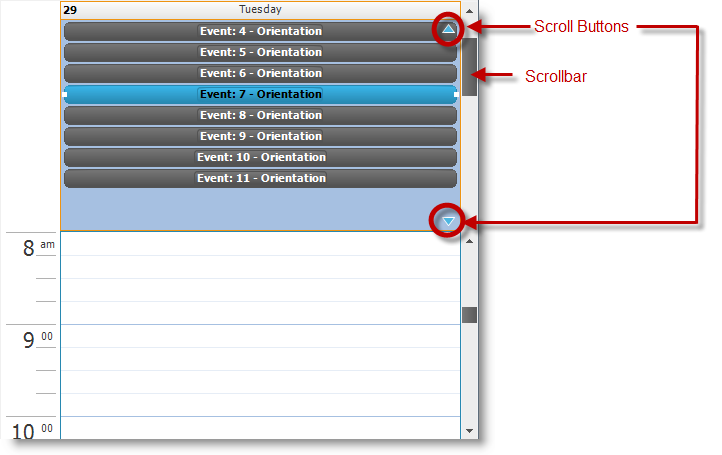

////

|metadata|
{
    "name": "winschedule-scrollable-alldayevent-area",
    "controlName": ["WinSchedule"],
    "tags": [],
    "guid": "666a919f-fb52-49a8-b2e5-bde1474f6bef",  
    "buildFlags": [],
    "createdOn": "2013-01-23T19:26:12.7203815Z"
}
|metadata|
////

= Scrollable AllDayEvent Area

== Topic Overview

=== Purpose

This topic provides users with the ability to scroll the  _UltraDayView_   control’s link:{ApiPlatform}win.ultrawinschedule{ApiVersion}~infragistics.win.ultrawinschedule.appointment~alldayevent.html[AllDayEvent] area allowing for the simultaneous display of all-day events without limitation.

=== Required background

The following topic is a prerequisite to understanding this topic:

[options="header", cols="a,a"]
|====
|Topic|Purpose

| link:winschedule-understanding-winschedule-controls-and-components.html[Understanding WinSchedule Controls and Components]
|This is a great place for you to start learning about the _WinSchedule_ controls and components, and their key features and functionalities.

|====

=== In this topic

This topic contains the following sections:

* <<_Ref342310371,Enabling AllDayEvent Area Scrolling>>

** <<_Ref342310379,Introduction and preview>>
** <<_Ref342310386,Property setting>>

* <<_Ref342310394,Related Content>>

[[_Ref342310371]]
== Enabling  _AllDayEvent_  Area Scrolling

[[_Ref342310379]]

=== Introduction and preview

Earlier versions (prior to 13.1) of the  _UltraDayView_   control did not support scrolling within the link:{ApiPlatform}win.ultrawinschedule{ApiVersion}~infragistics.win.ultrawinschedule.appointment~alldayevent.html[AllDayEvent] area and imposed a 16-event limit.

By default, the  _UltraDayView_   control will continue displaying the all-day event area as it appeared in previous versions without a scrollbar or scroll buttons.

This feature allows you to set the  _UltraDayView_   control’s properties to enable the scroll buttons and scrollbars in the link:{ApiPlatform}win.ultrawinschedule{ApiVersion}~infragistics.win.ultrawinschedule.appointment~alldayevent.html[AllDayEvent] area without limitations.

The following preview illustrates all-day events with scrollbar and scroll buttons enabled.

In addition to scrolling capability, the  _UltraDayView_   control introduces the new link:{ApiPlatform}win.ultrawinschedule{ApiVersion}~infragistics.win.ultrawinschedule.ultradayview~alldayeventareapreferredmaxheight.html[AllDayEventAreaPreferredMaxHeight] property allowing you to control the link:{ApiPlatform}win.ultrawinschedule{ApiVersion}~infragistics.win.ultrawinschedule.appointment~alldayevent.html[AllDayEvent] area’s vertical size. By default, size is 0 (Integer value), which informs the control to calculate the view’s optimum size.

.Note:
[NOTE]
====
Enabling scrolling while the `AllDayEventAreaPreferredMaxHeight=0`, the all-day event area occupies as much space as it needs to display all events for the currently visible days, but will not exceed  *one-half*  the control’s height as illustrated in the following table.
====

[options="header", cols="a,a"]
|====
|`AllDayEventAreaScrolling = None`|`AllDayEventAreaScrolling = ScrollBar`

|image::images/WinSchedule_Scrollable_AllDayEvent_Area_2.png[]
|image::images/WinSchedule_Scrollable_AllDayEvent_Area_3.png[]

|====

[[_Ref342310386]]

=== Property setting

The  _UltraDayView_   control exposes the link:{ApiPlatform}win.ultrawinschedule{ApiVersion}~infragistics.win.ultrawinschedule.ultradayview~alldayeventareascrolling.html[AllDayEventAreaScrolling] property with three options with scrolling capability.

[options="header", cols="a,a,a,a"]
|====
|Property name|Options|Description|Default value

|AllDayEventAreaScrolling
| _ScrollButtons_ 
|Enables the scroll buttons
|Disabled

|
| _ScrollBar_ 
|Enables the scrollbar
|Disabled

|
| _ScrollButtonsAndScrollBar_ 
|Enables both the scroll buttons and scrollbars
|Disabled

|
| _None_ 
|Default option
|Enabled

|====

[[_Ref342310394]]
== Related Content

=== Topics

The following topic provides additional information related to this topic.

[options="header", cols="a,a"]
|====
|Topic|Purpose

| link:winschedule.html[WinSchedule]
|This topic provides links to valuable information about the _WinSchedule_ controls ranging from what the _WinSchedule_ controls do and why you would want to use them in your application, to step-by-step procedures on how to accomplish tasks common to multiple _WinSchedule_ controls.

|====