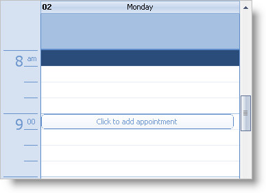

////

|metadata|
{
    "name": "winschedule-use-the-click-to-add-indicator",
    "controlName": ["WinSchedule"],
    "tags": ["Appointments"],
    "guid": "{DBB285DD-F419-4AFE-874F-06D70F8156FC}",  
    "buildFlags": [],
    "createdOn": "2006-10-10T08:24:31Z"
}
|metadata|
////

= Use the Click to Add Indicator

In Infragistics Windows Forms 2006 Volume 3, a new  pick:[win-forms="link:{ApiPlatform}win.ultrawinschedule{ApiVersion}~infragistics.win.ultrawinschedule.viewstyle.html[ViewStyle]"]  was added to WinCalendarLook™: Office2007. One of the features that is enabled by default when the ViewStyle is set to Office2007 is the Click To Add indicator. This indicator appears when the end user hovers the mouse pointer over a TimeSlot or the AllDayEvent area of the WinDayView™ control, or over the day area of the WinWeekView™ and WinMonthViewSingle™ controls. It provides a way to add an Appointment without launching the appointment dialog. When the indicator is clicked, a new Appointment is added and placed into edit mode. Initially, the Appointment has no subject; therefore, if the end user terminates the edit mode session without providing a subject or cancels by pressing the Escape key, the Appointment is removed from the Appointments collection.

While the Click To Add feature is new to Outlook2007, it is supported in WinSchedule™ under all settings of the ViewStyle property, via the  pick:[win-forms="link:{ApiPlatform}win.ultrawinschedule{ApiVersion}~infragistics.win.ultrawinschedule.ultradayview~showclicktoaddindicator.html[ShowClickToAddIndicator]"]  property (WinDayView, WinWeekView, and WinMonthViewSingle controls). The property's default value, Default, enables or disables the feature as appropriate for the current setting of the associated UltraCalendarLook's ViewStyle property - when ViewStyle is set to Office2007, the feature is enabled, and for all other settings of the ViewStyle property it is disabled. Under any of the settings of the ViewStyle property, the Click To Add feature can be explicitly switched on or off by setting the property's value to either True or False.

The following code sample demonstrates how to enable or disable the Click To Add indicator:

*In Visual Basic:*

----
Imports Infragistics.Win
Dim bShowIndicator As Boolean = True
If bShowIndicator Then
	Me.ultraDayView1.ShowClickToAddIndicator = DefaultableBoolean.True
Else
	Me.ultraDayView1.ShowClickToAddIndicator = DefaultableBoolean.False
End If
----

*In C#:*

----
using Infragistics.Win;
bool bShowIndicator = true;
if ( bShowIndicator )
	this.ultraDayView1.ShowClickToAddIndicator = DefaultableBoolean.True;
else
	this.ultraDayView1.ShowClickToAddIndicator = DefaultableBoolean.False;
----