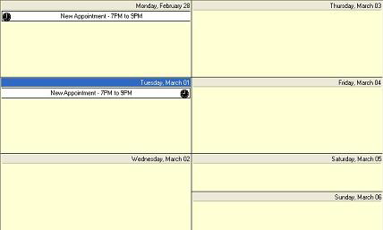

////

|metadata|
{
    "name": "winschedule-whats-new-2005-1",
    "controlName": [],
    "tags": [],
    "guid": "{DE9AD5FC-0FBB-4A97-9E41-698DA4B1B53C}",  
    "buildFlags": [],
    "createdOn": "0001-01-01T00:00:00Z"
}
|metadata|
////

= WinSchedule 2005.1

== WinCalendarInfo Logical Day Properties

The NAS2005 Vol1 release of WinSchedule™ contains support for a "logical day", which can differ (in the time it begins and the amount of time it spans) from the actual day. The logical day is defined by two new properties of the WinCalendarInfo™ component,  pick:[win-forms="link:{ApiPlatform}win.ultrawinschedule{ApiVersion}~infragistics.win.ultrawinschedule.ultracalendarinfo~logicaldayoffset.html[LogicalDayOffset]"] , and  pick:[win-forms="link:{ApiPlatform}win.ultrawinschedule{ApiVersion}~infragistics.win.ultrawinschedule.ultracalendarinfo~logicaldayduration.html[LogicalDayDuration]"] . Both properties are of type TimeSpan.

=== LogicalDayOffset

The  pick:[win-forms="link:{ApiPlatform}win.ultrawinschedule{ApiVersion}~infragistics.win.ultrawinschedule.ultracalendarinfo~logicaldayoffset.html[LogicalDayOffset]"]  property determines when the logical day begins, as relative to midnight of the actual day. The LogicalDayOffset property can be set to any value in the range of 1 minute, and 23 hours and 59 minutes, in either the positive or negative direction. For example, if the LogicalDayOffset property were set to a TimeSpan of -4 hours, the logical day would begin at 8PM of the previous day; a setting of +8hours and 30 minutes would result in a logical day that begins at 8:30AM of the same day. Since the maximum allowable setting for the LogicalDayOffset property is 23 hours and 59 minutes, the logical day can never be set to begin on the following day. Because the actual day begins at midnight, the default value for the property is TimeSpan.Zero.

=== LogicalDayDuration

The  pick:[win-forms="link:{ApiPlatform}win.ultrawinschedule{ApiVersion}~infragistics.win.ultrawinschedule.ultracalendarinfo~logicaldayduration.html[LogicalDayDuration]"]  property determines the length of the logical day. The LogicalDayDuration property can be set to any value in the range between 1 minute and 24 hours. Unlike the LogicalDayOffset property, only positive values are valid. The LogicalDayDuration property can be used to shorten the logical length of a day, but not to extend it. For example, if the LogicalDayDuration property were set to a TimeSpan of +8 hours, the logical day would then end 8 hours after it begins. Because the actual length of a day is 24 hours, the default value for the LogicalDayDuration property is 24 hours.

=== LogicalDayOffset in conjunction with LogicalDayDuration

The  pick:[win-forms="link:{ApiPlatform}win.ultrawinschedule{ApiVersion}~infragistics.win.ultrawinschedule.ultracalendarinfo~logicaldayoffset.html[LogicalDayOffset]"]  and  pick:[win-forms="link:{ApiPlatform}win.ultrawinschedule{ApiVersion}~infragistics.win.ultrawinschedule.ultracalendarinfo~logicaldayduration.html[LogicalDayDuration]"]  properties can of course be used together to define a logical day that begins at a time other than midnight, and spans less than 24 hours. The following code sample demonstrates how the properties can be used together to define a logical day that begins at 9AM (on the current day) and ends at 5PM (also on the current day):
*In Visual Basic:*
 

----
' Set the LogicalDayOffset and LogicalDayDuration properties such that
' the logical day begins at 9AM and ends at 5PM.
Me.UltraCalendarInfo1.LogicalDayOffset = TimeSpan.FromHours(9)
Me.UltraCalendarInfo1.LogicalDayDuration = TimeSpan.FromHours(8)
----

*In C#:*

----
// Set the LogicalDayOffset and LogicalDayDuration properties such that
// the logical day begins at 9AM and ends at 5PM.
this.ultraCalendarInfo1.LogicalDayOffset = TimeSpan.FromHours( 9f );
this.ultraCalendarInfo1.LogicalDayDuration = TimeSpan.FromHours( 8f );
----

==== The WinSchedule controls and the Logical Day Properties

The following section explains the effect of the LogicalDayOffset and LogicalDayDuration properties on the applicable WinSchedule controls, as well as the appointment dialog:

==== WinDayView and the logical day properties

The WinDayView™ control is the only WinSchedule control whose user interface is affected by the logical day properties. The WinDayView control displays time slots, each of which represent a particular interval of time in the day, so when the logical day properties are set such that one or more time slots fall outside their range, those time slots are not displayed. The following screen shot illustrates how the WinDayView control appears when the logical day is set to begin at 9AM and end at 5PM:

You will notice that the time slots which represent the hours between midnight and 9AM are missing, as are the time slots which represent the hours between 5PM and midnight of the following day. This is a direct result of the logical day property settings.

Just as time slots that fall outside the logical day range are hidden, so are any appointments that fall completely outside the logical day. An appointment, for example, that starts at 8AM and ends at 9AM would not appear in the WinDayView control (when the logical day begins at 9AM and ends at 5PM), since that appointment is said to fall completely outside the logical day.

By the same logic, if the logical day properties are set such that the logical day begins before midnight of the actual day, appointments for a particular day may appear in a different VisibleDay for the WinDayView control. If, for example, the logical day begins at 8PM on the previous day, and there is an appointment that also begins at 8PM of that same day, the WinDayView control will display that appointment in the VisibleDay that is displayed when the following day is selected. The following screen shot illustrates this; with the LogicalDayOffset property set to -4 hours, when March 1, 2005 is selected, the WinDayView control's first time slot actually corresponds to 8PM on February 28, 2005 (the previous day). From this it follows that an appointment which begins at 8PM on February 28, 2005 will appear in that time slot, even though the selected day is March 1, 2005:

Because the logical day properties apply only to the user interface, the valid range of values for the properties of an  pick:[win-forms="link:{ApiPlatform}win.ultrawinschedule{ApiVersion}~infragistics.win.ultrawinschedule.appointment.html[Appointment]"]  object are not affected by the logical day properties. The StartDateTime and EndDateTime properties of an Appointment object can be set to values that place that appointment completely outside the range of the logical day (the programmer is not hindered in this respect). The user interface, on the other hand, is designed to prevent the end user from changing appointment times such that they fall outside the logical day. Appointments cannot be dragged outside the logical day, nor can they be resized in such a way that the start or end time is brought outside the logical day.

=== WinWeekView/WinMonthViewSingle and the logical day properties

The WinWeekView™ and WinMonthViewSingle™ controls do not, by themselves, display any differently when the logical day properties are set to non-default values. They can, however, display appointments differently depending on the way the appointment's start and end times relate to the beginning and end of the logical day.

For example, consider the case where the logical day begins at 8PM on the previous day, and an appointment is created with a StartDateTime of 7PM of the previous day and an EndDateTime of 9PM. Because the appointment spans across more than one logical day (crosses the 8PM boundary), it will appear in more than one day in the WinWeekView and WinMonthViewSingle controls, even though its duration is only 2 hours. The following screen shot illustrates this:

.Note
[NOTE]
====
The Appointment's  pick:[win-forms="link:{ApiPlatform}win.ultrawinschedule{ApiVersion}~infragistics.win.ultrawinschedule.appointment~ismultiday.html[IsMultiDay]"]  property takes this into consideration, and would in fact return true in the above scenario.
====

=== WinMonthViewMulti and the logical day properties

As with the WinWeekView and WinMonthViewSingle controls, the WinMonthViewMulti control does not display any differently when the logical day properties are set to non-default values. Also like the WinWeekView and WinMonthViewSingle controls, it can depict activity in more than one day when an appointment spans across more than one logical day. The following screen shot illustrates this, using the same example that we used in the section above - the logical day begins at 8PM on the previous day, and an appointment is created with a StartDateTime of 7PM of the previous day and an EndDateTime of 9PM:

=== The AppointmentDialog and the logical day properties

The  pick:[win-forms="link:{ApiPlatform}win.ultrawinschedule{ApiVersion}~infragistics.win.ultrawinschedule.appointmentdialog.html[AppointmentDialog]"]  has been modified to restrict appointment times to the boundaries imposed by the logical day properties. For example, the drop-downs which contain a list of times do not include times that fall outside the logical day range. Furthermore, since it is possible for the end user to enter an invalid time via the keyboard, the appointment is validated against the logical day boundaries when it is saved, ensuring that the end user does not cause the appointment times to exceed those boundaries. When such an event occurs, the dialog will alert the end user and prevent the dialog from closing. For example, if the logical day spans from 9AM to 5PM of the current day, and the end user attempts to save an appointment with an EndDateTime of 6PM, the dialog will generate an error and notify the user. The following screen shot illustrates this:

Since there might be circumstances where the end developer elects to allow appointment times to exceed the logical day boundaries, the properties of the  pick:[win-forms="link:{ApiPlatform}win.ultrawinschedule{ApiVersion}~infragistics.win.ultrawinschedule.validateappointmenteventargs.html[ValidateAppointmentEventArgs]"]  class can be used to change this default behavior.

=== WinCalendarCombo SpinWrap Feature

A  pick:[win-forms="link:{ApiPlatform}win.ultrawinschedule{ApiVersion}~infragistics.win.ultrawinschedule.ultracalendarcombo~spinwrap.html[SpinWrap]"]  property has been added to the WinCalendarCombo™ control. The SpinWrap property gets/sets a value indicating whether the control's spin button should wrap its value. If set to true, the spin button will wrap the value incremented/decremented based on its Min/Max value.