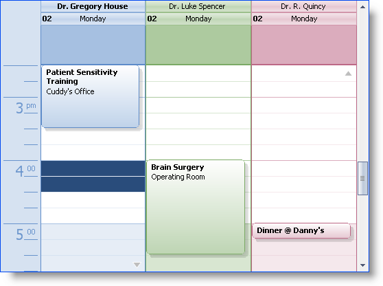
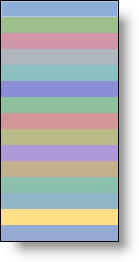

////

|metadata|
{
    "name": "winschedule-working-with-the-outlook-2007-color-scheme",
    "controlName": ["WinSchedule"],
    "tags": ["Styling","Theming"],
    "guid": "{3253D7E9-0E87-490E-A0C7-D7B3E968DFC6}",  
    "buildFlags": [],
    "createdOn": "2006-10-10T08:44:09Z"
}
|metadata|
////

= Working with the Outlook 2007 Color Scheme

== Overview

The Infragistics Windows Forms 2006 Volume 3 release supports the Office2007 look and feel for WinSchedule™. Outlook2007 utilizes the calendar-specific color schemes more extensively than with the previous versions of Outlook. As seen in the screen shot, virtually every visual element is rendered with a color that is based on a color scheme which is specific to that calendar (or, in WinSchedule terminology, Owner).

In order to support this new approach to the visual representation of different calendars, WinSchedule introduces the concept of Outlook2007 color schemes. Outlook2007 color schemes are based on a single color; by using various different shades of this one color, all the colors used by the visual elements for each control are automatically generated, in a manner which reflects the same visual appearance as that of MS Outlook2007.

Developers who are familiar with the Infragistics appearance model know that the colors of visual elements are highly customizable through the use of this model. This model was extended in the NAS2006 Volume 2 release with the introduction of application styling, offering an additional layer of customizability. The Outlook 2007 color scheme model works in conjunction with both of the previously mentioned models; in the absence of specific appearance (or application styling) settings, the ultimate default values that are used to color the visual elements are obtained from an instance of the  pick:[win-forms="link:{ApiPlatform}win.ultrawinschedule{ApiVersion}~infragistics.win.ultrawinschedule.outlook2007colorscheme.html[Outlook2007ColorScheme]"]  class. We'll go into greater details about this class and how it works in forthcoming sections of this document.

Where the application styling model was designed to assist the graphic artist in creating compelling visual looks for the WinSchedule controls, the Outlook2007 color scheme model was designed for the developer who wants to assign different colors for each calendar in the view, but would prefer not to be a part of the "grunt work" that usually comes along with intensive appearance-driven coding. The Outlook2007 color scheme model makes it possible to achieve a look like that seen in the screen shot, without setting any appearance properties or using any application styling mechanisms.

== The Outlook2007ColorSchemes collection

Outlook2007 provides support for fifteen different color schemes (see screen shot on right), made available through its 'Calendar Options' dialog. WinCalendarLook exposes these color schemes through its  pick:[win-forms="link:{ApiPlatform}win.ultrawinschedule{ApiVersion}~infragistics.win.ultrawinschedule.outlook2007colorschemecollection.html[Outlook2007ColorSchemes]"]  collection. The collection contains fifteen instances of the Outlook2007ColorScheme class, with each instance corresponding to one of the fifteen colors seen in the 'Calendar Options' dialog. The indexer for the collection is of type System.Drawing.Color. The colors for each of these schemes are also exposed via the  pick:[win-forms="link:{ApiPlatform}win.ultrawinschedule{ApiVersion}~infragistics.win.ultrawinschedule.outlook2007colorschemecollection~supportedcolors.html[SupportedColors]"]  property; the property returns an array of System.Drawing.Color structures, with each color in the array appearing at the same ordinal position as the color scheme with which it corresponds.

Developers who are familiar with Office2007 may be aware of the two different "themes" supported therein: Blue, Black, and Silver. These themes are realized in the Infragistics framework through the static Infragistics.Win.Office2007ColorTable.ColorScheme property. This is a settable property which determines the Office 2007 theme for all Infragistics controls in a given application, the WinSchedule controls being no exception. the Outlook2007ColorSchemes collection exposes a property,  pick:[win-forms="link:{ApiPlatform}win.ultrawinschedule{ApiVersion}~infragistics.win.ultrawinschedule.outlook2007colorschemecollection~defaultscheme.html[DefaultScheme]"]  , which returns the color scheme that corresponds to the current value of the ColorScheme property. The color properties returned by the DefaultScheme always reflect the current value of the ColorScheme property.

When a WinSchedule Owner is displayed, a color scheme is automatically assigned from the pool of the fifteen available color schemes. Since there are only fifteen of these color schemes, and WinSchedule supports the display of an unlimited number of Owners, the possibility exists that more than one Owner will be assigned the same color scheme. A mechanism exists to reserve a color scheme for a particular Owner; the Outlook2007ColorSchemeCollection class exposes a  pick:[win-forms="link:{ApiPlatform}win.ultrawinschedule{ApiVersion}~infragistics.win.ultrawinschedule.outlook2007colorschemecollection~disallowautoassignment.html[DisallowAutoAssignment]"]  method which removes a given color scheme from the pool of the ones that can be automatically assigned.

== The Outlook2007ColorScheme class

The Outlook2007ColorScheme class exposes several properties of type System.Drawing.Color. These properties determine the colors used as the ultimate default values for the visual elements of the WinSchedule controls when the associated UltraCalendarLook's ViewStyle property is set to 'Office2007'. These properties are read-only, and for the most part are derived by reducing or increasing the luminosity of the BaseColor. As discussed in the previous section, fifteen instances of this class are contained within the UltraCalendarLook's Outlook2007ColorSchemes collection, each instance corresponding to one of the color schemes available in MS Outlook.

The Outlook2007ColorScheme class exposes a constructor, so instances can be created independently of the Outlook2007ColorSchemes collection. The constructor takes a single parameter, of type System.Drawing.Color; this parameter defines the value of the BaseColor property. What this means is that the developer can create an instance of this class, using any visible color, and assign it to an Owner's Outlook2007ColorScheme property, and a look that is appropriate to the Office2007 ViewStyle is automatically generated for that Owner. It should be noted, however, that a bad choice for the BaseColor property can result in a garish appearance, so only colors in the "pastel" range should be used.

The following code sample demonstrates how to create an instance of the Outlook2007ColorScheme class using a non-standard BaseColor, and assign it to an Owner:

*In Visual Basic:*

----
Dim colorScheme As Outlook2007ColorScheme =_
New Outlook2007ColorScheme( Color.FromArgb(214, 142, 122) )
Me.ultraCalendarInfo1.Owners("House").Outlook2007ColorScheme = colorScheme
----

*In C#:*

----
Outlook2007ColorScheme colorScheme =
new Outlook2007ColorScheme( Color.FromArgb(214, 142, 122) );
this.ultraCalendarInfo1.Owners["House"].Outlook2007ColorScheme = colorScheme;
----

== Assigning the default color scheme to a particular Owner

The Outlook2007ColorSchemeCollection class exposes a DefaultScheme property. This property returns the Outlook2007ColorScheme instance which corresponds to either the 'Blue' or 'Black' Office2007 color scheme, as defined by the current value of the static  pick:[win-forms="link:{ApiPlatform}win{ApiVersion}~infragistics.win.office2007colortable~colorscheme.html[Infragistics.Win.Office2007ColorTable.ColorScheme]"]  property. A developer may decide that he wants to assign this color scheme to a particular Owner, and mark the scheme as unavailable to any other Owner. The following code sample demonstrates how this can be accomplished, using the Owner's Outlook2007ColorScheme property, in conjunction with the Outlook2007ColorSchemeCollection class' DisallowAutoAssignment method:

*In Visual Basic:*

----
Dim colorSchemes As Outlook2007ColorSchemeCollection =_
Me.ultraCalendarLook1.Outlook2007ColorSchemes
Dim owner as Infragistics.Win.UltraWinSchedule.Owner =_
Me.ultraCalendarInfo1.Owners("House")
owner.Outlook2007ColorScheme = colorSchemes.DefaultScheme
colorSchemes.DisallowAutoAssignment( colorSchemes.DefaultScheme.BaseColor )
----

*In C#:*

----
Outlook2007ColorSchemeCollection colorSchemes =
this.ultraCalendarLook1.Outlook2007ColorSchemes;
Infragistics.Win.UltraWinSchedule.Owner owner =
this.ultraCalendarInfo1.Owners["House"];
owner.Outlook2007ColorScheme = colorSchemes.DefaultScheme;
colorSchemes.DisallowAutoAssignment( colorSchemes.DefaultScheme.BaseColor );
----

Since the DisallowAutoAssignment method marks a color scheme as unavailable by keeping track of its color, the above example only reserves the current default color scheme, that is, either the 'Blue' scheme or the 'Black' scheme, but not both. The developer can use the BaseColorBlue and BaseColorBlack properties to reserve both default schemes, in which case neither of the default color schemes will ever be automatically assigned to some other owner. Alternatively, the developer can register as a listener of the ColorSchemeChanged event, release the reservation on the last default scheme, and reserve the current one, as demonstrated in the following code sample:

*In Visual Basic:*

----
AddHandler Infragistics.Win.Office2007ColorTable.ColorSchemeChanged,_
AddressOf Me.OnColorSchemeChanged
.
.
.
Private Sub OnColorSchemeChanged(ByVal sender As Object, ByVal e As EventArgs)
Dim calendarLook As UltraCalendarLook = Me.ultraCalendarLook1
If calendarLook.ViewStyle = ViewStyle.Office2007 Then
Dim colorSchemes As Outlook2007ColorSchemeCollection =_
          calendarLook.Outlook2007ColorSchemes
Dim baseColor As Color = Color.Empty
Select Case Office2007ColorTable.ColorScheme
Case Office2007ColorScheme.Blue
                baseColor = colorSchemes.BaseColorBlue
Case Office2007ColorScheme.Black
                baseColor = colorSchemes.BaseColorBlack
End Select
Dim owner As Infragistics.Win.UltraWinSchedule.Owner =_
If(Me.ultraCalendarInfo1.Owners.Exists("House"),_
Me.ultraCalendarInfo1.Owners("House"), Nothing)
If Not owner Is Nothing Then
Dim lastBaseColor As Color =_
If(baseColor.Equals(colorSchemes.BaseColorBlue),_
              colorSchemes.BaseColorBlack, colorSchemes.BaseColorBlue)
            colorSchemes.AllowAutoAssignment(lastBaseColor)
            colorSchemes.DisallowAutoAssignment(baseColor)
            owner.Outlook2007ColorScheme = colorSchemes.DefaultScheme
End If
End If
End Sub
----

*In C#:*

----
Office2007ColorTable.ColorSchemeChanged += new EventHandler( this.OnColorSchemeChanged );
.
.
.
private void OnColorSchemeChanged( object sender, EventArgs e )
{
        UltraCalendarLook calendarLook = this.ultraCalendarLook1;
if ( calendarLook.ViewStyle == ViewStyle.Office2007 )
        {
                Outlook2007ColorSchemeCollection colorSchemes = 
                  calendarLook.Outlook2007ColorSchemes;
                Color baseColor = Color.Empty;
switch ( Office2007ColorTable.ColorScheme )
                {
case Office2007ColorScheme.Blue: 
                          { baseColor = colorSchemes.BaseColorBlue; } break;
case Office2007ColorScheme.Black: 
                          { baseColor = colorSchemes.BaseColorBlack; } break;
                }
                Infragistics.Win.UltraWinSchedule.Owner owner =
this.ultraCalendarInfo1.Owners.Exists("House") ? 
  this.ultraCalendarInfo1.Owners["House"] : null;
if ( owner != null )
                {
                        Color lastBaseColor =   
                          baseColor.Equals(colorSchemes.BaseColorBlue) ?
						  colorSchemes.BaseColorBlack :
						  colorSchemes.BaseColorBlue;
                        colorSchemes.AllowAutoAssignment( lastBaseColor );
                        colorSchemes.DisallowAutoAssignment( baseColor );
                        owner.Outlook2007ColorScheme = colorSchemes.DefaultScheme;
                }
        }
}
----

== Summary

The WinCalendarLook's Outlook2007ColorSchemes collection and the Owner's Outlook2007ColorScheme property provide you with a way to have control over the manner in which Outlook2007 color schemes are managed, without assuming the whole burden of color management. The Outlook2007ColorScheme class extends this metaphor by providing you with a way to specify a custom base color (i.e., one not used in Outlook2007), while still maintaining the Office2007 look.