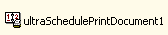

////

|metadata|
{
    "name": "winscheduleprintdocument-about-winscheduleprintdocument",
    "controlName": ["WinSchedulePrintDocument"],
    "tags": ["Getting Started","Scheduling"],
    "guid": "{4ACE9D08-A5DB-49A9-B56D-25AABA1FD036}",  
    "buildFlags": [],
    "createdOn": "0001-01-01T00:00:00Z"
}
|metadata|
////

= About WinSchedulePrintDocument

WinSchedulePrintDocument™ is a Windows Forms component that allows you to easily print out any of the WinSchedule™ views.

* Print Preview -- The WinSchedulePrintDocument component can be used with the WinPrintPreviewDialog component in order to preview a WinSchedule document before it is printed. See link:winprintpreviewdialog-winscheduleprintdocument-using-winprintpreviewdialog-with-winscheduleprintdocument.html[Using WinPrintPreviewDialog with WinSchedulePrintDocument] for details.
* Headers/Footers -- Allows you to specify custom headers and footers to print along with the WinSchedule view.

