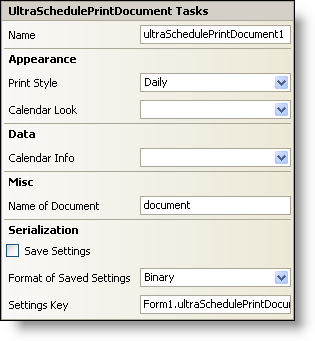

////

|metadata|
{
    "name": "winscheduleprintdocument-smart-tag",
    "controlName": ["WinSchedulePrintDocument"],
    "tags": [],
    "guid": "{3576B963-7661-4E0F-AA75-5876B464262E}",  
    "buildFlags": [],
    "createdOn": "0001-01-01T00:00:00Z"
}
|metadata|
////

= WinSchedulePrintDocument Smart Tag

In Visual Studio 2005 (.NET Framework 2.0), each Infragistics Windows Forms control/component is equipped with a Smart Tag. By simply selecting the control/component, a Smart Tag anchor appears. When you click this anchor, a pop-up panel appears, providing you with quick and easy access to the most common properties and settings of the control/component.

The WinSchedulePrintDocument™ Smart Tag contains the name of the component, as well as the following sections:

* Appearance -- Provides common tasks involving the appearance, look, and feel of the control.
* Data -- Refers to any underlying data the control is using such as data sources and data members.
* Misc -- Provides various options that will enhance the overall look or performance of the control.
* Serialization -- Provides quick access to properties used in the IPersistComponentSettings interface.

See below for a description of the item (e.g., field, drop-down list, checkbox) in each section, as well as the item's corresponding property in the properties grid.

[options="header", cols="a,a,a"]
|====
|Appearance|Description|Corresponding Property

|Print Style
|Print out calendars by day, week, month, year and several other options.
| pick:[win-forms="link:infragistics4.win.ultrawinschedule.v{ProductVersion}~infragistics.win.ultrawinschedule.ultrascheduleprintdocument~printstyle.html[PrintStyle]"] 

|Calendar Look
|Upon clicking the drop-down, all available WinCalendarLook controls on the form will be displayed.
| pick:[win-forms="link:infragistics4.win.ultrawinschedule.v{ProductVersion}~infragistics.win.ultrawinschedule.ultrascheduleprintdocument~calendarlook.html[CalendarLook]"] 

|====

[options="header", cols="a,a,a"]
|====
|Data|Description|Corresponding Property

|Calendar Info
|Upon clicking the drop-down, all available WinCalendarInfo controls on the form will be displayed.
| pick:[win-forms="link:infragistics4.win.ultrawinschedule.v{ProductVersion}~infragistics.win.ultrawinschedule.ultrascheduleprintdocument~calendarinfo.html[CalendarInfo]"] 

|====

[options="header", cols="a,a,a"]
|====
|Misc|Description|Corresponding Property

|Name of Document
|Enter a name for the document that will be shown to the user.
|DocumentName

|====

[options="header", cols="a,a,a"]
|====
|Serialization|Description|Corresponding Property

|Save Settings
|Selecting True from the drop-down will allow the control to automatically save the applications' settings properties.
| pick:[win-forms="link:infragistics4.win.v{ProductVersion}~infragistics.win.printing.ultraprintdocument~savesettings.html[SaveSettings]"] 

|Format of Saved Settings
|The control can save its settings to either Binary or XML files.
| pick:[win-forms="link:infragistics4.win.v{ProductVersion}~infragistics.win.printing.ultraprintdocument~savesettingsformat.html[SaveSettingsFormat]"] 

|Settings Key
|You can set the settings key of the current instance of the control.
| pick:[win-forms="link:infragistics4.win.v{ProductVersion}~infragistics.win.printing.ultraprintdocument~settingskey.html[SettingsKey]"] 

|====