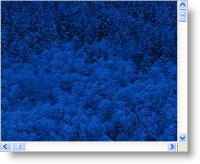

////

|metadata|
{
    "name": "winscrollbar-about-winscrollbar",
    "controlName": ["WinScrollBar"],
    "tags": ["Getting Started","Navigation"],
    "guid": "{62062E0C-FF00-42C9-9167-20EB5FA31C30}",  
    "buildFlags": [],
    "createdOn": "0001-01-01T00:00:00Z"
}
|metadata|
////

= About WinScrollBar

WinScrollbar™ is a Windows Forms control that allows you to add scrolling to a panel or container. Has full appearance support including alpha-blending, gradients, images, etc.

