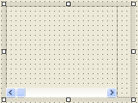
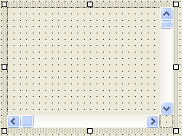
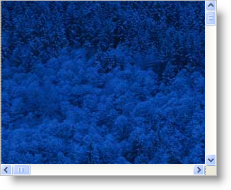

////

|metadata|
{
    "name": "winscrollbar-adding-vertical-and-horizontal-scrollbars",
    "controlName": ["WinScrollBar"],
    "tags": ["How Do I","Navigation"],
    "guid": "{A883AFFB-04DD-4EF3-BDD2-A5C617EF2EE8}",  
    "buildFlags": [],
    "createdOn": "2005-09-09T00:00:00Z"
}
|metadata|
////

= Adding Vertical and Horizontal Scrollbars

The WinScrollBar™ control has all the features of the inbox Scrollbar control with all the extra features of the Infragistics Presentation Layer Framework, such as themes and customizable colors including gradients and images. For this example, we will create a scrolling panel by placing one panel inside another and moving it based on the scrollbar value.

[start=1]
. *Start a new project in Visual Studio.*

Add a Panel to the form and name it 'pnlContainer'. This will be the containing panel that holds the scrollbars, the inner panel, and the outer panel.
[start=2]
. *Add a horizontal scrollbar.*

Add an UltraWinScrollBar control to the 'pnlContainer' and name it 'usbHorizontal'. This will be the horizontal scrollbar for the panel. Set the Dock property of the scrollbar to Bottom.
[start=3]
. *Add a vertical scrollbar.*

Add a panel inside 'pnlContainer' and name it 'pnlScrollBar'. This panel will contain the vertical scrollbar and provide space for the missing lower right corner into which the scrollbars do not typically extend.

Set the Dock property of 'pnlScrollBar' to Right.

Make sure that 'pnlScrollBar' is selected and click the Send To Back button on the Visual Studio toolbar. This is to give the panel precedence over the scrollbar docked to the bottom.

At this point, your form should look something like this.

Next, add an UltraWinScrollBar control to 'pnlScrollBar'. Name it 'usbVertical'. Set the Orientation on usbVertical to Vertical. Set the Width of 'pnlScrollBar' to the Width of 'usbVertical'. Set the Height of 'usbVertical' so that it almost reaches the top of the horizontal scrollbar. The form should now look something like this:

[start=4]
. *Add the outer panel*

Add a panel inside 'pnlContainer' and name it 'pnlOuter'. Set the Dock property to Fill.
[start=5]
. *Add the inner Panel.*

'pnlInner' will be moved around inside 'pnlOuter' based on the position of the scrollbars. So you will need to do something to 'pnlInner' so that the scrolling is visible. One easy way to do this is to set the BackgroundImage property of 'pnlInner'. Make sure the image you use is larger than 'pnlContainer', so there will be something to scroll. Assign a BackgroundImage to 'pnlInner'. For the purposes of this help topic, we will use Winter.jpg, a sample image that installs with Windows XP. Set the Size of 'pnlInner' to the size of the image (1024, 768 for Winter.jpg). Set the Location property of 'pnlInner' to 0,0. The form should now look like this. The Location property of 'pnlInner' is used to determine where the scrollbars. Moving the scrollbars causes this property to change therefore causing scrolling.

[start=6]
. Before you start writing any code, you should place using/imports directives in your code-behind so you don't need to always type out a member's fully qualified name.

*In Visual Basic:*

----
Imports Infragistics.Win.UltraWinScrollBar
----

*In C#:*

----
using Infragistics.Win.UltraWinScrollBar;
----

[start=7]
. *Initializing the Horizontal ScrollBar*

The Horizontal scrollbar will determine the Left of pnlInner within pnlContainer. Scrolling right will move the inner panel left. The Minimum will be set to 0.

Determining the Maximum using the inbox scrollbars would be tricky. You would normally have to account for preventing the panel from scrolling completely out of view and also account for allowing the thumb to be dragged all the way to the right edge. However, the WinScrollBar's Initialize method handles a lot of the calculations for you.

Determine the Maximum by simply subtracting the width of the outer panel from the width of the Inner Panel. This code will also set the SmallChange and LargeChange.

Finally, the code will set the AutoDisable property, so that the scrollbar will be disabled when there is nothing to scroll.

Create a method to initialize the Horizontal scrollbar.

*In Visual Basic:*

----
Private Sub InitializeHorizontalScrollBar()
	' The Minimum of the Horiontal scrollbar will be 0.
	Dim minHorizontal As Integer = 0
	' Determine the Maximum of the Horizontal scrollbar.
	' Start with the width of pnlInner.
	' Subtract the width of pnlOuter.
	Dim maxHorizontal As Integer = Me.pnlInner.Width - Me.pnlOuter.Width
	' SmallChange it typically 1%.
	Dim smallChangeHorizontal As Integer = Math.Max(CInt(maxHorizontal / 100), 1)
	' LargeChange is typically one page.
	Dim largeChangeHorizontal As Integer = Me.pnlOuter.Width
	' Initialize the Horizontal scrollbar
	Me.usbHorizontal.Initialize(minHorizontal, maxHorizontal, _
	  smallChangeHorizontal, largeChangeHorizontal)
	' Set AutoDisable to true so there is nothing
	Me.usbHorizontal.AutoDisable = True
End Sub
----

*In C#:*

----
private void InitializeHorizontalScrollBar()
{
	// The Minimum of the Horiontal scrollbar will be 0.
	int minHorizontal = 0;
	// Determine the Maximum of the Horizontal scrollbar.
	// Start with the width of pnlInner.
	// Subtract the width of pnlOuter.  
	int maxHorizontal = this.pnlInner.Width - this.pnlOuter.Width;
	// SmallChange it typically 1%.
	int smallChangeHorizontal = Math.Max((int)(maxHorizontal / 100), 1);
	// LargeChange is typically one page.
	int largeChangeHorizontal = this.pnlOuter.Width;
	// Initialize the Horizontal scrollbar
	this.usbHorizontal.Initialize(minHorizontal, maxHorizontal, 
	  smallChangeHorizontal, largeChangeHorizontal);
	// Set AutoDisable to true so there is nothing
	this.usbHorizontal.AutoDisable = true;
}
----

[start=8]
. *Initializing the Vertical ScrollBar*

Initializing the vertical scrollbar is almost the same as the horizontal. The only difference is that you will use Height instead of Width.

*In Visual Basic:*

----
Private Sub InitializeVerticalScrollBar()
	' The Minimum of the Vertical scrollbar will be 0.
	Dim minVertical As Integer = 0
	' Determine the Maximum of the Vertical scrollbar. 
	' Start with the height of pnlInner.
	' Subtract the height of pnlOuter.
	Dim maxVertical As Integer = Me.pnlInner.Height - Me.pnlOuter.Height
	' SmallChange it typically 1%.
	Dim smallChangeVertical As Integer = Math.Max(CInt(maxVertical / 100), 1)
	' LargeChange is typically one page.
	Dim largeChangeVertical As Integer = Me.pnlOuter.Height
	' Initialize the Vertical scrollbar
	Me.usbVertical.Initialize(minVertical, maxVertical, _
	  smallChangeVertical, largeChangeVertical)
End Sub
----

*In C#:*

----
private void InitializeVerticalScrollBar()
{
	// The Minimum of the Vertical scrollbar will be 0.
	int minVertical = 0;
	// Determine the Maximum of the Vertical scrollbar.
	// Start with the height of pnlInner.
	// Subtract the height of pnlOuter.
	int maxVertical = this.pnlInner.Height - this.pnlOuter.Height;
	// SmallChange it typically 1%.
	int smallChangeVertical = Math.Max((int)(maxVertical / 100), 1);
	// LargeChange is typically one page.
	int largeChangeVertical = this.pnlOuter.Height;
	// Initialize the Vertical scrollbar
	this.usbVertical.Initialize(minVertical, maxVertical, 
	  smallChangeVertical, largeChangeVertical);
}
----

[start=9]
. *Calling the Initialize methods.*

Call the two methods you just created from Form_Load.

*In Visual Basic:*

----
Private Sub Adding_Vertical_and_Horizontal_Scrollbars_Load( _
  ByVal sender As System.Object, ByVal e As System.EventArgs) _
  Handles MyBase.Load
	Me.InitializeHorizontalScrollBar()
	Me.InitializeVerticalScrollBar()
End Sub
----

*In C#:*

----
private void Adding_Vertical_and_Horizontal_Scrollbars_Load(object sender, 
  EventArgs e)
{
	this.InitializeHorizontalScrollBar();
	this.InitializeVerticalScrollBar();
}
----

[start=10]
. *Scrolling.*

Inside the scroll event of each scrollbar and set the Top or Left on pnlInner.

*In Visual Basic:*

----
Private Sub usbHorizontal_Scroll(ByVal sender As System.Object, _
  ByVal e As System.Windows.Forms.ScrollEventArgs) _
  Handles usbVertical.Scroll
	Dim scrollBar As UltraScrollBar = DirectCast(sender, UltraScrollBar)
	Me.pnlInner.Left = -scrollBar.Value
End Sub
Private Sub usbVertical_Scroll(ByVal sender As System.Object, _
  ByVal e As System.Windows.Forms.ScrollEventArgs) _
  Handles usbVertical.Scroll
	Dim scrollBar As UltraScrollBar = DirectCast(sender, UltraScrollBar)
	Me.pnlInner.Top = -scrollBar.Value
End Sub
----

*In C#:*

----
private void usbHorizontal_Scroll(object sender, 
  System.Windows.Forms.ScrollEventArgs e)
{
	UltraScrollBar scrollBar = sender as UltraScrollBar;
	this.pnlInner.Left = -scrollBar.Value;
}
private void usbVertical_Scroll(object sender, 
  System.Windows.Forms.ScrollEventArgs e)
{
	UltraScrollBar scrollBar = sender as UltraScrollBar;
	this.pnlInner.Top = -scrollBar.Value;
}
----

[start=11]
. *Run the application*

Run the application and move the scrollbars around. You will be able to scroll around the image on pnlInner. If you want to add controls, add them to pnlInner and they will scroll just like the image.

