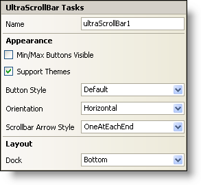

////

|metadata|
{
    "name": "winscrollbar-smart-tag",
    "controlName": ["WinScrollBar"],
    "tags": ["API","Design Environment"],
    "guid": "{EAC1B2B4-AE77-4E72-90BC-4144B95F5E83}",  
    "buildFlags": [],
    "createdOn": "0001-01-01T00:00:00Z"
}
|metadata|
////

= WinScrollBar Smart Tag

In Visual Studio 2005 (.NET Framework 2.0), each Infragistics Windows Forms control/component is equipped with a Smart Tag. By simply selecting the control/component, a Smart Tag anchor appears. When you click this anchor, a pop-up panel appears, providing you with quick and easy access to the most common properties and settings of the control/component.

The WinScrollBar™ Smart Tag contains the name of the control, as well as the following sections:

* Appearance -- Provides common tasks involving the appearance, look, and feel of the control.
* Layout -- Offers properties that will determine where and how the control is placed on the form.

See below for a description of the item (e.g., field, drop-down list, checkbox) in each section, as well as the item's corresponding property in the properties grid.

[options="header", cols="a,a,a"]
|====
|Appearance|Description|Corresponding Property

|Min/Max Buttons Visible
|If you select this checkbox, the Min and Max buttons will be displayed. The placement of the Min and Max buttons is dependent on the orientation of the scroll bar. If the scrollbar is horizontal, the Min and Max buttons will be displayed on the left and right side of the scrollbar, respectively. If the scrollbar is vertical, the Min and Max buttons will be displayed on the top and bottom areas of the scrollbar, respectively.
| pick:[win-forms="link:{ApiPlatform}win{ApiVersion}~infragistics.win.ultrawinscrollbar.ultrascrollbar~minmaxbuttonsvisible.html[MinMaxButtonsVisible]"] 

|Support Themes
|Select this check box to support basic Microsoft OS themes; for example, Windows Classic theme versus Windows XP theme.
| pick:[win-forms="link:{ApiPlatform}win{ApiVersion}~infragistics.win.ultracontrolbase~supportthemes.html[SupportThemes]"] 

|Button Style
|Use the drop-down to choose a look for the buttons of the scroll bar. This will be disabled if the SupportThemes property is set to True.
| pick:[win-forms="link:{ApiPlatform}win{ApiVersion}~infragistics.win.ultrawinscrollbar.ultrascrollbar~buttonstyle.html[ButtonStyle]"] 

|Orientation
|Select either horizontal or vertical from the drop-down box to display the scroll bar horizontally or vertically.
| pick:[win-forms="link:{ApiPlatform}win{ApiVersion}~infragistics.win.ultrawinscrollbar.ultrascrollbar~orientation.html[Orientation]"] 

|Scrollbar Arrow Style
|You can choose to display one arrow at each end, both arrows at each end, both arrows on the left, both arrows on the right, or you can choose not to display arrows at all.
| pick:[win-forms="link:{ApiPlatform}win{ApiVersion}~infragistics.win.ultrawinscrollbar.ultrascrollbar~scrollbararrowstyle.html[ScrollBarArrowStyle]"] 

|====

[options="header", cols="a,a,a"]
|====
|Layout|Description|Corresponding Property

|Dock
|Choose to dock the control to the top, right, bottom, left, full, or none. Inherited from System.Windows.Forms.Control.
|Dock

|====