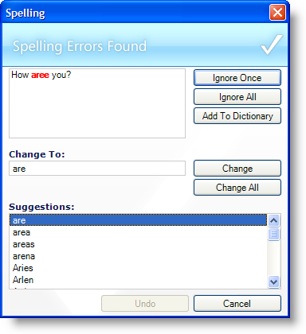

////

|metadata|
{
    "name": "winspellchecker-about-winspellchecker",
    "controlName": ["WinSpellChecker"],
    "tags": ["Application Scenarios","Getting Started"],
    "guid": "{4BD2EC02-6A20-4241-922A-FD83DB0633FB}",  
    "buildFlags": [],
    "createdOn": "0001-01-01T00:00:00Z"
}
|metadata|
////

= About WinSpellChecker

The WinSpellChecker™ component can spell check text-based controls such as the inbox TextBox, inbox RichTextBox, WinTextEditor™, and any control implementing the  pick:[win-forms="link:{ApiPlatform}win{ApiVersion}~infragistics.win.ultrawinspellchecker.iprovidetextbox.html[IProvideTextBox]"]  or  pick:[win-forms="link:{ApiPlatform}win{ApiVersion}~infragistics.win.ultrawinspellchecker.ispellchecktarget.html[ISpellCheckTarget]"]  interfaces. Upon adding WinSpellChecker to a form, an extender property called SpellCheckerSettings is added to these type of controls. Simply setting its Enabled property to True will let the WinSpellChecker component know that it should be spell checked. The WinSpellChecker component comes with a great feature set that rivals Microsoft® Word's spell checker. Some of these features include:

* Dictionary Support -- WinSpellChecker comes standard with dictionaries for nine different languages including Australian, Canadian, English (generic), Dutch, French, German, Portuguese, and Spanish. You also have the option to add new terms to a user dictionary.
* As You Type -- Have WinSpellChecker check a document's spelling as the end user types. WinSpellChecker can also replace misspelled words with suggested corrections as they are misspelled.
* SpellChecker Dialog -- WinSpellChecker's spell checking dialog can be launched on validation or on a button click. This dialog will then guide the end user through the spelling mistakes they've made and suggest a course of action.
* Visual Cues -- Let your end user's know when they've made a spelling error with the "red squiggle" made so famous by Microsoft Word. If you don't like the red squiggle, change it to blue or orange or black or any color. Don't like a squiggle? Make it a single or double line.

