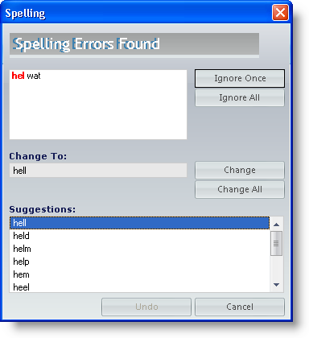

////

|metadata|
{
    "name": "winspellchecker-adding-winspellchecker-to-a-form",
    "controlName": ["WinSpellChecker"],
    "tags": ["Getting Started","Validation"],
    "guid": "{1BFA36A1-F6EB-4786-BAEF-49A25CB64CFE}",  
    "buildFlags": [],
    "createdOn": "2006-02-05T00:00:00Z"
}
|metadata|
////

= Adding WinSpellChecker to a Form

This topic is designed to get your WinSpellChecker™ application up and running as quickly as possible. We will discuss the minimum amount of steps to get WinSpellChecker functioning. In this topic, you will spell check a RichTextBox with the WinSpellChecker.

[start=1]
. *Drop the controls on the form.*

In a new C# or Visual Basic project, double click on the RichTextBox control under the Windows Forms tab in the toolbox. Set the RichTextBox's Dock property to top so that it is easier to see. Add a button to the form by double clicking it in the toolbox just like the RichTextBox. Next, double click the UltraSpellChecker component in the toolbox. Arrange the form so that it looks something like this:

[start=2]
. *Setup the RichTextBox to use ultraSpellChecker1 as its spell checker.*

With the RichTextBox selected, go to the properties window and find a property called  pick:[win-forms="link:{ApiPlatform}win.ultrawinspellchecker{ApiVersion}~infragistics.win.ultrawinspellchecker.spellcheckersettings.html[SpellCheckerSettings]"] . Expand the property and set the Enabled property to True.

[start=3]
. *Setup the button to check the RichTextBox's text when clicked.*

Double click the button and you will be taken to the code-behind for the button's click event. Inside that click event, add the following code:

*In Visual Basic:*

----
Me.UltraSpellChecker1.ShowSpellCheckDialog(Me.RichTextBox1)
----

*In C#:*

----
this.ultraSpellChecker1.ShowSpellCheckDialog(this.richTextBox1);
----

[start=4]
. *Run the project.*

When you run the project, you will see the RichTextBox and the button. Click the button. The SpellCheck dialog shows (because "richTextBox1" is not in the dictionary).

