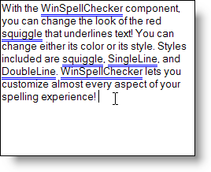

////

|metadata|
{
    "name": "winspellchecker-configuring-the-underline-style-and-color",
    "controlName": ["WinSpellChecker"],
    "tags": ["How Do I","Validation"],
    "guid": "{6CDE5577-6D26-4D9A-A144-B96A49C27CD3}",  
    "buildFlags": [],
    "createdOn": "0001-01-01T00:00:00Z"
}
|metadata|
////

= Configuring the Underline Style and Color

If you've never liked the look of the red squiggle that underlines misspelled words in Microsoft® Word, now's your chance to change it. WinSpellChecker™ lets you change the color of the red squiggle or change the squiggle to a single underline or double underline. You can also get rid of the squiggle completely. Use the code below to change the red squiggle to a blue double underline. 

*In Visual Basic:*

----
Imports Infragistics.Win.UltraWinSpellChecker
...
Me.UltraSpellChecker1.UnderlineSpellingErrorColor = Color.Blue
Me.UltraSpellChecker1.UnderlineSpellingErrorStyle = _
  UnderlineErrorsStyle.DoubleLine
----

*In C#:*

----
using Infragistics.Win.UltraWinSpellChecker;
...
this.ultraSpellChecker1.UnderlineSpellingErrorColor = Color.Blue;
this.ultraSpellChecker1.UnderlineSpellingErrorStyle = 
  UnderlineErrorsStyle.DoubleLine;
----