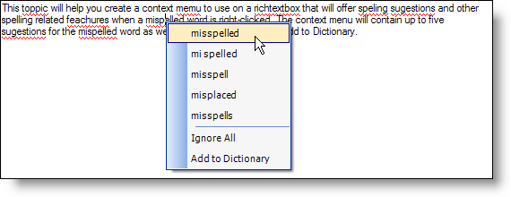

////

|metadata|
{
    "name": "winspellchecker-creating-a-shortcut-menu-to-resolve-spelling-errors",
    "controlName": ["WinSpellChecker"],
    "tags": ["How Do I","Validation"],
    "guid": "{0BE9E30D-377C-475D-BFF1-528FF870156C}",  
    "buildFlags": [],
    "createdOn": "0001-01-01T00:00:00Z"
}
|metadata|
////

= Creating a Shortcut Menu to Resolve Spelling Errors

== Before You Begin

The WinSpellChecker™ component gives you the ability to mimic Microsoft® Word's spell checking options on its shortcut menu. You can also create the same shortcut menu that looks and functions nothing like the Word shortcut menu; that's the power and flexibility of Infragistics Windows Forms controls and components. Along with the WinSpellChecker component, you'll also be using the  pick:[win-forms="link:{ApiPlatform}win{ApiVersion}~infragistics.win.igcontrols.igcontextmenu.html[IGContextMenu]"]  control. No, it's not in the toolbox. It's a simple shortcut menu capable of being styled and is perfect for this situation. The final control that you will be using is the inbox RichTextBox control. You could actually use any other spell checkable control, but we'll be using the the RichTextBox control for this walkthrough.

== What You Will Accomplish

This walkthrough will guide you through creating a shortcut menu with several spell-checking options. This shortcut menu will contain up to five suggestions for the misspelled word followed by options such as Ignore All and Add to Dictionary. A user dictionary is recommended (but not required) for this walkthrough. When you are done, you will have a shortcut menu for the RichTextBox control similar to this:

== Follow These Steps

[start=1]
. Before you start writing any code, you should place using/imports directives in your code-behind so you don't need to always type out a member's fully qualified name.

*In Visual Basic:*

----
Imports Infragistics.Win
Imports Infragistics.Win.IGControls
Imports Infragistics.Win.UltraWinSpellChecker
----

*In C#:*

----
using Infragistics.Win;
using Infragistics.Win.IGControls;
using Infragistics.Win.UltraWinSpellChecker;
----

[start=2]
. *Set up the form.*

Before you can write any code, you need to add the necessary controls and components to the form. You'll also need a block of text to spell check. Add a RichTextBox control to the form and set its Dock property to Fill. Then add the WinSpellChecker component to the form (you'll see it in the component tray). Set the RichTextBox's SpellCheckerSettings' Enabled property to True. Use the following block of text for the RichTextBox's Text property (Some words are intentionally misspelled for the purpose of this walkthrough):

[source]
----
This toppic will help you create a context memu to use on a richtextbox that will offer speling sugestions and other spelling related feachures when a mispelled word is right-clicked. The context menu will contain up to five sugestions for the mispelled word as well as the options to Ignor or Add to Dictionary.
----

[start=3]
. *Initialize the global variables and Load event.*

There are two variables that you will need to create so that all methods and events can access them. The first is the shortcut menu itself, the second is the spelling error object. Go to Code View and add the following code after all the pre-generated code.

*In Visual Basic:*

----
' Create the context menu for the richtextbox as well
' as the Error object.
Dim shortcut As New IGContextMenu()
Dim spellingError As [Error]
----

*In C#:*

----
// Create the context menu for the richtextbox as well
// as the Error object.
IGContextMenu menu = new IGContextMenu();
Error spellingError;
----

Directly after the global variables, add the Load event. You can do this by double-clicking the head of the form in Design View. You will add three lines of code in the Load event. The first line of code will set the style of the shortcut menu so that it looks like the Word 2003 shortcut menu. The second line of code sets the RichTextBox's shortcut menu to the shortcut menu we created earlier. The third line of code sets a user dictionary. If you wish, you can omit the third line of code as this project does not rely on a user dictionary.

*In Visual Basic:*

----
Private Sub Creating_a_Shortcut_Menu_to_Resolve_Spelling_Errors_Load( _
  ByVal sender As System.Object, _
  ByVal e As System.EventArgs) Handles MyBase.Load
	' Set the style of the context menu to look like
	' Microsoft Word 2003.
	Me.shortcut.Style = MenuStyle.Office2003
	' Set the richtextbox's context menu to be the 
	' context menu we created earlier.
	Me.RichTextBox1.ContextMenu = Me.shortcut
	' Set the User's Dictionary. If you don't have a
	' dictionary, then leave out this line, we will test
	' for a user dictionary later. 
	Me.UltraSpellChecker1.UserDictionary = "C:\custom.dict"
End Sub
----

*In C#:*

----
private void Creating_a_Shortcut_Menu_to_Resolve_Spelling_Errors_Load( 
  object sender, 
  EventArgs e)
{
	// Set the style of the context menu to look like
	// Microsoft Word 2003.
	this.menu.Style = MenuStyle.Office2003;
	// Set the richtextbox's context menu to be the 
	// context menu we created earlier.
	this.richTextBox1.ContextMenu = this.menu;
	// Set the User's Dictionary. If you don't have a 
	// dictionary, then leave out this line, we will test
	// for a user dictionary later.
	this.ultraSpellChecker1.UserDictionary = @"C:\custom.dict";
}
----

[start=4]
. *Create the method that will populate the shortcut menu.*

In this method, you will populate the shortcut menu with up to five spelling suggestions from the Suggestions collection. You will also add options to ignore all occurrences of the right-clicked word as well as add it to the user dictionary (if a user dictionary is set). The first goal of the shortcut menu is to clear it of the previously right-clicked word's suggestions. Once we have a clean slate, we can add the suggestions by looping through the Suggestions collection. After all suggestions have been added, add a separator bar to the menu by simply adding a MenuItem whose text is "-". After the separator, add an Ignore All button which will later be used to ignore all occurrences of that word. Finally, add an Add to Dictionary button so that you can add the right-clicked word to the user's dictionary. This is where you can also test to see if there is a user dictionary being used. If there is no user dictionary, then this button would be quite useless; therefore, it is disabled.

*In Visual Basic:*

----
Private Sub PopulateContextMenu(ByVal [error] As [Error])
	' Clear all menu items in the context menu.
	Me.shortcut.MenuItems.Clear()
	' Fill the context menu with the first five spelling
	' suggestions that WinSpellChecker comes up with.
	Dim i As Integer
	For i = 0 To [error].Suggestions.Count - 1
		If i = 5 Then
			Exit For
		End If
		Dim menuItem As IGMenuItem = New IGMenuItem([error].Suggestions(i).ToString(), _
		  New EventHandler(AddressOf menuItem_Click))
		Me.shortcut.MenuItems.Add(menuItem)
	Next i
	' Add a separator to the context menu.
	Dim barBreak As New IGMenuItem("-")
	Me.shortcut.MenuItems.Add(barBreak)
	' Add a menu item to the context menu that we will
	' later use to ignore all occurences of the right-
	' clicked word.
	Dim ignoreAll As IGMenuItem = New IGMenuItem("Ignore All", _
	  New System.EventHandler(AddressOf ignoreAll_Click))
	Me.shortcut.MenuItems.Add(ignoreAll)
	' Add a menu item to the context menu that we will
	' later use to add the right-clicked word to the
	' user's dictionary.
	Dim addToDictionary As New IGMenuItem("Add to Dictionary", _ 
	  New System.EventHandler(AddressOf addToDictionary_Click))
	Me.shortcut.MenuItems.Add(addToDictionary)
	' If there is no user dictionary, disable the "Add
	' to Dictionary" menu item.
	If Me.ultraSpellChecker1.UserDictionary = "" Then
	    Me.shortcut.MenuItems(Me.shortcut.MenuItems.Count - 1).Enabled = False
	End If
End Sub
----

*In C#:*

----
private void PopulateContextMenu(Error error)
{
	// Clear all menu items in the context menu.
	this.menu.MenuItems.Clear();
	// Fill the context menu with the first five spelling
	// suggestions that WinSpellChecker comes up with.
	for (int i = 0; i < error.Suggestions.Count; i++)
	{
		if (i == 5) break;
		IGMenuItem menuItem = 
		  new IGMenuItem(error.Suggestions[i].ToString(), 
		  new EventHandler(this.menuItem_Click));
		this.menu.MenuItems.Add(menuItem);
	}
	// Add a separator to the context menu.
	IGMenuItem barBreak = new IGMenuItem("-");
	this.menu.MenuItems.Add(barBreak);
	// Add a menu item to the context menu that we will
	// later use to ignore all occurences of the right-
	// clicked word.
	IGMenuItem ignoreAll = new IGMenuItem("Ignore All", 
	  new EventHandler(this.ignoreAll_Click));
	this.menu.MenuItems.Add(ignoreAll);
	// Add a menu item to the context menu that we will
	// later use to add the right-clicked word to the
	// user's dictionary.
	IGMenuItem addToDictionary = new IGMenuItem("Add to Dictionary", 
	  new EventHandler(this.addToDictionary_Click));
	this.menu.MenuItems.Add(addToDictionary);
	// If there is no user dictionary, disable the "Add
	// to Dictionary" menu item.
	if (this.ultraSpellChecker1.UserDictionary == "")
		this.menu.MenuItems[this.menu.MenuItems.Count - 1].Enabled = false;
}
----

[start=5]
. *Create the MouseDown event for the RichTextBox.*

Inside the MouseDown event is where we tell WinSpellChecker which word we are going to get suggestions for, ignore, or add to the dictionary. We start the event off by verifying if the right mouse button was clicked. If it was clicked, the X and Y coordinates of the mouse are retrieved and a new Point is created. This Point will then be passed to the GetErrorAtPoint method of the WinSpellChecker component. Remember the spelling error object you created at the very beginning of this walkthrough? Now you will set it to a new Error with the GetErrorAtPoint method. This method takes in two parameters: the object that you are spell checking (in this case, the RichTextBox), and the coordinates of the word to be spell checked (the Point you created from the Mouse's X and Y coordinates). If there is no error at the point you give it, the method will return Null/Nothing. If the method returns Null, you are going to clear the shortcut menu and prevent the shortcut menu from showing. If the method does not return Null, you will pass the Error that you got from the GetErrorAtPoint method to the PopulateContextMenu method that you created in step 3.

*In Visual Basic:*

----
Private Sub RichTextBox1_MouseDown(ByVal sender As Object, _
  ByVal e As System.Windows.Forms.MouseEventArgs) _
  Handles RichTextBox1.MouseDown
	If e.Button = System.Windows.Forms.MouseButtons.Right Then
		' Create a new point for spellingError to use
		' to get the spelling error at point. The point
		' will be the mouse coordinates.
		Dim point As New Point(e.X, e.Y)
		' Get the spelling error at the mouse's coordinates.
		Me.spellingError = Me.UltraSpellChecker1.GetErrorAtPoint(Me.RichTextBox1, point)
		' If there is no spelling error at the designated
		' coordinates, clear the context menu and cancel.
		If spellingError Is Nothing Then
			Me.shortcut.MenuItems.Clear()
			Return
		Else
			Me.PopulateContextMenu(spellingError)
		End If
	End If
End Sub
----

*In C#:*

----
private void richTextBox1_MouseDown(object sender, MouseEventArgs e)
{			
	if (e.Button == System.Windows.Forms.MouseButtons.Right)
	{
		// Create a new point for spellingError to use
		// to get the spelling error at point. The point
		// will be the mouse coordinates.
		Point point = new Point(e.X,e.Y);
		// Get the spelling error at the mouse's coordinates.
		this.spellingError = 
		  this.ultraSpellChecker1.GetErrorAtPoint(this.richTextBox1, point);
		// If there is no spelling error at the designated
		// coordinates, clear the context menu and cancel.
		if (spellingError == null)
		{
			this.menu.MenuItems.Clear();
			return;
		}
		else this.PopulateContextMenu(spellingError);
	}
}
----

[start=6]
. *Create the Click events for the MenuItems on the shortcut menu.*

The final step is to create the Click events for the suggestion buttons, Ignore All button, and Add to Dictionary button. The Ignore All and Add to Dictionary buttons are basically self-explanatory. However, the Click event for the suggestions is easier than you'd think, once you know what's going on. These Click events use the event handlers created in the PopulateContextMenu method. If you recall, when we created the new IGMenuItems, we passed in two parameters: the name of the item and an EventHandler. The first thing we must do in these events is declare new IGMenuItems to represent the sender object. Once represented, the sender's (also known as menuItem) text will be used to replace the original right-clicked word's text. What you will do is select the original word's text with the RichTextBox's Select method. You will then set that selected text to the menuItem's text using the SelectedText method. Add the following three Click events for the suggestions, Ignore All, and Add to Dictionary MenuItems to the project after the RichTextBox's MouseDown event.

*In Visual Basic:*

----
Private Sub menuItem_Click(ByVal sender As Object, ByVal e As EventArgs)
	Dim menuItem As IGMenuItem = sender
	Dim selectSpellingError As Integer = _
	  (Me.spellingError.EndIndex - Me.spellingError.StartIndex) + 1
	' The Select method takes in two arguments in this override:
	' the starting index of the selection and the length of the
	' selection. Once the propert text is selected, it is replaced
	' with the text of the menu item that the user clicked.
	Me.RichTextBox1.Select(Me.spellingError.StartIndex, selectSpellingError)
	Me.RichTextBox1.SelectedText = menuItem.Text
End Sub
Private Sub ignoreAll_Click(ByVal sender As Object, ByVal e As EventArgs)
	' Ignore all occurences of the word that was right-clicked.
	Me.UltraSpellChecker1.IgnoreAll(Me.spellingError.CheckedWord.ToString())
End Sub
Private Sub addToDictionary_Click(ByVal sender As Object, ByVal e As EventArgs)
	' add the word that was right-clicked to the user's dictionary.
	Me.UltraSpellChecker1.AddWordToUserDictionary( _
	  Me.spellingError.CheckedWord.ToString())
End Sub
----

*In C#:*

----
private void menuItem_Click(object sender, EventArgs e)
{
	IGMenuItem menuItem = sender as IGMenuItem;
	int selectSpellingError = 
	  (this.spellingError.EndIndex - this.spellingError.StartIndex) + 1;
	// The Select method takes in two arguments in this override:
	// the starting index of the selection and the length of the
	// selection. Once the propert text is selected, it is replaced
	// with the text of the menu item that the user clicked.
	this.richTextBox1.Select(this.spellingError.StartIndex, selectSpellingError);
	this.richTextBox1.SelectedText = menuItem.Text;
}
private void ignoreAll_Click(object sender, EventArgs e)
{
	// Ignore all occurences of the word that was right-clicked.
	this.ultraSpellChecker1.IgnoreAll(this.spellingError.CheckedWord.ToString());
}
private void addToDictionary_Click(object sender, EventArgs e)
{
	// add the word that was right-clicked to the user's dictionary.
	this.ultraSpellChecker1.AddWordToUserDictionary(
	  this.spellingError.CheckedWord.ToString());
}
----