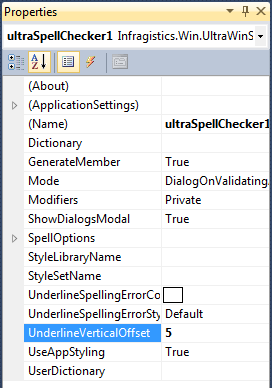

////

|metadata|
{
    "name": "winspellchecker-offsetting-the-spellchecker-underline",
    "controlName": [],
    "tags": [],
    "guid": "ca0adde1-104a-41a0-bd4e-3fdabd7007dc",  
    "buildFlags": [],
    "createdOn": "2014-01-29T04:53:42.3764167Z"
}
|metadata|
////

= Offsetting the SpellChecker Underline

== Topic Overview

=== Purpose

This topic explains how to adjust the offset of the spellchecked words’ underline that appears under the misspelled word.

=== Adjusting the Spellchecked Underline

The link:{ApiPlatform}win.ultrawinspellchecker{ApiVersion}~infragistics.win.ultrawinspellchecker.ultraspellchecker~underlineverticaloffset.html[UnderlineVerticalOffset] property accepts integer value (positive/negative) that allows setting the offset vertically for the underline of the misspelled word.

The following example demonstrates the SpellChecker underline adjustment with a property setting. The word “underlyne” is intentionally misspelled to demonstrate the feature by shifting the underline down.

[options="header", cols="a,a"]
|====
|_UnderlineVerticalOffset=0_   (default)| _UnderlineVerticalOffset=5_  

|image::images/Offsetting_the_SpellChecker_Underline_1.png[]
|image::images/Offsetting_the_SpellChecker_Underline_2.png[]

|====

=== Setting the Spellchecked Underline

Configuring the `UnderlineVerticalOffset` through property grid.

Configuring `UnderlineVerticalOffset` in code behind.

*In C#:*

[source,csharp]
----
ultraSpellChecker1.UnderlineVerticalOffset = 5;
----

*In Visual Basic:*

[source,vb]
----
ultraSpellChecker1.UnderlineVerticalOffset = 5
----

== Related Content

=== Topics

The following topics provide additional information related to this topic.

[options="header", cols="a,a"]
|====
|Topic|Purpose

| link:win-winspellchecker-using-winspellchecker.html[Using WinSpellChecker]
|Provides list of topics that contain short, task-based topics that explain how to perform specific tasks related to the _WinSpellChecker_ component.

|====