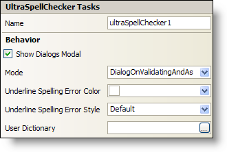

////

|metadata|
{
    "name": "winspellchecker-smart-tag",
    "controlName": ["WinSpellChecker"],
    "tags": ["API","Design Environment"],
    "guid": "{95A8C7F0-30BE-4FD7-88C2-CFE83EA3E5E8}",  
    "buildFlags": [],
    "createdOn": "0001-01-01T00:00:00Z"
}
|metadata|
////

= WinSpellChecker Smart Tag

In Visual Studio 2005 (.NET Framework 2.0), each Infragistics Windows Forms control/component is equipped with a Smart Tag. By simply selecting the control/component, a Smart Tag anchor appears. When you click this anchor, a pop-up panel appears, providing you with quick and easy access to the most common properties and settings of the control/component.

The WinSpellChecker™ Smart Tag contains the name of the control, as well as the following sections:

* Behavior -- Provides easy access to properties that govern how the control behaves on the form.

See below for a description of the item (e.g., field, drop-down list, checkbox) in each section, as well as the item's corresponding property in the properties grid.

[options="header", cols="a,a,a"]
|====
|Behavior|Description|Corresponding Property

|Show Dialogs Modal
|Check the checkbox to display the spell check dialog box modally.
| pick:[win-forms="link:{ApiPlatform}win.ultrawinspellchecker{ApiVersion}~infragistics.win.ultrawinspellchecker.ultraspellchecker~showdialogsmodal.html[ShowDialogsModal]"] 

|Mode
|Choose between several modes of operation from spell checking the document as the end user types to spell checking a document upon validation.
| pick:[win-forms="link:{ApiPlatform}win.ultrawinspellchecker{ApiVersion}~infragistics.win.ultrawinspellchecker.ultraspellchecker~mode.html[Mode]"] 

|Underline Spelling Error Color
|Change the color of the red squiggle under misspelled words.
| pick:[win-forms="link:{ApiPlatform}win.ultrawinspellchecker{ApiVersion}~infragistics.win.ultrawinspellchecker.ultraspellchecker~underlinespellingerrorcolor.html[UnderlineSpellingErrorColor]"] 

|Underline Spelling Error Style
|Change the style of the red squiggle under misspelled words to singleline, doubleline, or none.
| pick:[win-forms="link:{ApiPlatform}win.ultrawinspellchecker{ApiVersion}~infragistics.win.ultrawinspellchecker.ultraspellchecker~underlinespellingerrorstyle.html[UnderlineSpellingErrorStyle]"] 

|User Dictionary
|Set the User Dictionary by clicking on the ellipsis to the right of the text box and selecting a dictionary file from the open file dialog box.
| pick:[win-forms="link:{ApiPlatform}win.ultrawinspellchecker{ApiVersion}~infragistics.win.ultrawinspellchecker.ultraspellchecker~userdictionary.html[UserDictionary]"] 

|====