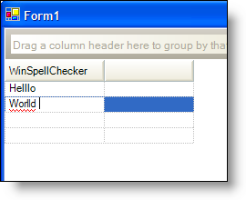

////

|metadata|
{
    "name": "winspellchecker-spell-check-a-cell-in-wingrid",
    "controlName": ["WinSpellChecker"],
    "tags": ["Grids","How Do I","Validation"],
    "guid": "{9D67854B-7837-450F-A33B-8B327BBE9A0F}",  
    "buildFlags": [],
    "createdOn": "0001-01-01T00:00:00Z"
}
|metadata|
////

= Spell Check a Cell in WinGrid

One of the several controls that WinSpellChecker™ supports is the WinGrid™ control. WinSpellChecker can check the spelling of any cell in WinGrid. You need to set the  pick:[win-forms="link:{ApiPlatform}win.ultrawingrid{ApiVersion}~infragistics.win.ultrawingrid.ultragridcolumn~spellchecker.html[SpellChecker]"]  extender property of the  pick:[win-forms="link:{ApiPlatform}win.ultrawingrid{ApiVersion}~infragistics.win.ultrawingrid.ultragridcolumn.html[UltraGridColumn]"]  to an instance of WinSpellChecker. Once set, WinSpellChecker will spell check any cells that are in edit mode. Set the WinSpellChecker component's  pick:[win-forms="link:{ApiPlatform}win.ultrawinspellchecker{ApiVersion}~infragistics.win.ultrawinspellchecker.ultraspellchecker~mode.html[Mode]"]  to AsYouType and a red squiggle will appear under a misspelled word in a cell that is in edit mode. Set WinSpellChecker's Mode to DialogOnValidating and the spell checker dialog box will appear when you leave a cell that contains a misspelled word.

.Note
[NOTE]
====
You will not see red squiggles under misspelled words unless the cell being spell checked is in edit mode. Only one cell in WinGrid can be in edit mode at a time; therefore, you will never see red squiggles in more than one cell at a time.
====

To spell check a cell in the first column of the first band of WinGrid, use the following code.

*In Visual Basic:*

----
Me.UltraGrid1.DisplayLayout.Bands(0).Columns(0).SpellChecker = _
  Me.ultraSpellChecker1
----

*In C#:*

----
this.ultraGrid1.DisplayLayout.Bands[0].Columns[0].SpellChecker = 
  this.ultraSpellChecker1;
----