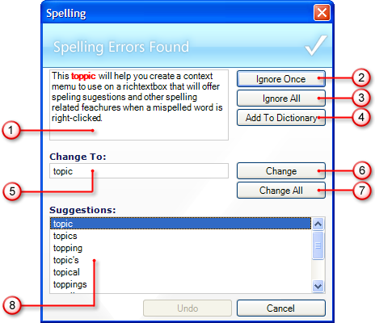

////

|metadata|
{
    "name": "winspellchecker-using-the-spell-checker-dialog",
    "controlName": ["WinSpellChecker"],
    "tags": ["Getting Started","Validation"],
    "guid": "{E2EF7BE1-8D9C-481C-92BA-D11E862BA398}",  
    "buildFlags": [],
    "createdOn": "0001-01-01T00:00:00Z"
}
|metadata|
////

= Using the Spell Checker Dialog

When spell checking a document, the end user will inevitably encounter the spell check dialog box. You can display this dialog box to the end user in several different ways. See link:winspellchecker-display-the-spell-checker-dialog-box.html[Display the Spell Check Dialog Box] for more information on how to display this dialog box to the end user.

The spell check dialog box has several useful options for dealing with misspelled words in a document. While WinSpellChecker™ is checking the spelling through the spell check dialog box, it will go through each misspelled word one at a time until all errors are ignored, added to the user dictionary, or corrected.

Below is an image of the spell check dialog box. The different parts of the dialog box are labeled and described in greater detail below.

[start=1]
. *Not in Dictionary* -- The text area here displays the misspelled word in red in its context (usually displaying the entire sentence).
[start=2]
. *Ignore Once* -- Clicking Ignore Once causes the spell checker to ignore this one instance of the misspelled word and continue on to the next misspelled word.
[start=3]
. *Ignore All* -- Ignore All ignores the current instance of the misspelled word as well as all future instances. Ignore All essentially "tricks" the spell checker into thinking the word is in the dictionary; however, the next time a spell check dialog box is opened, it will not remember these settings.
[start=4]
. *Add to Dictionary* -- Clicking Add to Dictionary will add the currently misspelled word to the user's dictionary. This button is only available when the  pick:[win-forms="link:{ApiPlatform}win.ultrawinspellchecker{ApiVersion}~infragistics.win.ultrawinspellchecker.ultraspellchecker~userdictionary.html[UserDictionary]"]  property is set.
[start=5]
. *Change To* -- If end users want to manually edit the misspelled word, they can enter a word to replace the misspelled word in this text box.
[start=6]
. *Change* -- Upon clicking this button, the misspelled word in the Not in Dictionary box will be replaced with the word in the Change To box. This will replace only the current instance of the word.
[start=7]
. *Change All* -- Clicking Change All will replace all occurrences of the misspelled word in the entire document to the word in the Change To box.
[start=8]
. *Suggestions* -- The list in the Suggestions box represents all of the possible words that the end user may have misspelled. Selecting one of these words will place it in the Change To box.