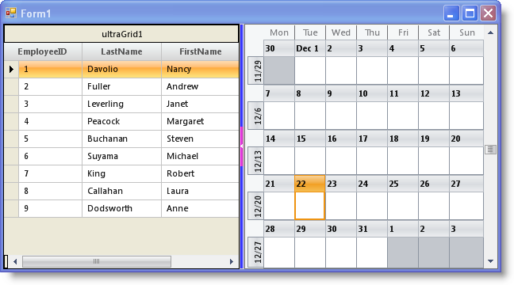
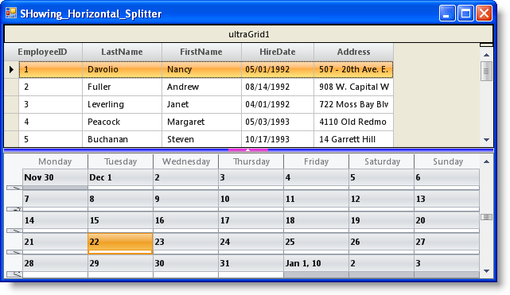

////

|metadata|
{
    "name": "winsplitter-adding-winsplitter-to-your-form",
    "controlName": ["WinSplitter"],
    "tags": [],
    "guid": "{63BA9539-B0B9-4DFD-8DF4-C2052923B203}",  
    "buildFlags": [],
    "createdOn": "2009-10-12T16:14:08Z"
}
|metadata|
////

= Adding WinSplitter to Your Form

== Before You Begin:

The WinSplitter™ control enables end users to resize controls that are docked to the edges of the WinSplitter at run time. End users can resize the docked control that is immediately before it in the docking order. Therefore, to enable resizing of a docked control, you must dock the control to an edge of a container, and then dock a WinSplitter control against the docked control towards the same side of the container.

== What you will accomplish:

This topic will demonstrate on how to add vertical and horizontal WinSplitter controls to a form and resize docked controls.

== Follow The Steps:

[start=1]
. Drag and drop an UltraGrid control onto the form and set its  pick:[win-forms="link:{ApiPlatform}win.misc{ApiVersion}~infragistics.win.misc.ultrasplitter~dock.html[Dock]"]  property to left. For this topic the UltraGrid control is bound to the Employees table of the Northwind database.
[start=2]
. Drag and drop an UltraSplitter control onto the form and set its Dock property to left.
[start=3]
. Drag and drop an UltraMonthViewSingle control onto the form and set its Dock property to left.

.Note
[NOTE]
====
In this case you will be able to resize only the UltraGrid control that is before the WinSplitter. In order to resize both UltraGrid and UltraMonthViewSingle controls, set the Dock property of UltraMonthViewSingle to fill.
====

[start=4]
. Now your form is set up to resize the controls with the vertical WinSplitter. In order to have a horizontal WinSplitter, drag and drop each control and set their Dock property to either top or bottom.
[start=5]
. The following code sets styling properties for the WinSplitter control, and for the collapse/restore button that is visible on the control.

*In Visual Basic:*

----
Me.ultraSplitter1.Appearance.BackColor = Color.Blue
Me.ultraSplitter1.ButtonExtent = 50
Me.ultraSplitter1.ButtonAppearance.BackColor = Color.Fuchsia
----

*In C#:*

----
this.ultraSplitter1.Appearance.BackColor = Color.Blue;
this.ultraSplitter1.ButtonExtent = 50;
this.ultraSplitter1.ButtonAppearance.BackColor = Color.Fuchsia;
----

[start=6]
. Run the application.

==== Form showing vertical WinSplitter

==== Form showing horizontal WinSplitter

== Related Topic

* link:winsplitter-using-winsplitter.html[Using WinSplitter]