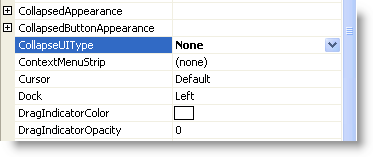

////

|metadata|
{
    "name": "winsplitter-collapse-restore-button-on-winsplitter",
    "controlName": ["WinSplitter"],
    "tags": [],
    "guid": "{EDAED122-2BD6-4727-80D1-F096A84BBE50}",  
    "buildFlags": [],
    "createdOn": "2009-10-12T16:24:18Z"
}
|metadata|
////

= Collapse/Restore Button on WinSplitter

WinSplitter™ enables end users to click and drag on the splitter bar to resize controls on the form. You can also collapse and restore using the collapse/Restore button available on the WinSplitter.

The button user interface on the WinSplitter control can be hidden by setting the  pick:[win-forms="link:{ApiPlatform}win.misc{ApiVersion}~infragistics.win.misc.ultrasplitter~collapseuitype.html[CollapseUIType]"]  property to None, either through code or the property window.

*In Visual Basic:*

----
Me.ultraSplitter1.CollapseUIType = Infragistics.Win.Misc.CollapseUIType.None
----

*In C#:*

----
this.ultraSplitter1.CollapseUIType = Infragistics.Win.Misc.CollapseUIType.None;
----

The WinSplitter control can be collapsed so that the control docked before WinSplitter has an extent of 0 and is not visible at run time. This can be accomplished using the control’s Collapsed property.

*In Visual Basic:*

----
Me.ultraSplitter1.Collapsed = True
----

*In C#:*

----
this.ultraSplitter1.Collapsed = true;
----

== Related Topic

* link:winsplitter-styling-winsplitter-and-collapse-restore-button.html[Styling WinSplitter and Collapse Restore Button] 