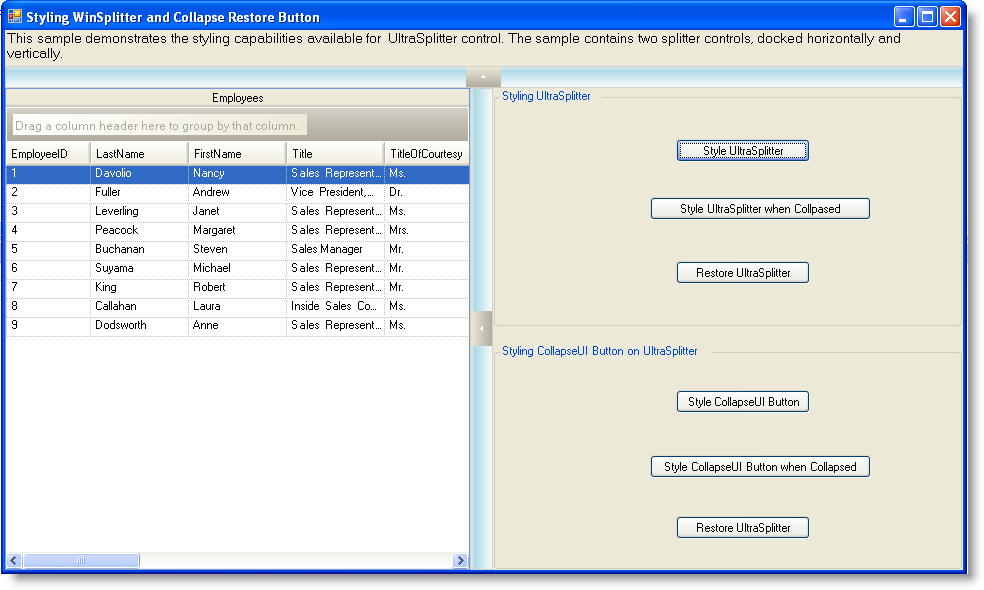
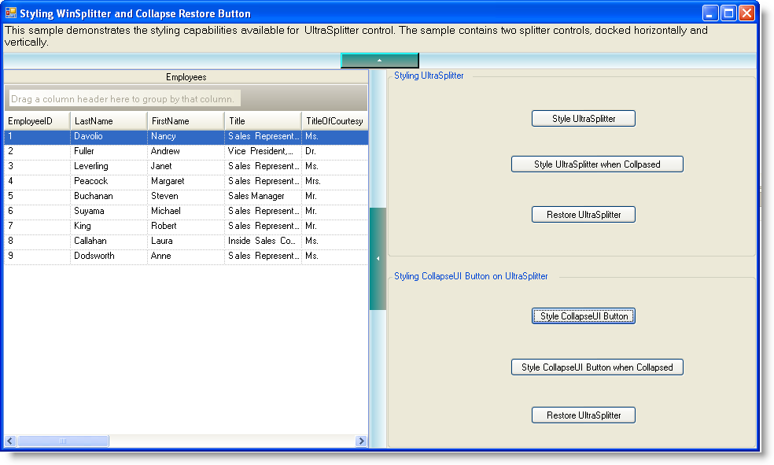

////

|metadata|
{
    "name": "winsplitter-styling-winsplitter-and-collapse-restore-button",
    "controlName": ["WinSplitter"],
    "tags": ["Styling"],
    "guid": "{06C27E6B-D252-4CC6-A62F-993B3A51FAE9}",  
    "buildFlags": [],
    "createdOn": "2009-10-12T16:26:33Z"
}
|metadata|
////

= Styling WinSplitter and Collapse Restore Button

You can style the WinSplitter™ control similar to styling all other Windows Forms controls using AppStyling as well as through the Appearance property settings. You can also style the collapse/Restore Button available on the WinSplitter.

This topic assumes that you have the following controls dropped onto your form in the order specified below:

1. Drop an UltraLabel and dock it to Top.

2. Drop an UltraSplitter and dock it to Top.

3. Drop an UltraGrid and dock it Left.

4. Drop an UltraSplitter and dock it Left.

4. Drop UltraPanel, set its Dock property to Left. UltraButtons used for this sample are dropped in a GroupBox within the Panel.

The following example code shows you the various styling options available for the WinSplitter control in normal state as well as when collapsed.

*In Visual Basic:*

----
#Region "Styling UltraSplitter"
Private Sub styleSplitter_Click(ByVal sender As Object, ByVal e As EventArgs) Handles styleSplitter.Click
' Set Back color for UltraSplitter
Me.UltraSplitter1.Appearance.BackColor = Color.LightBlue
Me.UltraSplitter2.Appearance.BackColor = Color.LightBlue
' Set Appearance for UltraSplitter when dragged
Me.UltraSplitter1.DragIndicatorColor = Color.Blue
Me.UltraSplitter2.DragIndicatorColor = Color.Blue
' Set Appearance when UltraSplitter is hot tracked
Me.UltraSplitter1.UseHotTracking = Infragistics.Win.DefaultableBoolean.[True]
Me.UltraSplitter1.HotTrackingAppearance.BackColor = Color.Green
Me.UltraSplitter2.UseHotTracking = Infragistics.Win.DefaultableBoolean.[True]
Me.UltraSplitter2.HotTrackingAppearance.BackColor = Color.Green
End Sub
#Region "Styling UltraSplitter when collapsed"
Private Sub splitterCollapsed_Click(ByVal sender As Object, ByVal e As EventArgs) Handles splitterCollapsed.Click
' Collpase Splitter control.
Me.UltraSplitter1.Collapsed = True
Me.UltraSplitter2.Collapsed = True
' Set Appearance for UltraSplitter when collapsed
Me.UltraSplitter1.CollapsedAppearance.BackColor = Color.Orange
Me.UltraSplitter2.CollapsedAppearance.BackColor = Color.Orange
End Sub
#End Region
#Region "Restore Splitter"
Private Sub restoreSplitter1_Click(ByVal sender As Object, ByVal e As EventArgs) Handles restoreSplitter1.Click
' Restore Splitter control
Me.UltraSplitter1.Collapsed = False
Me.UltraSplitter2.Collapsed = False
End Sub
#End Region
#End Region
----

*In C#:*

----
#region Styling UltraSplitter
private void styleSplitter_Click(object sender, EventArgs e)
{
// Set Back color for UltraSplitter
this.ultraSplitter1.Appearance.BackColor = Color.LightBlue;
this.ultraSplitter2.Appearance.BackColor = Color.LightBlue;
// Set Appearance for UltraSplitter when dragged
this.ultraSplitter1.DragIndicatorColor = Color.Blue;
this.ultraSplitter2.DragIndicatorColor = Color.Blue;
// Set Appearance when UltraSplitter is hot tracked
this.ultraSplitter1.UseHotTracking = Infragistics.Win.DefaultableBoolean.True;
this.ultraSplitter1.HotTrackingAppearance.BackColor = Color.Green;
this.ultraSplitter2.UseHotTracking = Infragistics.Win.DefaultableBoolean.True;
this.ultraSplitter2.HotTrackingAppearance.BackColor = Color.Green;
}
#region Styling UltraSplitter when Collapsed
private void splitterCollapsed_Click(object sender, EventArgs e)
{
// Collpase Splitter control.
this.ultraSplitter1.Collapsed = true;
this.ultraSplitter2.Collapsed = true;
// Set Appearance for UltraSplitter when collapsed
this.ultraSplitter1.CollapsedAppearance.BackColor = Color.Orange;
this.ultraSplitter2.CollapsedAppearance.BackColor = Color.Orange;
}
#endregion // Styling UltraSplitter when Collapsed
#region Restore Splitter
private void restoreSplitter1_Click(object sender, EventArgs e)
{
// Restore Splitter control
this.ultraSplitter1.Collapsed = false;
this.ultraSplitter2.Collapsed = false;
}
#endregion // Restore Splitter
#endregion //Styling UltraSplitter
----

=== The following screenshot shows UltraSplitter controls with Appearance objects set

*In Visual Basic:*

----
#Region "Styling CollapseUI Button on UltraSplitter"
----

----
Private Sub styleCollapseUI_Click(ByVal sender As Object, ByVal e As EventArgs) Handles styleCollapseUI.Click
' Set Back color for Collapse/Restore UI button on ultraSplitter
Me.UltraSplitter1.ButtonAppearance.BackColor = Color.DarkCyan
Me.UltraSplitter2.ButtonAppearance.BackColor = Color.DarkCyan
' Set Collapse/Restore buttons style
Me.UltraSplitter1.ButtonStyle = Infragistics.Win.UIElementButtonStyle.Button3D
Me.UltraSplitter2.ButtonStyle = Infragistics.Win.UIElementButtonStyle.Office2007RibbonButton
' Set Collpase/Restore button Extent
Me.UltraSplitter1.ButtonExtent = 100
Me.UltraSplitter2.ButtonExtent = 130
' Set Appearance when Collapse/Restore UI button is hot tracked
Me.UltraSplitter1.HotTrackingButtonAppearance.BackColor = Color.Green
Me.UltraSplitter2.HotTrackingButtonAppearance.BackColor = Color.Green
' Set Appearance when Collapse/Restore UI button is pressed
Me.UltraSplitter1.PressedButtonAppearance.BackColor = Color.Fuchsia
Me.UltraSplitter2.PressedButtonAppearance.BackColor = Color.Fuchsia
End Sub
----

----
#Region "Styling the Buttons when UltraSplitter is collapsed"
Private Sub collapsedUIButton_Click(ByVal sender As Object, ByVal e As EventArgs) Handles collapsedUIButton.Click
' Collpase Splitter control.
Me.UltraSplitter1.Collapsed = True
Me.UltraSplitter2.Collapsed = True
' Set Appearance for Collapse/Restore UI button, when collapsed
Me.UltraSplitter1.CollapsedButtonAppearance.BackColor = Color.Red
Me.UltraSplitter2.CollapsedButtonAppearance.BackColor = Color.Red
End Sub
#End Region
----

----
#Region "Restore Splitter"
Private Sub restoreSplitter2_Click(ByVal sender As Object, ByVal e As EventArgs) Handles restoreSplitter2.Click
' Restore Splitter control
Me.UltraSplitter1.Collapsed = False
Me.UltraSplitter2.Collapsed = False
End Sub
#End Region
----

----
#End Region
----

*In C#:*

----
#region Styling CollapseUI Button on UltraSplitter
private void styleCollapseUI_Click(object sender, EventArgs e)
{
// Set Back color for Collapse/Restore UI button on ultraSplitter
this.ultraSplitter1.ButtonAppearance.BackColor = Color.DarkCyan;
this.ultraSplitter2.ButtonAppearance.BackColor = Color.DarkCyan;
// Set Collapse/Restore buttons style
this.ultraSplitter1.ButtonStyle = Infragistics.Win.UIElementButtonStyle.Button3D;
this.ultraSplitter2.ButtonStyle = Infragistics.Win.UIElementButtonStyle.Office2007RibbonButton;
// Set Collpase/Restore button Extent
this.ultraSplitter1.ButtonExtent = 100;
this.ultraSplitter2.ButtonExtent = 130;
// Set Appearance when Collapse/Restore UI button is hot tracked
this.ultraSplitter1.HotTrackingButtonAppearance.BackColor = Color.Green;
this.ultraSplitter2.HotTrackingButtonAppearance.BackColor = Color.Green;
// Set Appearance when Collapse/Restore UI button is pressed
this.ultraSplitter1.PressedButtonAppearance.BackColor = Color.Fuchsia;
this.ultraSplitter2.PressedButtonAppearance.BackColor = Color.Fuchsia;
}
#region Styling Button when UltraSplitter is collapsed
private void collapsedUIButton_Click(object sender, EventArgs e)
{
// Collpase Splitter control.
this.ultraSplitter1.Collapsed = true;
this.ultraSplitter2.Collapsed = true;
// Set Appearance for Collapse/Restore UI button, when collapsed
this.ultraSplitter1.CollapsedButtonAppearance.BackColor = Color.Red;
this.ultraSplitter2.CollapsedButtonAppearance.BackColor = Color.Red;
}
#endregion // Styling Button when UltraSplitter is collapsed 
#region Restore UltraSplitter
private void restoreSplitter2_Click(object sender, EventArgs e)
{
// Restore Splitter control
this.ultraSplitter1.Collapsed = false;
this.ultraSplitter2.Collapsed = false;
}
#endregion // Restore UltraSplitter
#endregion //Styling CollapseUI Button on UltraSplitter
----

=== The following screenshot shows the UltraSplitter controls with Appearance objects set on collapse/Restore buttons

