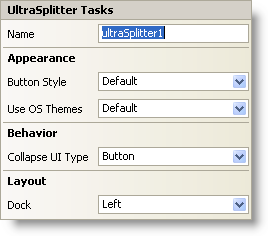

////

|metadata|
{
    "name": "winsplitter-winsplitter-smart-tag",
    "controlName": ["WinSplitter"],
    "tags": ["Design Environment"],
    "guid": "{7E291D2F-CD3D-46FF-B2D3-30BDF0B86063}",  
    "buildFlags": [],
    "createdOn": "2009-10-12T16:23:25Z"
}
|metadata|
////

= WinSplitter Smart Tag

In Visual Studio 2005/2008 (.NET Framework 2.0/3.5), each Infragistics Windows Forms control/component is equipped with a Smart Tag. By simply selecting the control/component, a Smart Tag anchor appears. When you click this anchor, a pop-up panel appears, providing you with quick and easy access to the most common properties and settings of the control/component.

The WinSplitter™ Smart Tag contains the name of the control, as well as the following sections:

* Appearance -- Provides common tasks involving the appearance, look, and feel of the control.
* Behavior -- Provides easy access to properties that govern how the control behaves on the form.
* Layout – Offer property that will determine where the control is placed on the form.

See below for a description of the item (e.g., field, drop-down list, checkbox) in each section, as well as the item's corresponding property in the properties grid.

[options="header", cols="a,a,a"]
|====
|Appearance|Description|Corresponding Property

|Button Style
|To apply or get the style of the button in WinSplitter
| pick:[win-forms="link:infragistics4.win.misc.v{ProductVersion}~infragistics.win.misc.ultrasplitter~buttonstyle.html[ButtonStyle]"] 

|Use OS Themes
|Choose if the control must render using Operating System theme.
| pick:[win-forms="link:{ApiPlatform}win.v{ProductVersion}~infragistics.win.ultracontrolbase~useosthemes.html[UseOSThemes]"] 

|====

[options="header", cols="a,a,a"]
|====
|Behavior|Description|Corresponding Property

|Collapse UI Type
|Assign the type of the user interface used to collapse/Restore the Splitter.
| pick:[win-forms="link:infragistics4.win.misc.v{ProductVersion}~infragistics.win.misc.ultrasplitter~collapseuitype.html[CollapseUIType]"] 

|====

[options="header", cols="a,a,a"]
|====
|Layout|Description|Corresponding Property

|Dock
|Choose to dock the control to the top, right, bottom, left, full, or none.
| pick:[win-forms="link:infragistics4.win.misc.v{ProductVersion}~infragistics.win.misc.ultrasplitter~dock.html[Dock]"] 

|====

