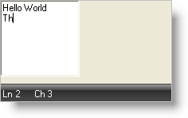

////

|metadata|
{
    "name": "winstatusbar-set-the-panel-style-to-characterposition",
    "controlName": ["WinStatusBar"],
    "tags": ["How Do I","Styling"],
    "guid": "{97F2399B-3DF5-4FAC-83AB-B2C00BBE6852}",  
    "buildFlags": [],
    "createdOn": "2005-07-07T00:00:00Z"
}
|metadata|
////

= Set the Panel Style to CharacterPosition

The WinStatusBar™ CharacterPostion style is a type of panel that will display the current line and character position of a control.

== Setting up CharacterPosition Style Panel at Design-Time

[start=1]
. Add an UltraStatusBar to your Windows Form.
[start=2]
. In the Property Pages scroll down to the Panels Property. Click the ellipsis to bring up the  pick:[win-forms="link:{ApiPlatform}win.ultrawinstatusbar{ApiVersion}~infragistics.win.ultrawinstatusbar.ultrastatuspanelscollection.html[Panels]"]  Collection.
[start=3]
. Click the "Add" button. This will add a new panel.
[start=4]
. Scroll the properties until you come to the  pick:[win-forms="link:{ApiPlatform}win.ultrawinstatusbar{ApiVersion}~infragistics.win.ultrawinstatusbar.ultrastatuspanel~style.html[Style]"]  property. Set the Style property equal to CharacterPosition.
[start=5]
. Set the Control property equal to the control that should be reflected by this panel. Any valid instantiated control will be displayed within this drop-down list.
[start=6]
. Click OK to close the window and you will see your CharacterPosition panel added to the status bar.

image::images\WinStatusBar_WinStatusBar_QuickTour_CharacterPosition_Panel_01.png[shows ultrastatusbar with characterposition style panel setup at design time]

== Setting up CharacterPosition Style Panel at Run-Time

*In Visual Basic:*

----
Imports Infragistics.Win.UltraWinStatusBar
...
Private Sub Set_the_Panel_Style_to_CharacterPosition_Load( _
  ByVal sender As System.Object, _
  ByVal e As System.EventArgs) Handles MyBase.Load
	' Create an instance of RichTextBox
	Dim myRichTextBox As New RichTextBox
	Me.Controls.Add(myRichTextBox)
	' Create new panel
	Dim myPanel As New UltraStatusPanel()
	' Set the style for the panel
	myPanel.Style = PanelStyle.CharacterPosition
	' Set the default text
	myPanel.Text = "CharacterPosition"
	' Add the panel to the element
	Me.UltraStatusBar1.Panels.Add(myPanel)
	' Designate the control whose character position will be reflected
	Me.UltraStatusBar1.Panels(0).Control = myRichTextBox
End Sub
----

*In C#:*

----
using Infragistics.Win.UltraWinStatusBar;
...
private void Set_the_Panel_Style_to_CharacterPosition_Load(object sender, 
  EventArgs e)
{
	// Create an instance of RichTextBox
	RichTextBox myRichTextBox = new RichTextBox();
	this.Controls.Add(myRichTextBox);
	// Create new panel
	UltraStatusPanel myPanel = new UltraStatusPanel();
	// Set the style for the panel
	myPanel.Style = PanelStyle.CharacterPosition;
	// Set the default text
	myPanel.Text = "CharacterPosition";
	// Add the panel to the element
	this.ultraStatusBar1.Panels.Add(myPanel);
	// Designate the control whose character position will be reflected
	this.ultraStatusBar1.Panels[0].Control = myRichTextBox;
}
----

