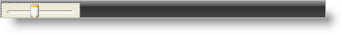

////

|metadata|
{
    "name": "winstatusbar-set-the-panel-style-to-controlcontainer",
    "controlName": ["WinStatusBar"],
    "tags": ["How Do I","Styling"],
    "guid": "{7394DA5B-569B-4061-93BD-B63BE1A7AD08}",  
    "buildFlags": [],
    "createdOn": "2005-07-07T00:00:00Z"
}
|metadata|
////

= Set the Panel Style to ControlContainer

The WinStatusBar™ mimics the behavior of the status bar in a web browser. When a panel is added to the UltraStatusBar with the ControlContainer style, almost any control can be incorporated within the status bar.

== Setting up ControlContainer Style Panel at Design-Time

[start=1]
. Add an UltraStatusBar and a TrackBar to your Windows Form. Select the UltraStatusBar.
[start=2]
. In the Property Pages scroll down to the Panels Property.
[start=3]
. Click the ellipsis to bring up the  pick:[win-forms="link:{ApiPlatform}win.ultrawinstatusbar{ApiVersion}~infragistics.win.ultrawinstatusbar.ultrastatuspanelscollection.html[Panels]"]  Collection.
[start=4]
. Click the "Add" button. This will add a new panel.
[start=5]
. Scroll the properties until you come to the  pick:[win-forms="link:{ApiPlatform}win.ultrawinstatusbar{ApiVersion}~infragistics.win.ultrawinstatusbar.ultrastatuspanel~style.html[Style]"]  property. Set the Style property equal to ControlContainer.
[start=6]
. Go to the Control property and click on the drop-down arrow. All instantiated controls on the form that can validly be added will be included within the drop-down. Select the "TrackBar1" control.
[start=7]
. Click OK to close the window and you will see your panel with the TrackBar in it added to the status bar.

== Setting up ControlContainer Style Panel at Run-Time

*In Visual Basic:*

----
Imports Infragistics.Win.UltraWinStatusBar
...
Private Sub Set_the_Panel_Style_to_ControlContainer_Load( _
  ByVal sender As System.Object, _
  ByVal e As System.EventArgs) Handles MyBase.Load
	' Create an instance of a TrackBar
	Dim myTrackBar As New TrackBar()
	Me.Controls.Add(myTrackBar)
	' Create new panel
	Dim myPanel As New UltraStatusPanel()
	' Set the style for the panel
	myPanel.Style = PanelStyle.ControlContainer
	' Assign the desired control to the Control property
	myPanel.Control = myTrackBar
	' Add the panel to the element
	Me.UltraStatusBar1.Panels.Add(myPanel)
End Sub
----

*In C#:*

----
using Infragistics.Win.UltraWinStatusBar;
...
private void Set_the_Panel_Style_to_ControlContainer_Load(object sender, EventArgs e)
{
	// Create an instance of a TrackBar
	TrackBar myTrackBar = new TrackBar();
	this.Controls.Add(myTrackBar);
	// Create new panel
	UltraStatusPanel myPanel = new UltraStatusPanel();
	// Set the style for the panel
	myPanel.Style = PanelStyle.ControlContainer;
	// Add the panel to the element
	myPanel.Control = myTrackBar;
	// Assign the desired control to the Control property
	this.ultraStatusBar1.Panels.Add(myPanel);
}
----

