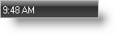

////

|metadata|
{
    "name": "winstatusbar-set-the-panel-style-to-time",
    "controlName": ["WinStatusBar"],
    "tags": ["How Do I","Styling"],
    "guid": "{85D5EEAB-9356-4AFF-A187-227CC21696E4}",  
    "buildFlags": [],
    "createdOn": "2005-07-07T00:00:00Z"
}
|metadata|
////

= Set the Panel Style to Time

The Time panel is used to display the current time. The format of the time display is determined by the  pick:[win-forms="link:{ApiPlatform}win.ultrawinstatusbar{ApiVersion}~infragistics.win.ultrawinstatusbar.ultrastatuspanel~datetimeformat.html[DateTimeFormat]"]  property of the Panel.

== Setting up Time Style Panel at Design-Time

[start=1]
. Add a UltraStatusBar to your Windows Form.
[start=2]
. In the Property Pages scroll down to the Panels Property. Click the ellipsis to bring up the  pick:[win-forms="link:{ApiPlatform}win.ultrawinstatusbar{ApiVersion}~infragistics.win.ultrawinstatusbar.ultrastatuspanelscollection.html[Panels]"]  Collection.
[start=3]
. Click the "Add" button. This will add a new panel.
[start=4]
. Set the  pick:[win-forms="link:{ApiPlatform}win.ultrawinstatusbar{ApiVersion}~infragistics.win.ultrawinstatusbar.ultrastatuspanel~style.html[Style]"]  of the panel to "Time". Click OK.

.Note
[NOTE]
====
The time appears in the panel you chose.
====

== Setting up Time Style Panel at Run-Time

To add a panel and set its type to "Time" at run-time, use the following line of code:

*In Visual Basic:*

----
Imports Infragistics.Win.UltraWinStatusBar
...
Private Sub Set_the_Panel_Style_to_Time_Load(ByVal sender As System.Object, _
  ByVal e As System.EventArgs) Handles MyBase.Load
	Me.UltraStatusBar1.Panels.Add("Time", PanelStyle.Time)
End Sub
----

*In C#:*

----
using Infragistics.Win.UltraWinStatusBar;
...
private void Set_the_Panel_Style_to_Time_Load(object sender, EventArgs e)
{
	this.ultraStatusBar1.Panels.Add("Time", PanelStyle.Time);
}
----

.Note
[NOTE]
====
There is also a Date panel that will display the current date.
====