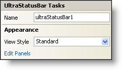

////

|metadata|
{
    "name": "winstatusbar-smart-tag",
    "controlName": ["WinStatusBar"],
    "tags": ["API","Design Environment"],
    "guid": "{BB18A552-CF6C-4360-8210-8BBE3B469DAD}",  
    "buildFlags": [],
    "createdOn": "0001-01-01T00:00:00Z"
}
|metadata|
////

= WinStatusBar Smart Tag

In Visual Studio 2005 (.NET Framework 2.0), each Infragistics Windows Forms control/component is equipped with a Smart Tag. By simply selecting the control/component, a Smart Tag anchor appears. When you click this anchor, a pop-up panel appears, providing you with quick and easy access to the most common properties and settings of the control/component.

The WinStatusBar™ Smart Tag contains the name of the control, as well as the following sections:

* Appearance -- Provides common tasks involving the appearance, look, and feel of the control.

See below for a description of the item (e.g., field, drop-down list, checkbox) in each section, as well as the item's corresponding property in the properties grid.

[options="header", cols="a,a,a"]
|====
|Appearance|Description|Corresponding Property

|View Style
|Change the look of the status bar to Office 2003, Visual Studio 2005, Office 2007.
| pick:[win-forms="link:{ApiPlatform}win.ultrawinstatusbar{ApiVersion}~infragistics.win.ultrawinstatusbar.ultrastatusbar~viewstyle.html[ViewStyle]"] 

|Edit Panels
|You can divide the status bar into separate panels, each giving the user certain information. Clicking Edit Panels will open the UltraStatusPanel collection editor and allow you to add or change panels.
| pick:[win-forms="link:{ApiPlatform}win.ultrawinstatusbar{ApiVersion}~infragistics.win.ultrawinstatusbar.ultrastatusbar~panels.html[Panels]"] 

|====