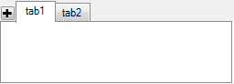

////

|metadata|
{
    "name": "wintab-adding-new-tab-button",
    "controlName": [],
    "tags": [],
    "guid": "493e9549-d935-4562-8376-a0997553b435",  
    "buildFlags": [],
    "createdOn": "2014-01-29T18:00:06.3524867Z"
}
|metadata|
////

= Adding New Tab Button

[[_Ref377392040]]
== Topic Overview

=== Purpose

This topic introduces the ability to allow users to add a new tab button at runtime on the  _WinTabStrip_   and  _WinTab_   controls.

=== In this topic

This topic contains the following sections:

* <<_Ref377462986,Adding New Tab Button>>

** <<_Ref377462993,Introduction>>
** <<_Ref377463001,Enabling new tab button location>>
** <<_Ref377463007,Events>>
** <<_Ref377463015,Styling>>

* <<_Ref370929790,Related Content>>

[[_Ref377462986]]
== Adding New Tab Button

[[_Ref377462993]]

=== Introduction

Similar to the tabs found on contemporary browsers, this feature allows the user to add new tabs while the application is up and running. To configure this feature both the  _WinTabStrip_   and  _WinTab_   controls exposes the link:{ApiPlatform}win{ApiVersion}~infragistics.win.ultrawintabs.newtabbuttonlocation.html[NewTabButtonLocation] property.

The `NewTabButtonLocation` property has three option settings:

[options="header", cols="a,a"]
|====
|Option|Description

| _None_ 
|No new tab button is set to be visible (Default). 

| _End_ 
|New tab button is added at the end of the tabs. 

| _Start_ 
|New tab button is added at the beginning of the tabs. 

| _AfterTabs_ 
|New tab button is added after the last tab. 

|====

[[_Ref376430820]]

=== Enabling new tab button location

The `NewTabButtonLocation` property can be set using either the Visual Studio designer or in code.

An example of configuring the new tab button location in code behind.

*In C#:*

[source,csharp]
----
ultraTabControl1.NewTabButtonLocation = NewTabButtonLocation.AfterTabs;
----

*In Visual Basic:*

[source,vb]
----
ultraTabControl1.NewTabButtonLocation = NewTabButtonLocation.AfterTabs
----

[[_Ref377463007]]

=== Events

The following events have been added to the link:{ApiPlatform}win.ultrawintabcontrol{ApiVersion}~infragistics.win.ultrawintabcontrol.ultratabcontrolbase_members.html[UltraTabControlBase] class.

[options="header", cols="a,a"]
|====
|Event|Description

| link:{ApiPlatform}win.ultrawintabcontrol{ApiVersion}~infragistics.win.ultrawintabcontrol.ultratabcontrolbase~beforenewtabbuttonclicked_ev.html[BeforeNewTabButtonClicked]
|This event allows you to disable the new tab from being added by handling the event and setting the *Cancel* property of the `EventArgs` argument to _True_ .

| link:{ApiPlatform}win.ultrawintabcontrol{ApiVersion}~infragistics.win.ultrawintabcontrol.ultratabcontrolbase~afternewtabbuttonclicked_ev.html[AfterNewTabButtonClicked]
|This event allows you to enable users to crate and populate the new tab by handling the event and referencing the *Tab* property of the `EventArgs` argument.

|====

[[_Ref377463015]]

=== Styling

The new tab button supports  _AppStylist_   by adding a new role called, `NewTabButton` to enable the styling of the new tab button’s appearance.

==== Related Topics

* link:styling-guide-setting-up-your-application-for-styling.html[Setting Up Your Application for Styling]

[[_Ref370929790]]
== Related Content

=== Topics

The following topic provides additional information related to this topic.

[options="header", cols="a,a"]
|====
|Topic|Purpose

| link:wintab-using-wintab-and-wintabstrip.html[Using WinTab and WinTabStrip]
|In this section, you'll find short, task-based topics that explain how to perform a specific task related to the _WinTab_ and _WinTabStrip_ controls.

|====