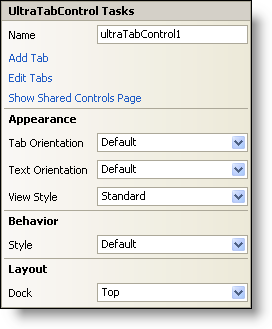

////

|metadata|
{
    "name": "wintab-smart-tag",
    "controlName": ["WinTab"],
    "tags": ["Getting Started"],
    "guid": "{DA9B0E5D-5A97-417D-9D02-351E60DE87B2}",  
    "buildFlags": [],
    "createdOn": "0001-01-01T00:00:00Z"
}
|metadata|
////

= WinTab Smart Tag

In Visual Studio 2005 (.NET Framework 2.0), each Infragistics Windows Forms control/component is equipped with a Smart Tag. By simply selecting the control/component, a Smart Tag anchor appears. When you click this anchor, a pop-up panel appears, providing you with quick and easy access to the most common properties and settings of the control/component.

The WinTab™ Smart Tag contains the name of the control, as well as the following sections:

* Appearance -- Provides common tasks involving the appearance, look, and feel of the control.
* Behavior -- Provides easy access to properties that govern how the control behaves on the form.
* Layout -- Offers properties that will determine where and how the control is placed on the form.

See below for a description of the item (e.g., field, drop-down list, checkbox) in each section, as well as the item's corresponding property in the properties grid.

[options="header", cols="a,a,a"]
|====
|Appearance|Description|Corresponding Property

|Tab Orientation
|Select from the drop-down where in the tab control you would like to display the tabs.
| pick:[win-forms="link:infragistics4.win.ultrawintabcontrol.v{ProductVersion}~infragistics.win.ultrawintabcontrol.ultratabcontrolbase~taborientation.html[TabOrientation]"] 

|Text Orientation
|Select from the drop-down how you would like to display the text on the tabs.
| pick:[win-forms="link:infragistics4.win.ultrawintabcontrol.v{ProductVersion}~infragistics.win.ultrawintabcontrol.ultratabcontrolbase~textorientation.html[TextOrientation]"] 

|View Style
|Change the style of the WinTabControl to make it look like Office 2003, Visual Studio 2005, Office 2007.
| pick:[win-forms="link:infragistics4.win.ultrawintabcontrol.v{ProductVersion}~infragistics.win.ultrawintabcontrol.ultratabcontrolbase~viewstyle.html[ViewStyle]"] 

|====

[options="header", cols="a,a,a"]
|====
|Behavior|Description|Corresponding Property

|Style
|Change the look of the tabs to Property Page, Visual Studio, Excel, Visual Studio 2005, and many more.
| pick:[win-forms="link:infragistics4.win.ultrawintabcontrol.v{ProductVersion}~infragistics.win.ultrawintabcontrol.ultratabcontrolbase~style.html[Style]"] 

|====

[options="header", cols="a,a,a"]
|====
|Layout|Description|Corresponding Property

|Dock
|Choose to dock the control to the top, right, bottom, left, full, or none. Inherited from System.Windows.Forms.Control.
|Dock

|====