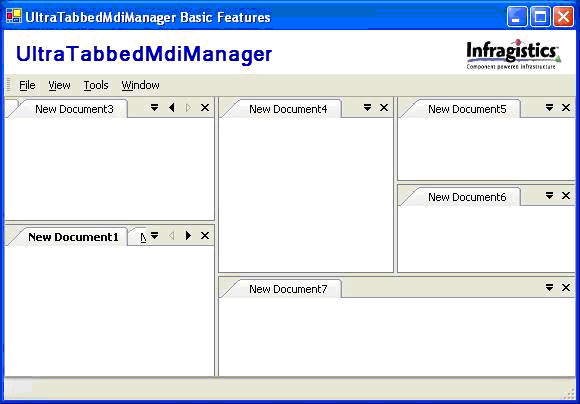
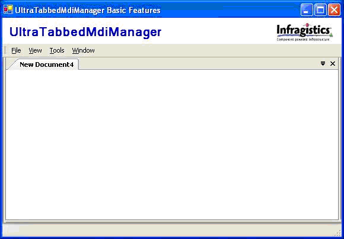

////

|metadata|
{
    "name": "wintabbedmdi-whats-new-2005-2",
    "controlName": [],
    "tags": [],
    "guid": "{B4EF6155-00FE-4AB6-BF61-3292F9B2F7A0}",  
    "buildFlags": [],
    "createdOn": "0001-01-01T00:00:00Z"
}
|metadata|
////

= WinTabbedMDI 2005.2

== Nested Tab Groups

The WinTabbedMdiManager™ layout functionality has been extended to allow the creation of nested groups. Each MdiTabGroup can either contain MdiTab items that represent the forms it contains or other MdiTabGroups thereby allowing for nested structure. This functionality can be enabled by setting the  pick:[win-forms="link:{ApiPlatform}win.ultrawintabbedmdi{ApiVersion}~infragistics.win.ultrawintabbedmdi.ultratabbedmdimanager~allownestedtabgroups.html[AllowNestedTabGroups]"]  property to true.

== Maximize MdiTabGroup

Depending upon the layout (whether determined by the end user or by the programmer), it is possible that the MDI child form does not have a lot of space available to display its child controls. The  pick:[win-forms="link:{ApiPlatform}win.ultrawintabbedmdi{ApiVersion}~infragistics.win.ultrawintabbedmdi.ultratabbedmdimanager~isactivetabgroupmaximized.html[IsActiveTabGroupMaximized]"]  property has been added to the WinTabbedMdiManager. When set to true, the MdiTabGroup containing the active tab will be maximized. When maximized, only the contents of the maximized tab group will be displayed. The  pick:[win-forms="link:{ApiPlatform}win.ultrawintabbedmdi{ApiVersion}~infragistics.win.ultrawintabbedmdi.ultratabbedmdimanager~maximizedtabgroupdisplaystyle.html[MaximizedTabGroupDisplayStyle]"]  is used to determine how the minimized tab groups will be displayed. When this is set to ShowMaximizedGroupOnly, there will be no visual indication that any other MdiTabGroups exist. When set to CompressUnmaximizedGroups (as seen in the image below), only the splitter bars of some panes will be displayed.

An  pick:[win-forms="link:{ApiPlatform}win.ultrawintabbedmdi{ApiVersion}~infragistics.win.ultrawintabbedmdi.ultratabbedmdimanager~allowmaximize.html[AllowMaximize]"]  property has been added to determine whether the user may change the IsActiveTabGroupMaximized property. When set to true, the context menus for tabs in that group will include an additional checkable menu option - Maximize.

== TabActivated Events

A new event,  pick:[win-forms="link:{ApiPlatform}win.ultrawintabbedmdi{ApiVersion}~infragistics.win.ultrawintabbedmdi.ultratabbedmdimanager~tabactivated_ev.html[TabActivated]"] , has been added to the WinTabbedMdiManager. This event is invoked whenever the active tab - the tab that represents the active mdi child - has been changed.