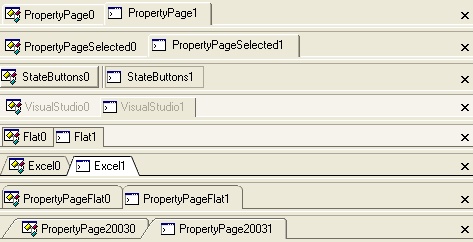
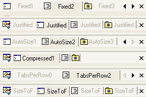

////

|metadata|
{
    "name": "wintabbedmdimanager-defining-the-appearance-of-tabs",
    "controlName": ["WinTabbedMdiManager"],
    "tags": ["Styling"],
    "guid": "{1326D92A-79BE-49CB-BC9D-93EE71733D2A}",  
    "buildFlags": [],
    "createdOn": "2005-07-07T00:00:00Z"
}
|metadata|
////

= Defining the Appearance of Tabs

The WinTabbedMdiManager™ component exposes many properties to control the location, size and appearance of the tab items. The properties that can be set for all tabs in a tab group (e.g. TabStyle, TabHeight, etc.) can either be set using the specific  pick:[win-forms="link:{ApiPlatform}win.ultrawintabbedmdi{ApiVersion}~infragistics.win.ultrawintabbedmdi.mditabgroup~settings.html[MdiTabGroup's Settings]"]  or for all tab groups using the element's  pick:[win-forms="link:{ApiPlatform}win.ultrawintabbedmdi{ApiVersion}~infragistics.win.ultrawintabbedmdi.mditabgroupsettings.html[GroupSettings]"]  property. Properties that be set for each tab (e.g. AllowDrag, appearances, etc.) may be set using the MdiTab's  pick:[win-forms="link:{ApiPlatform}win.ultrawintabbedmdi{ApiVersion}~infragistics.win.ultrawintabbedmdi.mditab~settings.html[Settings]"]  property, for all tabs in a tab group using the MdiTabGroup's  pick:[win-forms="link:{ApiPlatform}win.ultrawintabbedmdi{ApiVersion}~infragistics.win.ultrawintabbedmdi.mditabgroup~tabsettings.html[TabSettings]"] , or for all tabs using the element's TabSettings property.

== Tab Styles

The TabStyle property of the MdiTabGroupSettings object allows you to control the overall appearance and borders of the tab items in an MdiTabGroup.

* 'PropertyPage' - Standard property page / options dialog style tabs with 3D rounded edge borders.
* 'PropertyPageSelected' - Similar to property page but only the selected tab displays a border. If HotTrack is enabled, the tab under the mouse will also display a border around the tabs.
* 'VisualStudio' - This style is similar to that of Visual Studio.
* 'State Buttons' - Each tab is represented by a button. The ShowButtonSeparators property can be used to display a separator line between the tab buttons. The TabButtonStyle property may be used to control the appearance of the tab button borders.
* 'Excel' - Notched excel workbook style tabs.
* 'Flat' - Single pixel borders around the tabs.
* 'PropertyPageFlat' - Single pixel property page style borders with rounded edges.
* 'PropertyPage2003' - Two pixel border with a sloped leading edge and rounded trailing edge.
* 'Wizard' - No tabs are displayed. The available area is used by the forms and splitter bars for each tab group.

== Tab Sizing

The TabSizing property of the MdiTabGroupSettings object provides control over the extent of the tab items. The default extent for a tab is based on the size of its text and image. The height of the tab may either be automatically calculated or can be overridden using the TabHeight property.

* 'Fixed' - Fixed width tabs. By default tabs are auto-sized based on the text and image but the width of the tab may be specified using the TabWidth property of the MdiTabSettings object.
* 'Justified' - The tabs are sized up to the size required to display the text and image. If there is not enough room to display all the tabs, the tabs are reduced so that all the tabs are displayed within the visible area.
* 'AutoSize' - The tabs are sized based on the text and image.
* 'Compressed' - This style is similar to that seen in the unpinned windows in Visual Studio. The unselected tabs display only their image. The selected tab displays both the image and text.
* 'TabsPerRow' - The tabs are sized so that each is given a portion of the available space. For example, a TabsPerRow value of 4 will mean that each tab will be 1/4 of the available area.
* 'SizeToFit' - The tabs are sized based on the text and image. The tabs are then expanded or reduced so that all the tabs combine to use all of the available space.

== Tab Layout

*  pick:[win-forms="link:{ApiPlatform}win.ultrawintabbedmdi{ApiVersion}~infragistics.win.ultrawintabbedmdi.mditabgroupsettings~taborientation.html[TabOrientation]"]  - The TabOrientation property of the MdiTabGroupSettings can be used to control the orientation of the tabs with respect to the forms that they represent.
* link:{ApiPlatform}win.ultrawintabbedmdi{ApiVersion}~infragistics.win.ultrawintabbedmdi.mditabgroupsettings~textorientation.html[ pick:[win-forms="TextOrientation"] ] - This property can be used to control the orientation of the text. The text may be oriented based on the TabOrientation or set to an absolute orientation.
*  pick:[win-forms="link:{ApiPlatform}win.ultrawintabbedmdi{ApiVersion}~infragistics.win.ultrawintabbedmdi.mditabgroupsettingsresolved~intertabspacing.html[InterTabSpacing]"]  - This property allows you to control the amount of space or overlap between tab items.
*  pick:[win-forms="link:{ApiPlatform}win.ultrawintabbedmdi{ApiVersion}~infragistics.win.ultrawintabbedmdi.mditabgroupsettingsresolved~maxtabwidth.html[MaxTabWidth]"]  and  pick:[win-forms="link:{ApiPlatform}win.ultrawintabbedmdi{ApiVersion}~infragistics.win.ultrawintabbedmdi.mditabgroupsettingsresolved~mintabwidth.html[MinTabWidth]"]  - You can use the MaxTabWidth and MinTabWidth properties to restrict the size of the tab while still allowing the tab width to be calculated automatically based on the image and text.
*  pick:[win-forms="link:{ApiPlatform}win.ultrawintabbedmdi{ApiVersion}~infragistics.win.ultrawintabbedmdi.mditabgroupsettingsresolved~tabpadding.html[TabPadding]"]  - The TabPadding determines the amount of space between the borders and the contents (i.e. text and image) of the tab items.
* *Fixed*  pick:[win-forms="link:{ApiPlatform}win.ultrawintabbedmdi{ApiVersion}~infragistics.win.ultrawintabbedmdi.mditabsettings~tabwidth.html[TabWidth]"]  and  pick:[win-forms="link:{ApiPlatform}win.ultrawintabbedmdi{ApiVersion}~infragistics.win.ultrawintabbedmdi.mditabgroupsettings~tabheight.html[TabHeight]"]  - The TabWidth and TabHeight properties allow the extent and height of the tab items to be controlled absolutely. The TabWidth is only honored with certain tab styles.

== Scroll Buttons

The UltraTabbedMdiManager can display scroll buttons to allow the user to navigate to tab items not currently in view. It includes several properties to control when the scroll buttons are displayed and which ones will be displayed:

* The  pick:[win-forms="link:{ApiPlatform}win.ultrawintabbedmdi{ApiVersion}~infragistics.win.ultrawintabbedmdi.mditabgroupsettingsresolved~scrollbuttons.html[ScrollButtons]"]  property is used to determine when scroll buttons should be displayed. They may always be visible - even when not needed - or they may be hidden. By default, scroll buttons only appear when there is not enough room to display all the tab items.
* The  pick:[win-forms="link:{ApiPlatform}win.ultrawintabbedmdi{ApiVersion}~infragistics.win.ultrawintabbedmdi.mditabgroupsettingsresolved~scrollbuttontypes.html[ScrollButtonTypes]"]  property can be used to determine which scroll buttons will be displayed. By default, only the next and previous item scroll buttons will be displayed.
* When the  pick:[win-forms="link:{ApiPlatform}win.ultrawintabbedmdi{ApiVersion}~infragistics.win.ultrawintabbedmdi.mditabgroupsettingsresolved~scrollbuttontypes.html[ScrollButtonTypes]"]  includes the Thumb, a scroll track is displayed. The ScrollTrackExtent can be used to control the length of the scroll track.

The UltraTabbedMdiManager also includes several properties for controlling the appearance of the scroll buttons:

*  pick:[win-forms="link:{ApiPlatform}win.ultrawintabbedmdi{ApiVersion}~infragistics.win.ultrawintabbedmdi.mditabgroupsettings~scrollarrowstyle.html[ScrollArrowStyle]"]  - The ScrollArrowStyle property determines the type of scroll arrow displayed in the scroll buttons.
*  pick:[win-forms="link:{ApiPlatform}win.ultrawintabbedmdi{ApiVersion}~infragistics.win.ultrawintabbedmdi.mditabgroupsettingsresolved~buttonstyle.html[ButtonStyle]"]  - The ButtonStyle property determines the border style of the close and scroll buttons.
*  pick:[win-forms="link:{ApiPlatform}win.ultrawintabbedmdi{ApiVersion}~infragistics.win.ultrawintabbedmdi.mditabgroupsettings~scrollbuttonappearance.html[ScrollButtonAppearance]"]  - The ScrollButtonAppearance determines the colors used used when rendering the scroll buttons.

.Note
[NOTE]
====
When running on Windows XP with SupportThemes set to true, the appearance may be overridden by the theme appearance information.
====

== Close Button

A close button may be displayed in each tab group to allow the user to close or hide the selected tab in the tab group. There are several properties for controlling the appearance and behavior of the close button:

*  pick:[win-forms="link:{ApiPlatform}win.ultrawintabbedmdi{ApiVersion}~infragistics.win.ultrawintabbedmdi.mditabgroupsettings~closebuttonlocation.html[CloseButtonLocation]"]  - The CloseButtonLocation property determines the location of the close button. If set to None the close button will not be shown.
*  pick:[win-forms="link:{ApiPlatform}win.ultrawintabbedmdi{ApiVersion}~infragistics.win.ultrawintabbedmdi.mditabsettings~allowclose.html[AllowClose]"]  - The AllowClose property determines whether a tab may be closed. When the selected tab cannot be closed, the close button will appear disabled and the 'Close' menu option on the context menu that is displayed for the tab will be removed.
*  pick:[win-forms="link:{ApiPlatform}win.ultrawintabbedmdi{ApiVersion}~infragistics.win.ultrawintabbedmdi.mditabsettings~tabcloseaction.html[TabCloseAction]"]  - The TabCloseAction property determines what action is taken on the associated form when the close button is clicked. By default, the Close method of the associated form is invoked.
*  pick:[win-forms="link:{ApiPlatform}win.ultrawintabbedmdi{ApiVersion}~infragistics.win.ultrawintabbedmdi.mditabgroupsettings~buttonstyle.html[ButtonStyle]"]  - The ButtonStyle property the appearance of the close button.
*  pick:[win-forms="link:{ApiPlatform}win.ultrawintabbedmdi{ApiVersion}~infragistics.win.ultrawintabbedmdi.mditabgroupsettings~closebuttonappearance.html[CloseButtonAppearance]"]  - The CloseButtonAppearance property determines the colors used when rendering the close button.

.Note
[NOTE]
====
When running on Windows XP with SupportThemes set to true, the style and appearance of the close button may be overridden by the theme appearance information.
====

== Splitter Bar

Each tab group except the last tab group has a splitter bar that may be used to adjust the Extent of the tab group. The SplitterWidth determines the thickness of the splitter bar. The SplitterBorderStyle property determines the border style used to render the splitter. The back and border colors can be controlled using the SplitterAppearance property.

== General Appearance

*  pick:[win-forms="link:{ApiPlatform}win.ultrawintabbedmdi{ApiVersion}~infragistics.win.ultrawintabbedmdi.mditabsettings~hottrack.html[HotTrack]"]  - This property affects the display of the tab under the mouse. By default, hot tracking is disabled. When enabled, the HotTrackAppearance is used to resolve the appearance of the tab. When no forecolor appearance information has been specified, the default behavior is to alter the ForeColor of the tab. When the tab style is set to PropertyPageSelected, this also causes the border of the tab under the mouse to be displayed.
*  pick:[win-forms="link:{ApiPlatform}win.ultrawintabbedmdi{ApiVersion}~infragistics.win.ultrawintabbedmdi.mditabgroupsettings~showbuttonseparators.html[ShowButtonSeparators]"]  - This property determines whether a separator line is rendered between StateButton style tabs. Note that the InterTabSpacing must be greater than 0 to display the separator.
*  pick:[win-forms="link:{ApiPlatform}win.ultrawintabbedmdi{ApiVersion}~infragistics.win.ultrawintabbedmdi.mditabsettings~displayformicon.html[DisplayFormIcon]"]  - This property determines whether the icon of the form associated with the tab is used as the tab image when no other image has been specified in the appearance properties. By default, the form's icon property is not used.
*  pick:[win-forms="link:{ApiPlatform}win.ultrawintabbedmdi{ApiVersion}~infragistics.win.ultrawintabbedmdi.ultratabbedmdimanager~usemnemonics.html[UseMnemonics]"]  - This property determines whether an "&" character preceding another character is interpreted as a mnemonic. If UseMnemonic is set to true and the mnemonic sequence is pressed, the tab with the mnemonic will be activated.
*  pick:[win-forms="link:{ApiPlatform}win.ultrawintabbedmdi{ApiVersion}~infragistics.win.ultrawintabbedmdi.ultratabbedmdimanager~imagesize.html[ImageSize]"]  - This property determines the size of the images displayed in the tabs.
*  pick:[win-forms="link:{ApiPlatform}win.ultrawintabbedmdi{ApiVersion}~infragistics.win.ultrawintabbedmdi.ultratabbedmdimanager~imagetransparentcolor.html[ImageTransparentColor]"]  - The ImageTransparentColor property determines the color that is interpreted as transparent when rendering the tab images.

== Behavior

* link:{ApiPlatform}win.ultrawintabbedmdi{ApiVersion}~infragistics.win.ultrawintabbedmdi.mditabgroupsettings~autoselect.html[ pick:[win-forms="AutoSelect"] ] - Tabs can be automatically selected after a specified duration (AutoSelectDelay) when the  pick:[win-forms="link:{ApiPlatform}win.ultrawintabbedmdi{ApiVersion}~infragistics.win.ultrawintabbedmdi.mditabgroupsettings~autoselect.html[AutoSelect]"]  property resolves to true.
*  pick:[win-forms="link:{ApiPlatform}win.ultrawintabbedmdi{ApiVersion}~infragistics.win.ultrawintabbedmdi.ultratabbedmdimanager~showtooltips.html[ShowToolTips]"]  - When ShowToolTips is set to true (the default value), tooltips are displayed when there is not enough room to display the text for the tab item or when the ToolTip property of the tab is explicitly set.
*  pick:[win-forms="link:{ApiPlatform}win.ultrawintabbedmdi{ApiVersion}~infragistics.win.ultrawintabbedmdi.ultratabbedmdimanager~maxtabgroups.html[MaxTabGroups]"]  - The MaxTabGroups property determines the maximum number of TabGroups that may be created. Attempting to create an additional tab group will result in an exception.
*  pick:[win-forms="link:{ApiPlatform}win.ultrawintabbedmdi{ApiVersion}~infragistics.win.ultrawintabbedmdi.ultratabbedmdimanager~allowverticaltabgroups.html[AllowVerticalTabGroups]"]  and  pick:[win-forms="link:{ApiPlatform}win.ultrawintabbedmdi{ApiVersion}~infragistics.win.ultrawintabbedmdi.ultratabbedmdimanager~allowhorizontaltabgroups.html[AllowHorizontalTabGroups]"]  - These properties are used to determine when the end user may create new horizontal or vertical tab groups via dragging a tab or using the context menu displayed when right clicking on a tab. Note, all tab groups must be in the same orientation.