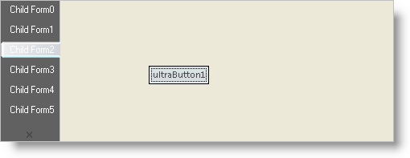

////

|metadata|
{
    "name": "wintabbedmdimanager-defining-the-orientaton-and-appearance-of-mdi-tabs",
    "controlName": ["WinTabbedMdiManager"],
    "tags": ["Styling"],
    "guid": "{60068420-9B55-4269-8658-3E338505045B}",  
    "buildFlags": [],
    "createdOn": "2005-07-07T00:00:00Z"
}
|metadata|
////

= Defining the Orientation and Appearance of MDI Tabs

You can change the way MDI tabs are oriented in them MDI client area. You can also control the appearance of the tabs through Appearance objects to match the look of the tabs to the overall look of your application.

== Questions

* How can I place the tabs at the side or at the bottom of the client area?
* How can I rotate the text on the tabs?
* How do I change the colors, fonts, etc. used by the tabs to match those used n the rest of my application?

== Solution

The first two of these goals may be accomplished through the TabGroupSettings property of the element and the TabGroupSettings object to which it provides access. Properties set on this object become the defaults for every TabGroup (and therefore every tab) in the element. However they can be overridden at the TabGroup level, so it is possible to have different TabGroups with different settings.

* Tab orientation can be changed using the TabOrientation property of the TabGroupSettings object.
* Orientation of the text on the tabs may be changed using the TextOrientation property of the TabGroupSettings object.
* Colors, fonts, transparency and other formatting attributes my be set through the Appearance object returned by the Appearance property of the element. This object specifies the default formatting that will apply to sub-objects in the element. (Since this is a non-visual element, the element itself has no formatting.) However, appearance settings may be overridden at a lower level of the hierarchy. In particular, the TabSettings object (accessible through the element's TabSettings property) has an Appearance property which specifies much of the formatting that applies to the tabs themselves. Also, various parts of the element may have their own settings. So for example, you can use the CloseButtonAppearance, ScrollButtonAppearance and TabAreaAppearance properties of the TabGroupSettings object to apply formatting to just the close button, scroll buttons and tab area of the tab groups.

== Sample Project

The following code will move the tabs to the left side of the client area at the top. When tabs are on either of the sides, by default the text is rotated to match the tab orientation. Instead, you will change the text orientation to keep it horizontal. Finally, you will change the text of the active (currently selected) tab to White.

[start=1]
. Before you start writing any code, you should place using/imports directives in your code-behind so you don't need to always type out a member's fully qualified name.

*In Visual Basic:*

----
Imports Infragistics.Win.UltraWinTabs
----

*In C#:*

----
using Infragistics.Win.UltraWinTabs;
----

[start=2]
. Enter the following code in the Load event of the form. This code should be entered before any code that is already in the Load event:

*In Visual Basic:*

----
Private Sub Defining_the_Orientaton_and_Appearance_of_MDI_Tabs_Load( _
  ByVal sender As System.Object, _
  ByVal e As System.EventArgs) Handles MyBase.Load
	' Put tabs on the left side at the top
	Me.UltraTabbedMdiManager1.TabGroupSettings.TabOrientation = _
	  TabOrientation.LeftTop
	' Keep text horizontal
	Me.UltraTabbedMdiManager1.TabGroupSettings.TextOrientation = _
	  TextOrientation.Horizontal
	' Change tab captions to White
	Me.UltraTabbedMdiManager1.TabSettings.TabAppearance.ForeColor = _
	  Color.White
End Sub
----

*In C#:*

----
private void Defining_the_Orientaton_and_Appearance_of_MDI_Tabs_Load(
  object sender, EventArgs e)
{
	// Put tabs on the left side at the top
	this.ultraTabbedMdiManager1.TabGroupSettings.TabOrientation = 
	  TabOrientation.LeftTop;
	// Keep text horizontal
	this.ultraTabbedMdiManager1.TabGroupSettings.TextOrientation = 
	  TextOrientation.Horizontal;
	// Change tab captions to White
	this.ultraTabbedMdiManager1.TabSettings.TabAppearance.ForeColor = 
	  Color.White;
}
----

== Review

In this exercise, you saw how to manipulate the orientation of the tabs and the text they contain. You also saw how to use specific Appearance objects to control the formatting of specific parts of the tabbed MDI interface.