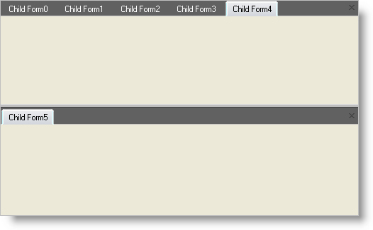

////

|metadata|
{
    "name": "wintabbedmdimanager-reposition-a-tab-within-tab-groups",
    "controlName": ["WinTabbedMdiManager"],
    "tags": [],
    "guid": "{CB007579-3EC2-469B-A068-FB5FD3F95725}",  
    "buildFlags": [],
    "createdOn": "2005-07-07T00:00:00Z"
}
|metadata|
////

= Reposition a Tab within Tab Groups

Tabbed windows displayed in the TabbedMDI interface always belong to a tab group. When there is only one tab group in use, the presence of tab groups will not be obvious, but by dragging or right-clicking on any tab, users of the application can quickly create and interact with tab groups.

Tab groups can be oriented either horizontally or vertically. (Note that the orientation of the tab groups is independent of the orientation of the tabs themselves. The two concepts are unrelated.) Tab group orientations are mutually exclusive - groups can be either horizontal or vertical, but both cannot coexist at the same time.

When there is only one tab group in the element, the user can specify the orientation of the second tab group at the time they create it. After the second tab group has been created, all later tab groups will share its orientation.

The Orientation property of the element specifies the orientation of new tab groups that are created programmatically at run-time. You can also use this property to determine the current orientation of the tab groups in the element. To constrain the user to a particular orientation, use the AllowHorizontalTabGroups and AllowVerticalTabGroups properties of the element.

Once multiple tab groups have been set up in the element, the user can reposition tabs by dragging them between groups. They can also right-click on a tab and choose to move it to the next or previous tab group, based on the location of the tab's current tab group. You can also re-arrange tabs at run-time by using the MoveToGroup and MoveToNewGroup methods of the Tab object.

Move a tab to a new group at run-time

[start=1]
. Click on the tab's header and drag it out of the tab header area, into the client area of the form. You will see a "dragging page" icon appear.

Move the mouse pointer close to any edge of the client area, the tab will snap to that edge, and an outline border will appear showing the position and orientation of the tab group that will be created when you release the mouse button. Release the mouse button to create a new tab group containing the tab in the indicated area.

OR

Move the mouse pointer to a neutral position within the client area. When you release the mouse button, a pop-up menu will appear prompting you for the orientation of the new tab group. Select the orientation you wish to use, and the new tab group will be created containing the tab you were dragging.

Moving a tab to a new group in code

*In Visual Basic:*

----
Private Sub Reposition_a_Tab_within_Tab_Groups_Load(ByVal sender As System.Object, _
  ByVal e As System.EventArgs) Handles MyBase.Load
	Dim i As Integer
	For i = 0 To 5
		Dim myForm As New ChildForm()
		myForm.MdiParent = Me
		myForm.Text = "Child Form" & i.ToString()
		myForm.Show()
	Next i
	' Set the orientation for the new tab group
	Me.UltraTabbedMdiManager1.Orientation = Orientation.Horizontal
	' Moves the currently active tab to a new tab group
	Me.UltraTabbedMdiManager1.ActiveTab.MoveToNewGroup()
End Sub
----

*In C#:*

----
private void Reposition_a_Tab_within_Tab_Groups_Load(object sender, EventArgs e)
{
	for(int i=0; i$$<=$$5; i++)
	{
		ChildForm myform = new ChildForm();
		myform.MdiParent = this;
		myform.Text = "Child Form" + i.ToString();
		myform.Show();
	}
	// Set the orientation for the new tab group
	this.ultraTabbedMdiManager1.Orientation = Orientation.Horizontal;
	// Moves the currently active tab to a new tab group
	this.ultraTabbedMdiManager1.ActiveTab.MoveToNewGroup();
}
----

