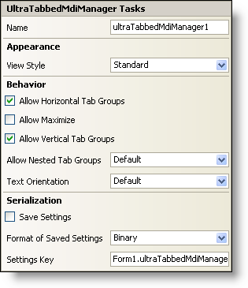

////

|metadata|
{
    "name": "wintabbedmdimanager-smart-tag",
    "controlName": ["WinTabbedMdiManager"],
    "tags": ["Design Environment"],
    "guid": "{C0BE1C43-5BDC-40E7-BD3D-FDDE9C277959}",  
    "buildFlags": [],
    "createdOn": "0001-01-01T00:00:00Z"
}
|metadata|
////

= WinTabbedMdiManager Smart Tag

In Visual Studio 2005 (.NET Framework 2.0), each Infragistics Windows Forms control/component is equipped with a Smart Tag. By simply selecting the control/component, a Smart Tag anchor appears. When you click this anchor, a pop-up panel appears, providing you with quick and easy access to the most common properties and settings of the control/component.

The WinTabbedMdiManager™ Smart Tag contains the name of the component, as well as the following sections:

* Appearance -- Provides common tasks involving the appearance, look, and feel of the control.
* Behavior -- Provides easy access to properties that govern how the control behaves on the form.
* Serialization -- Provides quick access to properties used in the IPersistComponentSettings interface.

See below for a description of the item (e.g., field, drop-down list, checkbox) in each section, as well as the item's corresponding property in the properties grid.

[options="header", cols="a,a,a"]
|====
|Appearance|Description|Corresponding Property

|View Style
|Change the style of the WinTabbedMdiManager to make it look like Office 2003, Visual Studio 2005, Office 2007.
| pick:[win-forms="link:{ApiPlatform}win.ultrawintabbedmdi{ApiVersion}~infragistics.win.ultrawintabbedmdi.ultratabbedmdimanager~viewstyle.html[ViewStyle]"] 

|====

[options="header", cols="a,a,a"]
|====
|Behavior|Description|Corresponding Property

|Allow Horizontal Tab 

Groups
|Select the check box to allow the user to create tab groups which span horizontally across the form.
| pick:[win-forms="link:{ApiPlatform}win.ultrawintabbedmdi{ApiVersion}~infragistics.win.ultrawintabbedmdi.ultratabbedmdimanager~allowhorizontaltabgroups.html[AllowHorizontalTabGroups]"] 

|Allow Maximize
|Selecting the check box will cause an additional option (Maximize) to show up on the tab context menu when the user right-clicks on a tab. The Maximize menu item is then used to toggle the IsActiveTabGroupMaximized property.
| pick:[win-forms="link:{ApiPlatform}win.ultrawintabbedmdi{ApiVersion}~infragistics.win.ultrawintabbedmdi.ultratabbedmdimanager~allowmaximize.html[AllowMaximize]"] 

|Allow Vertical Tab Groups
|Select the check box to allow the user to create tab groups which span vertically across the form.
| pick:[win-forms="link:{ApiPlatform}win.ultrawintabbedmdi{ApiVersion}~infragistics.win.ultrawintabbedmdi.ultratabbedmdimanager~allowverticaltabgroups.html[AllowVerticalTabGroups]"] 

|Allow Nested Tab Groups
|Selecting this check box will allow the user to create Mdi tab groups within other Mdi tab groups.
| pick:[win-forms="link:{ApiPlatform}win.ultrawintabbedmdi{ApiVersion}~infragistics.win.ultrawintabbedmdi.ultratabbedmdimanager~allownestedtabgroups.html[AllowNestedTabGroups]"] 

|Text Orientation
|Select from the drop-down how you would like the text of the tab displayed with respect to the orientation of the tabs. You can also change this property in the properties grid by setting the TextOrientation property under the link:{ApiPlatform}win.ultrawintabbedmdi{ApiVersion}~infragistics.win.ultrawintabbedmdi.mditabgroupsettings.html[TabGroupSettings] object.
| pick:[win-forms="link:{ApiPlatform}win.ultrawintabbedmdi{ApiVersion}~infragistics.win.ultrawintabbedmdi.mditabgroupsettings~textorientation.html[TextOrientation]"] 

|====

[options="header", cols="a,a,a"]
|====
|Serialization|Description|Corresponding Property

|Save Settings
|If you select this checkbox, the component will automatically load/save its property settings with the application's settings.
| pick:[win-forms="link:{ApiPlatform}win.ultrawintabbedmdi{ApiVersion}~infragistics.win.ultrawintabbedmdi.ultratabbedmdimanager~savesettings.html[SaveSettings]"] 

|Format of Saved Settings
|The component can save its settings in either binary or XML format.
| pick:[win-forms="link:{ApiPlatform}win.ultrawintabbedmdi{ApiVersion}~infragistics.win.ultrawintabbedmdi.ultratabbedmdimanager~savesettingsformat.html[SaveSettingsFormat]"] 

|Settings Key
|You can specify the settings key that will be used to uniquely identify the settings' values that will be loaded/saved. By default, Visual Studio 2005 sets the settings key value based on the name of the containing form/control and the name of the component.
| pick:[win-forms="link:{ApiPlatform}win.ultrawintabbedmdi{ApiVersion}~infragistics.win.ultrawintabbedmdi.ultratabbedmdimanager~settingskey.html[SettingsKey]"] 

|====