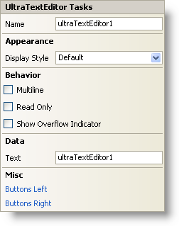

////

|metadata|
{
    "name": "wintexteditor-smart-tag",
    "controlName": ["WinTextEditor"],
    "tags": ["Design Environment"],
    "guid": "{50453B76-5F24-4742-9F7F-7A4276C3EE7F}",  
    "buildFlags": [],
    "createdOn": "2005-09-11T00:00:00Z"
}
|metadata|
////

= WinTextEditor Smart Tag

In Visual Studio 2005 (.NET Framework 2.0), each Infragistics Windows Forms control/component is equipped with a Smart Tag. By simply selecting the control/component, a Smart Tag anchor appears. When you click this anchor, a pop-up panel appears, providing you with quick and easy access to the most common properties and settings of the control/component.

The WinTextEditor™ Smart Tag contains the name of the control, as well as the following sections:

* Appearance -- Provides common tasks involving the appearance, look, and feel of the control.
* Behavior -- Provides easy access to properties that govern how the control behaves on the form.
* Data -- Refers to any underlying data the control is using such as data sources and data members.
* Misc -- Provides various options that will enhance the overall look or performance of the control.

See below for a description of the item (e.g., field, drop-down list, checkbox) in each section, as well as the item's corresponding property in the properties grid.

[options="header", cols="a,a,a"]
|====
|Appearance|Description|Corresponding Property

|Display Style
|Change the style of the WinTextEditor to make it look like Office 2000, Office XP, Office 2003, Visual Studio 2005, Office 2007.
| pick:[win-forms="link:{ApiPlatform}win.ultrawineditors.v{ProductVersion}~infragistics.win.ultrawineditors.texteditorcontrolbase~displaystyle.html[DisplayStyle]"] 

|====

[options="header", cols="a,a,a"]
|====
|Behavior|Description|Corresponding Property

|Multiline
|Check this checkbox to allow the WinTextEditor to have multiple lines of text in the control.
| pick:[win-forms="link:infragistics4.win.ultrawineditors.v{ProductVersion}~infragistics.win.ultrawineditors.ultratexteditor~multiline.html[Multiline]"] 

|Read Only
|Making the editor read only will prevent the user from being able to insert or change text.
| pick:[win-forms="link:infragistics4.win.ultrawineditors.v{ProductVersion}~infragistics.win.ultrawineditors.texteditorcontrolbase~readonly.html[ReadOnly]"] 

|Show Overflow Indicator
|When the Text property is too long to be seen in the editor, a small box with two right arrows shows up to indicate that there is more text.
| pick:[win-forms="link:infragistics4.win.ultrawineditors.v{ProductVersion}~infragistics.win.ultrawineditors.texteditorcontrolbase~showoverflowindicator.html[ShowOverflowIndicator]"] 

|====

[options="header", cols="a,a,a"]
|====
|Data|Description|Corresponding Property

|Text
|This is the text that will display in the WinTextEditor when first loaded on the form.
| pick:[win-forms="link:infragistics4.win.ultrawineditors.v{ProductVersion}~infragistics.win.ultrawineditors.texteditorcontrolbase~text.html[Text]"] 

|====

[options="header", cols="a,a,a"]
|====
|Misc|Description|Corresponding Property

|Buttons Left
|Click the ellipsis (...) to open the ButtonsLeft collection. This is a collection of custom buttons that can be placed on the left of the editor.
| pick:[win-forms="link:infragistics4.win.v{ProductVersion}~infragistics.win.ultrawineditors.editorbuttoncontrolbase~buttonsleft.html[ButtonsLeft]"] 

|Buttons Right
|Click the ellipsis (...) to open the ButtonsRight collection. This is a collection of custom buttons that can be placed on the right of the editor.
| pick:[win-forms="link:infragistics4.win.v{ProductVersion}~infragistics.win.ultrawineditors.editorbuttoncontrolbase~buttonsright.html[ButtonsRight]"] 

|====