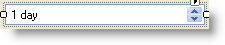

////

|metadata|
{
    "name": "wintimespaneditor-about-wintimespaneditor ",
    "controlName": ["WinTimeSpanEditor"],
    "tags": ["Editing","Getting Started"],
    "guid": "ef85b606-ad3d-4e9a-b14b-0cef65554309",  
    "buildFlags": [],
    "createdOn": "2010-06-03T20:15:57.976504Z"
}
|metadata|
////

= About WinTimeSpanEditor

The WinTimeSpanEditor™ control provides you with an editor to enter duration with any format you specify. A minimum and maximum value can be set and you can increment or decrement the time span values using the spin buttons. This editor control can be used as a stand-alone control or can be embedded within any control that supports embeddable editors (e.g., WinGrid, WinTree, WinSchedule controls). The WinTimeSpanEditor control derives from WinTextEditor™.

Following are some of the additional features for WinTimeSpanEditor:

* Appearance support – Full appearance support including alpha-blending, gradients, image, etc.
* Built-in theming – Supports Standard, Office 2000, Office XP, Office 2003, Visual Studio 2005, Office 2007 themes, WindowsVista, and ScenicRibbon.
* Ink-enabled – The user can switch between freeform ink input and virtual keyboard input.
* Overflow indicator -- A customizable text overflow indicator image with tooltip support for the full text.
* Null text – Display a custom string when the control's current value is null.

*Related Topics:*

link:wintimespaneditor-wintimespaneditor-smart-tag.html[WinTimeSpanEditor Smart Tag]

link:wintimespaneditor-setting-time-span-values.html[Setting Time Span Values]