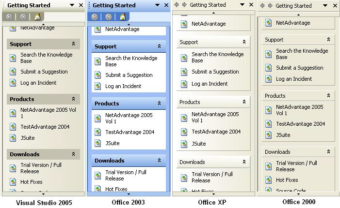

////

|metadata|
{
    "name": "wintoolbars-whats-new-2005-1",
    "controlName": [],
    "tags": [],
    "guid": "{3D672196-4F09-48C2-A836-AC9452E42305}",  
    "buildFlags": [],
    "createdOn": "0001-01-01T00:00:00Z"
}
|metadata|
////

= WinToolbars 2005.1

== BeforeToolDragBegin/AfterToolDragEnd Events

WinToolbarsManager™ has two new events -  pick:[win-forms="link:{ApiPlatform}win.ultrawintoolbars{ApiVersion}~infragistics.win.ultrawintoolbars.ultratoolbarsmanager~beforetooldragbegin_ev.html[BeforeToolDragBegin]"]  and  pick:[win-forms="link:{ApiPlatform}win.ultrawintoolbars{ApiVersion}~infragistics.win.ultrawintoolbars.ultratoolbarsmanager~aftertooldragend_ev.html[AfterToolDragEnd]"] . BeforeToolDragBegin is a cancellable event that is invoked before the drag operation for a tool has begun. AfterToolDragEnd is invoked after the drag operation is complete and indicates whether the tool was repositioned, copied, or removed. Note that AfterToolDragEnd is not invoked if the drag operation is cancelled (i.e., ESC is pressed during the drag).

== TaskPane

WinToolbarsManager now supports the ability to create Microsoft Office style task panes. The task pane is implemented as a derived UltraToolbar -  pick:[win-forms="link:{ApiPlatform}win.ultrawintoolbars{ApiVersion}~infragistics.win.ultrawintoolbars.ultrataskpanetoolbar.html[UltraTaskPaneToolbar]"]  - and therefore behaves much like a standard toolbar which may be dragged and displayed within a floating window. The tools collection of the UltraTaskPaneToolbar determines the list of items from which the end user can select. These tools may be selected using either a drop down menu or using the navigation buttons. The content area of the UltraTaskPaneToolbar is occupied by the Control associated with the selected TaskPaneTool.

WinTab™ and WinTabStrip™ have two new properties ( pick:[win-forms="link:{ApiPlatform}win.ultrawintabcontrol{ApiVersion}~infragistics.win.ultrawintabcontrol.ultratabcontrolbase~spacebeforetabs.html[SpaceBeforeTabs]"]  and  pick:[win-forms="link:{ApiPlatform}win.ultrawintabcontrol{ApiVersion}~infragistics.win.ultrawintabcontrol.ultratabcontrolbase~spaceaftertabs.html[SpaceAfterTabs]"] ) which can be used to control the amount of space between the tabs and the edge of the tab header area. In addition, WinTabbedMdiManager™

&trade;

includes these properties on the  pick:[win-forms="link:{ApiPlatform}win.ultrawintabbedmdi{ApiVersion}~infragistics.win.ultrawintabbedmdi.mditabgroupsettings.html[TabGroupSettings]"] .

== Related Topics

link:wintoolbarsmanager-working-with-the-taskpane-toolbar-and-tool.html[Working with the TaskPane Toolbar and Tool]

link:wintoolbarsmanager-working-with-dynamically-created-taskpane-toolbars.html[Working with Dynamically Created TaskPane Toolbars]