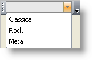

////

|metadata|
{
    "name": "wintoolbarsmanager-add-a-combobox-tool-with-a-valuelist",
    "controlName": ["WinToolbarsManager"],
    "tags": [],
    "guid": "{0453CC7B-0697-4306-BF8B-20729C075324}",  
    "buildFlags": [],
    "createdOn": "2005-07-07T00:00:00Z"
}
|metadata|
////

= Add a ComboBox Tool with a ValueList

WinToolbarsManager™ includes 15 different tool types that can be added to toolbars and menus. This topic demonstrates how to add a  pick:[win-forms="link:{ApiPlatform}win.ultrawintoolbars{ApiVersion}~infragistics.win.ultrawintoolbars.comboboxtool.html[ComboBoxTool]"]  to a toolbar and use a ValueList to populate the combo.

== At Design Time

[start=1]
. To configure the UltraWinToolbar element, open the design-time customizer by right-clicking on the UltraToolbarsManager element and selecting "Customize"
[start=2]
. To create a new Tool, click the "Tools" tab in the customizer, and then the "New..." button.
[start=3]
. Select ComboBox as your Tool Type and click on the Add button.
[start=4]
. Click the Close button to dismiss the New Tool dialog.
[start=5]
. To add values to the ValueList, expand the ValueList property and select the ValueListItems property. Then click the ellipsis button (the button with the '...' on it at the right edge of the property entry) to bring up the ValueListItems Collection Editor.
[start=6]
. Click the "Add" button to insert a value into the list.
[start=7]
. Click OK when you are finished adding this tool to dismiss the ValueListItems Collection Editor.
[start=8]
. Click the "ToolBars" tab in the customizer, and then the "New..." button.
[start=9]
. Change the toolbar name if you like and click OK to create the toolbar.
[start=10]
. Click the "Tools" tab and drag the ComboBox tool onto the toolbar on the form.

== At Run Time

*In Visual Basic:*

----
Imports Infragistics.Win.UltraWinToolbars
Imports Infragistics.Win
...
Private Sub Add_a_ComboBox_Tool_with_a_ValueList_Load( _
  ByVal sender As System.Object, _
  ByVal e As System.EventArgs) Handles MyBase.Load
	Dim comboboxtool As New ComboBoxTool("comboboxtool")
	' Creates a valuelist to be displayed in the ComboBox
	Dim valuelist1 As New ValueList()
	' Creates items associated to the ValueList
	Dim item1 As New ValueListItem()
	Dim item2 As New ValueListItem()
	Dim item3 As New ValueListItem()
	' Sets text for the Items
	item1.DisplayText = "Classical"
	item2.DisplayText = "Rock"
	item3.DisplayText = "Metal"
	' Adds the items to the ValueList
	valuelist1.ValueListItems.Add(item1)
	valuelist1.ValueListItems.Add(item2)
	valuelist1.ValueListItems.Add(item3)
	' Sets the ValueList of the ComboBox to the new ValueList created
	comboboxtool.ValueList = valuelist1
	' Add Tool to tools collection
	Me.UltraToolbarsManager1.Tools.Add(comboboxtool)
	' Add the tool to the toolbar's tools collection
	Me.UltraToolbarsManager1.Toolbars(0).Tools.Add(comboboxtool)
End Sub
----

*In C#:*

----
using Infragistics.Win.UltraWinToolbars;
using Infragistics.Win;
...
private void Add_a_ComboBox_Tool_with_a_ValueList_Load(object sender, EventArgs e)
{
	ComboBoxTool comboboxtool = new ComboBoxTool("comboboxtool");
	// Creates a valuelist to be displayed in the ComboBox
	ValueList valuelist1 = new ValueList();
	// Creates items associated to the ValueList
	ValueListItem  item1 = new ValueListItem();
	ValueListItem item2 = new ValueListItem();
	ValueListItem item3 = new ValueListItem();
	// Sets text for the Items
	item1.DisplayText = "Classical";
	item2.DisplayText = "Rock";
	item3.DisplayText = "Metal";
	// Adds the items to the ValueList
	valuelist1.ValueListItems.Add(item1);
	valuelist1.ValueListItems.Add(item2);
	valuelist1.ValueListItems.Add(item3);
	// Sets the ValueList of the ComboBox to the new ValueList created
	comboboxtool.ValueList = valuelist1;
	// Add Tool to tools collection
	this.ultraToolbarsManager1.Tools.Add(comboboxtool);
	// Add the tool to the toolbar's tools collection
	this.ultraToolbarsManager1.Toolbars[0].Tools.Add(comboboxtool);
}
----

