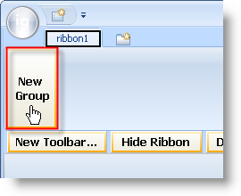

////

|metadata|
{
    "name": "wintoolbarsmanager-add-a-group-to-a-ribbon-tab",
    "controlName": ["WinToolbarsManager"],
    "tags": [],
    "guid": "{CF89BCFF-3914-4D27-ABEA-C452B2605C18}",  
    "buildFlags": [],
    "createdOn": "0001-01-01T00:00:00Z"
}
|metadata|
////

= Add a Group to a Ribbon Tab

{Warning}

The Ribbon's structure is built by creating tabs, and then placing groups inside those tabs, and placing tools inside those groups. The following diagram demonstrates this structural relationship:

image::images/WinToolbarsManager_Add_a_Tab_to_a_Ribbon_01.png[Image of Ribbon describing object relationships]

This topic discusses how you can add a group to a Ribbon tab. After the group has been added, you can then link:wintoolbarsmanager-add-a-tool-to-a-ribbon-group.html[add a tool to a ribbon group]. This topic assumes that you already have a tab on your Ribbon. If this is not the case, see link:wintoolbarsmanager-add-a-tab-to-the-ribbon.html[Add a Tab to the Ribbon] for more information.

You can add a group to a Ribbon tab either at design time or run time. At design time, make sure the WinToolbarsManager™ component is selected in the component tray and that the Show Ribbon button is clicked. If you already have a tab, you will see the New Group button. Click it to create a new group in the tab. Alternatively, you can add the following code to the FormLoad event.

*In Visual Basic:*

----
Imports Infragistics.Win.UltraWinToolbars
...
' Create a tab and add it to the Ribbon.
Dim homeTab As New RibbonTab("Home")
Me.UltraToolbarsManager1.Ribbon.Tabs.Add(homeTab)
' Create a group and add it to the tab.
Dim fontGroup As New RibbonGroup("Font")
Me.UltraToolbarsManager1.Ribbon.Tabs("Home").Groups.Add(fontGroup)
----

*In C#:*

----
using Infragistics.Win.UltraWinToolbars;
...
// Create a tab and add it to the Ribbon.
RibbonTab homeTab = new RibbonTab("Home");
this.ultraToolbarsManager1.Ribbon.Tabs.Add(homeTab);
// Create a group and add it to the tab.
RibbonGroup fontGroup = new RibbonGroup("Font");
this.ultraToolbarsManager1.Ribbon.Tabs["Home"].Groups.Add(fontGroup);
----