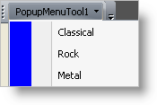

////

|metadata|
{
    "name": "wintoolbarsmanager-add-a-list-tool-to-a-toolbar",
    "controlName": ["WinToolbarsManager"],
    "tags": [],
    "guid": "{3B30C983-1913-4A99-AEA6-7D91AF8B7678}",  
    "buildFlags": [],
    "createdOn": "2005-07-07T00:00:00Z"
}
|metadata|
////

= Add a List Tool to a Toolbar

The WinToolbarsManager™ component has 15 different tool types that you can add to a  pick:[win-forms="link:{ApiPlatform}win.ultrawintoolbars{ApiVersion}~infragistics.win.ultrawintoolbars.ultratoolbar.html[ToolBar]"] . This demonstrates how to add a  pick:[win-forms="link:{ApiPlatform}win.ultrawintoolbars{ApiVersion}~infragistics.win.ultrawintoolbars.listtool.html[ListTool]"] design-time and run-time and highlights one of the major features of the Tool. Since a ListTool can display images when its StateButton is pressed and unpressed, you can use the ImageList control to store these images.

== At design-time:

[start=1]
. To configure the UltraWinToolbar element, open the design-time customizer by right-clicking on the UltraToolbarsManager element and selecting "Customize."
[start=2]
. To create a new Tool, click the "Tools" tab in the customizer, and then the "New..." button.
[start=3]
. Select Popup Menu as your Tool Type and click on the Add button.
[start=4]
. Select List Tool as your Tool Type and click on the Add button.
[start=5]
. To specify a side strip, expand the  pick:[win-forms="link:{ApiPlatform}win.ultrawintoolbars{ApiVersion}~infragistics.win.ultrawintoolbars.ultratoolbar~settings.html[Settings]"]  property of the  pick:[win-forms="link:{ApiPlatform}win.ultrawintoolbars{ApiVersion}~infragistics.win.ultrawintoolbars.popupmenutool.html[PopupMenu]"]  Tool and set  pick:[win-forms="link:{ApiPlatform}win.ultrawintoolbars{ApiVersion}~infragistics.win.ultrawintoolbars.menusettings~issidestripvisible.html[IsSideStripVisible]"]  to True. If you would like to customize the look of the side strip, you can set the properties of the  pick:[win-forms="link:{ApiPlatform}win.ultrawintoolbars{ApiVersion}~infragistics.win.ultrawintoolbars.menusettings~sidestripappearance.html[SideStripAppearance]"] .
[start=6]
. To add  pick:[win-forms="link:{ApiPlatform}win.ultrawintoolbars{ApiVersion}~infragistics.win.ultrawintoolbars.listtoolitem.html[ListToolItems]"] , click on the  pick:[win-forms="link:{ApiPlatform}win.ultrawintoolbars{ApiVersion}~infragistics.win.ultrawintoolbars.listtoolitemscollection.html[ListToolItems]"]  Collection of the List Tool. Select the Add button to Add a ListToolItem. Once you are finished adding ListToolItems, then click the OK button.
[start=7]
. Click the "ToolBars" tab in the customizer, and then the "New..." button.
[start=8]
. Click the "Tools" tab and drag the Popup Menu Tool to the ToolBar residing on the form.
[start=9]
. Drag the List Tool to the Popup Menu Tool.

== At run-time:

Use the following code:

*In Visual Basic:*

----
Imports Infragistics.Win
Imports Infragistics.Win.UltraWinToolbars
...
Private Sub Add_a_List_Tool_to_a_Toolbar_Load(ByVal sender As System.Object, _
  ByVal e As System.EventArgs) Handles MyBase.Load
	Dim popupmenutool As New PopupMenuTool("popupmenutool")
	popupmenutool.SharedProps.Caption = "PopupMenuTool1"
	Dim listtool As New ListTool("listtool")
	' Adds the tool to the Toolbar Manager's Tools collection
	Me.UltraToolbarsManager1.Tools.Add(popupmenutool)
	Me.UltraToolbarsManager1.Toolbars(0).Tools.Add(popupmenutool)
	Me.UltraToolbarsManager1.Tools.Add(listtool)
	Me.UltraToolbarsManager1.Toolbars(0).Tools.Add(listtool)
	' Adds items to the list
	listtool.ListToolItems.Add("Classical", "Classical")
	listtool.ListToolItems.Add("Rock", "Rock")
	listtool.ListToolItems.Add("Metal", "Metal")
	' Adds the List Tool to the Popup menu
	popupmenutool.Tools.AddTool("listtool")
	' Specifies a side strip for a menu
	popupmenutool.Settings.IsSideStripVisible = DefaultableBoolean.True
	popupmenutool.Settings.SideStripAppearance.BackColor = Color.Blue
End Sub
----

*In C#:*

----
using Infragistics.Win;
using Infragistics.Win.UltraWinToolbars;
...
private void Add_a_List_Tool_to_a_Toolbar_Load(object sender, EventArgs e)
{
	PopupMenuTool popupmenutool = new PopupMenuTool("popupmenutool");
	popupmenutool.SharedProps.Caption = "PopupMenuTool1";
	ListTool listtool = new ListTool("listtool");
	// Adds the tool to the Toolbar Manager's Tools collection
	this.ultraToolbarsManager1.Tools.Add(popupmenutool);
	this.ultraToolbarsManager1.Toolbars[0].Tools.Add(popupmenutool);
	this.ultraToolbarsManager1.Tools.Add(listtool);
	this.ultraToolbarsManager1.Toolbars[0].Tools.Add(listtool);
	// Adds items to the list
	listtool.ListToolItems.Add("Classical", "Classical");
	listtool.ListToolItems.Add("Rock", "Rock");
	listtool.ListToolItems.Add("Metal", "Metal");
	// Adds the List Tool to the Popup menu
	popupmenutool.Tools.AddTool("listtool");
	// Specifies a side strip for a menu
	popupmenutool.Settings.IsSideStripVisible = DefaultableBoolean.True;
	popupmenutool.Settings.SideStripAppearance.BackColor = Color.Blue;
}
----

