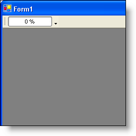

////

|metadata|
{
    "name": "wintoolbarsmanager-add-a-progressbar-tool-to-a-toolbar",
    "controlName": ["WinToolbarsManager"],
    "tags": [],
    "guid": "{DA059044-0C88-4300-BF68-5CF1A905F876}",  
    "buildFlags": [],
    "createdOn": "0001-01-01T00:00:00Z"
}
|metadata|
////

= Add a ProgressBar Tool to a Toolbar

The WinToolbarsManager™ component has several different tool types that you can add to a toolbar. This topic demonstrates how to add a  pick:[win-forms="link:{ApiPlatform}win.ultrawintoolbars{ApiVersion}~infragistics.win.ultrawintoolbars.progressbartool.html[ProgressBarTool]"]  at design time and run time.

[start=1]
. Drag an UltraToolbarsManager control from the toolbox onto your windows form if you haven't already done so. The ultraToolbarsManager1 component is added to the Component Tray.
[start=2]
. Make sure that the ultraToolbarsManager1 component in the Component Tray is selected. As long as the component is selected, the New Toolbar… button will be displayed in the upper-left corner of your form. Click the New Toolbar… button.
[start=3]
. Once the New Toolbar… button is clicked, a New Toolbar dialog will display. Leave all the entries at their defaults and click OK. There is now a new toolbar on the form.
[start=4]
. Click the [Insert New Tool] button on the new toolbar you just created and select Insert New Tool… from the context menu. The New Tool dialog displays.
[start=5]
. From the Tool Type drop-down menu, select ProgressBar. Leave the rest of the entries at their defaults and click Add. The ProgressBar Tool is added to the toolbar. Click Close.

*In Visual Basic:*

----
Imports Infragistics.Win.UltraWinToolbars
...
' Create a new ProgressBar Tool and add it to the Tools collection
Dim ProgressBar As New ProgressBarTool("MyProgressBarTool")
Me.UltraToolbarsManager1.Tools.Add(ProgressBar)
' Add the new ProgressBar Tool to the toolbar
Me.UltraToolbarsManager1.Toolbars(0).Tools.AddTool("MyProgressBarTool")
----

*In C#:*

----
using Infragistics.Win.UltraWinToolbars;
...
// Create a new ProgressBar Tool and add it to the Tools collection
ProgressBarTool progressTool = new ProgressBarTool("MyProgressBarTool");
this.ultraToolbarsManager1.Tools.Add(progressTool);
// Add the new ProgressBar Tool to the toolbar
this.ultraToolbarsManager1.Toolbars[0].Tools.AddTool("MyProgressBarTool");
----