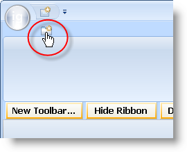

////

|metadata|
{
    "name": "wintoolbarsmanager-add-a-tab-to-the-ribbon",
    "controlName": ["WinToolbarsManager"],
    "tags": [],
    "guid": "{336B5150-7AB2-4E9E-ADFB-831484399FDE}",  
    "buildFlags": [],
    "createdOn": "0001-01-01T00:00:00Z"
}
|metadata|
////

= Add a Tab to the Ribbon

{Warning}

The Ribbon's structure is built by creating tabs, and then placing groups inside those tabs, and placing tools inside those groups. The following diagram demonstrates this structural relationship:

image::images/WinToolbarsManager_Add_a_Tab_to_a_Ribbon_01.png[Image of Ribbon object relationships]

This topic discusses how you can add a single tab to the Ribbon. After the tab has been added, you can then link:wintoolbarsmanager-add-a-group-to-a-ribbon-tab.html[add a group to a Ribbon tab], and then link:wintoolbarsmanager-add-a-tool-to-a-ribbon-group.html[add a tool to a Ribbon group].

You can add a tab to the Ribbon either at design time or run time. At design time, you need to make sure the WinToolbarsManager™ component is selected in the component tray, then click the Show Ribbon button. Once the Ribbon is displayed, you will see an Add Tab icon. Click the Add Tab icon and a tab will be added to the Ribbon. At run time, you simply need to add the following lines of code to your FormLoad event:

*In Visual Basic:*

----
Imports Infragistics.Win.UltraWinToolbars
...
Dim homeTab As New RibbonTab("Home")
Me.UltraToolbarsManager1.Ribbon.Tabs.Add(homeTab)
----

*In C#:*

----
using Infragistics.Win.UltraWinToolbars;
...
RibbonTab homeTab = new RibbonTab("Home");
this.ultraToolbarsManager1.Ribbon.Tabs.Add(homeTab);
----