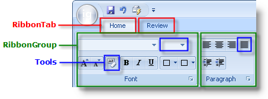

////

|metadata|
{
    "name": "wintoolbarsmanager-add-a-tool-to-a-ribbon-group",
    "controlName": ["WinToolbarsManager"],
    "tags": [],
    "guid": "{EF3A4B8E-F01A-4F1D-BCBF-4FA58C17B07E}",  
    "buildFlags": [],
    "createdOn": "0001-01-01T00:00:00Z"
}
|metadata|
////

= Add a Tool to a Ribbon Group

{Warning}

The Ribbon's structure is built by creating tabs, and then placing groups inside those tabs, and placing tools inside those groups. The following diagram demonstrates this structural relationship:

This topic discusses how you can add a tool to a Ribbon group. This topic assumes that you already have a tab on your Ribbon and a group in that tab. If this is not the case, see link:wintoolbarsmanager-add-a-tab-to-the-ribbon.html[Add a Tab to the Ribbon] and link:wintoolbarsmanager-add-a-group-to-a-ribbon-tab.html[Add a Group to a Ribbon Tab] for more information.

You can add a tool to a Ribbon group either at design time or run time. At design time, make sure the WinToolbarsManager™ component is selected in the component tray and that the Show Ribbon button is clicked. If you already have a Ribbon tab and group, you will see the Insert New Tool button. Click it and a new popup menu will display allowing you to insert a new tool or an existing one. Alternatively, you can add the following code to the FormLoad event to add a new tool to a Ribbon group inside a Ribbon tab.

image::images/WinToolbarsManager_Add_a_Tool_to_a_Ribbon_Group_02.png[Image of Ribbon object relationships]

*In Visual Basic:*

----
Imports Infragistics.Win.UltraWinToolbars
...
' Create a tab and add it to the Ribbon.
Dim homeTab As New RibbonTab("Home")
Me.UltraToolbarsManager1.Ribbon.Tabs.Add(homeTab)
' Create a group and add it to the tab.
Dim fontGroup As New RibbonGroup("Font")
Me.UltraToolbarsManager1.Ribbon.Tabs("Home").Groups.Add(fontGroup)
' Create a tool that will have a drop-down font list.
Dim fontFaceTool As New FontListTool("FontFace")
' You must add the tool to the main Tools collection
' before you add it to the Ribbon.
Me.UltraToolbarsManager1.Tools.Add(fontFaceTool)
' Add the tool to the Ribbon tab and group that we
' created above. Adding a tool to a Ribbon group is
' a similar procedure to adding it to a standard toolbar.
fontGroup.Tools.AddTool(fontFaceTool.Key, False)
----

*In C#:*

----
using Infragistics.Win.UltraWinToolbars;
...
// Create a tab and add it to the Ribbon.
RibbonTab homeTab = new RibbonTab("Home");
this.ultraToolbarsManager1.Ribbon.Tabs.Add(homeTab);
// Create a group and add it to the tab.
RibbonGroup fontGroup = new RibbonGroup("Font");
this.ultraToolbarsManager1.Ribbon.Tabs["Home"].Groups.Add(fontGroup);
// Create a tool that will have a drop-down font list.
FontListTool fontFaceTool = new FontListTool("FontFace");
// You must add the tool to the main Tools collection
// before you add it to the Ribbon.
this.ultraToolbarsManager1.Tools.Add(fontFaceTool);
// Add the tool to the Ribbon tab and group that we
// created above. Adding a tool to a Ribbon group is
// a similar procedure to adding it to a standard toolbar.
fontGroup.Tools.AddTool(fontFaceTool.Key, false);
----