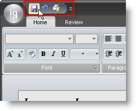

////

|metadata|
{
    "name": "wintoolbarsmanager-add-a-tool-to-the-quick-access-toolbar",
    "controlName": ["WinToolbarsManager"],
    "tags": [],
    "guid": "{689A2C2E-699F-48FC-888E-6ACD66AE3BEB}",  
    "buildFlags": [],
    "createdOn": "0001-01-01T00:00:00Z"
}
|metadata|
////

= Add a Tool to the Quick Access Toolbar

{Warning}

The Ribbon offers you an easy way to help the end user work quickly and efficiently. Using the Quick Access Toolbar (QAT), you can gather the most frequently used tools in one convenient location. The QAT is completely customizable at run time with no extra code. By right-clicking any tool in the Ribbon, the end user can add it to the QAT. Adding a tool to the QAT at design time is performed just as you would add any tool to the Ribbon or a standard toolbar.

The following code demonstrates how to create a tool and add it to the QAT at run time.

*In Visual Basic:*

----
' Create a QuickSave button for the QAT.
Dim quickSave As New Infragistics.Win.UltraWinToolbars.ButtonTool("QuickSave")
' Add the QuickSave button to the Tools collection.
Me.UltraToolbarsManager1.Tools.Add(quickSave)
' Add the QuickSave button to the QAT Tools collection.
Me.UltraToolbarsManager1.Ribbon.QuickAccessToolbar.Tools.AddTool("QuickSave")
----

*In C#:*

----
// Create a QuickSave button for the QAT.
Infragistics.Win.UltraWinToolbars.ButtonTool quickSave = new
  Infragistics.Win.UltraWinToolbars.ButtonTool("QuickSave");
// Add the QuickSave button to the Tools collection.
this.ultraToolbarsManager1.Tools.Add(quickSave);
// Add the QuickSave button to the QAT Tools collection.
this.ultraToolbarsManager1.Ribbon.QuickAccessToolbar.Tools.AddTool("QuickSave");
----