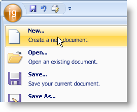

////

|metadata|
{
    "name": "wintoolbarsmanager-add-a-tool-to-the-tool-area-of-the-ribbons-application-menu",
    "controlName": ["WinToolbarsManager"],
    "tags": [],
    "guid": "{C732C1FA-D169-4BFE-BFFD-3F16FA12F278}",  
    "buildFlags": [],
    "createdOn": "0001-01-01T00:00:00Z"
}
|metadata|
////

= Add a Tool to the Tool Area of the Ribbon's Application Menu

{Warning}

The Ribbon has a unique menu area that can be opened by clicking the large round button in the upper-left corner of the Ribbon. The drop-down Application Menu contains three areas where you can place almost any type of tool. These three areas are the  pick:[win-forms="link:{ApiPlatform}win.ultrawintoolbars{ApiVersion}~infragistics.win.ultrawintoolbars.applicationmenu~toolarealeft.html[ToolAreaLeft]"] ,  pick:[win-forms="link:{ApiPlatform}win.ultrawintoolbars{ApiVersion}~infragistics.win.ultrawintoolbars.applicationmenu~toolarearight.html[ToolAreaRight]"] , and  pick:[win-forms="link:{ApiPlatform}win.ultrawintoolbars{ApiVersion}~infragistics.win.ultrawintoolbars.applicationmenu~footertoolbar.html[FooterToolbar]"] . The procedure for adding a tool to any one of these areas is very similar to adding a tool to a standard toolbar.

The following code demonstrates how to create a  pick:[win-forms="link:{ApiPlatform}win.ultrawintoolbars{ApiVersion}~infragistics.win.ultrawintoolbars.buttontool.html[ButtonTool]"] , add it to the Tools collection, and then add it to the left tool area.

.Note
[NOTE]
====
This example assumes that you have already dropped a WinToolbarsManager™ component from the toolbox onto the form).
====

*In Visual Basic:*

----
Imports Infragistics.Win.UltraWinToolbars
...
Dim NewMenuItem As New ButtonTool("NewMenuItem")
NewMenuItem.SharedProps.Caption = "New..."
Me.UltraToolbarsManager1.Tools.Add(newMenuItem)
Me.UltraToolbarsManager1.Ribbon.ApplicationMenu.ToolAreaLeft.Tools.AddTool( _
  "NewMenuItem")
----

*In C#:*

----
using Infragistics.Win.UltraWinToolbars;
...
ButtonTool newMenuItem = new ButtonTool("NewMenuItem");
newMenuItem.SharedProps.Caption = "New...";
this.ultraToolbarsManager1.Tools.Add(newMenuItem);
this.ultraToolbarsManager1.Ribbon.ApplicationMenu.ToolAreaLeft.Tools.AddTool(
  "NewMenuItem");
----

.Note
[NOTE]
====
The ApplicationMenu.Visible property of the Ribbon object is now obsolete. Instead use the FileMenuStyle property and set it to None.
====