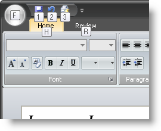

////

|metadata|
{
    "name": "wintoolbarsmanager-add-keytips-to-the-ribbon",
    "controlName": ["WinToolbarsManager"],
    "tags": [],
    "guid": "{E59B95E9-50AA-4699-B508-A17554FE718A}",  
    "buildFlags": [],
    "createdOn": "2006-09-10T11:30:53Z"
}
|metadata|
////

= Add KeyTips to the Ribbon

{Warning}

Most windows forms applications contain some sort of a main menu. This main menu can include items such as File, Edit, View, etc. You can use mnemonics to help the end user select items from the menu without actually pointing and clicking with the mouse. The Ribbon does not have a main menu toolbar per se. The Ribbon has an Application Menu, Quick Access Toolbar, and several tabs instead. In order to reach these items using the keyboard, KeyTips were introduced to replace mnemonics.

KeyTips work very much the same way as mnemonics. Pressing the Alt key will display KeyTips for the link:wintoolbarsmanager-the-ribbon-application-menu.html[Application Menu], link:wintoolbarsmanager-quick-access-toolbar.html[Quick Access Toolbar], and tabs. Upon clicking a tab KeyTip, All currently displayed KeyTips will disappear and KeyTips for the tools inside that particular tab will appear. The Application Menu KeyTips work the same way; upon typing the Application Menu's KeyTip, all currently displayed KeyTips disappear, the Application Menu is displayed, and all items in the Application Menu will then display their KeyTips.

Setting KeyTips involves just one property. To set a KeyTip for a tab or group on the Ribbon, set the KeyTip property off the  pick:[win-forms="link:{ApiPlatform}win.ultrawintoolbars{ApiVersion}~infragistics.win.ultrawintoolbars.ribbontab.html[RibbonTab]"]  or  pick:[win-forms="link:{ApiPlatform}win.ultrawintoolbars{ApiVersion}~infragistics.win.ultrawintoolbars.ribbongroup.html[RibbonGroup]"]  objects. To set a KeyTip for a tool, set the KeyTip property off the SharedProps object of that tool.

By default, the Ribbon will always generate KeyTips. As long as Office 2007 UI Compatibility is enabled, the  pick:[win-forms="link:{ApiPlatform}win.ultrawintoolbars{ApiVersion}~infragistics.win.ultrawintoolbars.ultratoolbarsmanager~autogeneratekeytips.html[AutoGenerateKeyTips]"]  property will be ignored. Therefore, if you do not want the Ribbon to automatically generate a KeyTip for you, you will have to set the KeyTip property manually for each item in the Ribbon.

.Note
[NOTE]
====
KeyTips on the Quick Access Toolbar are always auto generated. You cannot set QAT KeyTips. If a tool is added to the QAT at run time, its KeyTip will be replaced with a new KeyTip. The first tool in the QAT's tools collection will have a KeyTip of '1'. The next tool in the collection will be '2' and so on.
====

The following code will set the KeyTip for the Application Menu, two Ribbon tabs, and two tools inside one tab:

*In Visual Basic:*

----
' Set the Application Menu's KeyTip
Me.UltraToolbarsManager1.Ribbon.ApplicationMenu.KeyTip = "F"
' Set the tabs KeyTips
Me.UltraToolbarsManager1.Ribbon.Tabs(0).KeyTip = "H"
Me.UltraToolbarsManager1.Ribbon.Tabs(1).KeyTip = "R"
' Set some tools KeyTips
Me.UltraToolbarsManager1.Ribbon.Tabs(0).Groups(0).Tools(0).SharedProps.KeyTip = _
  "FT"
Me.UltraToolbarsManager1.Ribbon.Tabs(0).Groups(0).Tools(1).SharedProps.KeyTip = _
  "FS"
----

*In C#:*

----
// Set the Application Menu's KeyTip
this.ultraToolbarsManager1.Ribbon.ApplicationMenu.KeyTip = "F";
// Set the tabs KeyTips
this.ultraToolbarsManager1.Ribbon.Tabs[0].KeyTip = "H";
this.ultraToolbarsManager1.Ribbon.Tabs[1].KeyTip = "R";
// Set some tools KeyTips
this.ultraToolbarsManager1.Ribbon.Tabs[0].Groups[0].Tools[0].SharedProps.KeyTip = 
  "FT";
this.ultraToolbarsManager1.Ribbon.Tabs[0].Groups[0].Tools[1].SharedProps.KeyTip = 
  "FS";
----