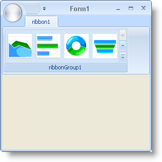

////

|metadata|
{
    "name": "wintoolbarsmanager-adding-groups-and-items-to-the-popupgallerytool",
    "controlName": ["WinToolbarsManager"],
    "tags": ["Charting"],
    "guid": "{1F267AA1-C164-40B9-BF70-914351893CCE}",  
    "buildFlags": [],
    "createdOn": "2006-06-10T10:51:29Z"
}
|metadata|
////

= Adding Groups and Items to the PopupGallery Tool

== Before You Begin

The  pick:[win-forms="link:{ApiPlatform}win.ultrawintoolbars{ApiVersion}~infragistics.win.ultrawintoolbars.popupgallerytool.html[PopupGalleryTool]"]  adds a new layer to the user interface. Using the PopupGalleryTool, you can display a visual selection of options for the user to select. The PopupGalleryTool supports a preview area and a drop-down area. The user will only see Images in the preview area, but clicking the drop-down button will display several items inside the PopupGalleryTool at a time. The PopupGalleryTool gives the end user a visual cue for any item.

== What You Will Accomplish

You will add a tab, group, and PopupGalleryTool to the Ribbon using the In-Place Designer. You will then add eight items to the PopupGalleryTool. These items will be divided into two groups, four items each. After completing this walkthrough, you will be able to continue learning how to link:wintoolbarsmanager-filtering-a-group-in-the-popupgallerytool.html[filter a group in the PopupGalleryTool].

== Follow these Steps

[start=1]
. Before you start writing any code, you should place using/imports directives in your code-behind so you don't need to always type out a member's fully qualified name.

*In Visual Basic:*

----
Imports Infragistics.Win.UltraWinToolbars
----

*In C#:*

----
using Infragistics.Win.UltraWinToolbars;
----

[start=2]
. *Setup the form by adding a tab, group, and PopupGalleryTool to the Ribbon.*

.. Find the UltraToolbarsManager component in the toolbox and double-click it. Click Yes on the following dialog box and the ultraToolbarsManager1 component will added to the component tray.
.. With the ultraToolbarsManager1 component selected, Click the Show Ribbon button at the top of the form. The Ribbon appears and the form takes on the Office 2007 look and feel.
.. Click the Add Tab button. A tab named ribbon1 is created on the Ribbon.
.. Click the New Group button inside the new tab. A new group named ribbonGroup1 is created inside the ribbon1 tab.
.. Click Insert New Tool inside ribbonGroup1.
.. Click Insert New Tool... from the popup menu. The New Tool dialog box appears.
.. Change the Tool Type to Popup Gallery.
.. Click Add. The new PopupGalleryTool is added to ribbonGroup1.
.. Click Close. The New Tool dialog box is closed.

Your form should now look like this:

[start=3]
. *Create an ImageList that contains images of the eight GalleryToolItems.*

.. Find the in-box ImageList component in the toolbox and double-click it. The imageList1 component is added to the component tray.
.. With the imageList1 component selected, find the Images collection in the properties window and click the ellipsis (...) to the right of the collection. The Image Collection Editor dialog box appears.
.. Click Add. The Open dialog box appears.
.. Add the following images to imageList1 in the order below:

[cols="a,a,a,a"]
|====
|image::images/2D_Area_Chart.png[image used in example]
|image::images/2D_Bar_Chart.png[image used in example]
|image::images/2D_Doughnut_Chart.png[image used in example]
|image::images/2D_Funnel_Chart.png[image used in example]

|1. 2d Area Chart
|2. 2d Bar Chart
|3. 2d Doughnut Chart
|4. 2d Funnel Chart

|image::images/3D_Area_Chart.png[image used in example]
|image::images/3D_Bar_Chart.png[image used in example]
|image::images/3D_Doughnut_Chart.png[image used in example]
|image::images/3D_Funnel_Chart.png[image used in example]

|5. 3D Area Chart
|6. 3D Bar Chart
|7. 3D Doughnut Chart
|8. 3D Funnel Chart

|====

.Note
[NOTE]
====
Simply right-click the images above and select Save As. You may use the title of the image as the filename.
====

The Image Collection Editor should look like this:

.. Once all eight images have been added to imageList1, click OK. The Image Collection Editor closes.
.. In the properties window, find the ImageSize property and change both the Width and Height to 48.

[start=4]
. *Create the GalleryToolItems and add them to the PopupGalleryTool.*

The first order of business is to instantiate eight  pick:[win-forms="link:{ApiPlatform}win.ultrawintoolbars{ApiVersion}~infragistics.win.ultrawintoolbars.gallerytoolitem.html[GalleryToolItems]"] . Four of these items will represent the 2D chart group and the other four the 3D chart group. Once created, you will need to instantiate an instance of the PopupGalleryTool so the application recognizes it at run time as a PopupGalleryTool. Once you have the instance of the PopupGalleryTool, you can add all the items to it's  pick:[win-forms="link:{ApiPlatform}win.ultrawintoolbars{ApiVersion}~infragistics.win.ultrawintoolbars.gallerytoolitemcollection.html[Items]"]  collection using the AddRange method. Place the following code in the FormLoad event. You can generate a FormLoad event by double-clicking the Form's header in Design view.

*In Visual Basic:*

----
Dim galleryItems() As GalleryToolItem = { _
New GalleryToolItem("2D Area Chart", "2D Area Chart"), _
New GalleryToolItem("2D Bar Chart", "2D Bar Chart"), _
New GalleryToolItem("2D Doughnut Chart", "2D Doughnut Chart"), _
New GalleryToolItem("2D Funnel Chart", "2D Funnel Chart"), _
New GalleryToolItem("3D Area Chart", "3D Area Chart"), _
New GalleryToolItem("3D Bar Chart", "3D Bar Chart"), _
New GalleryToolItem("3D Doughnut Chart", "3D Doughnut Chart"), _
New GalleryToolItem("3D Funnel Chart", "3D Funnel Chart")}
Dim chartGallery As PopupGalleryTool = _
  Me.UltraToolbarsManager1.Tools(0)
' Add the GalleryToolItems to the PopupGalleryTool
chartGallery.Items.AddRange(galleryItems)
----

*In C#:*

----
// Create 8 GalleryToolItems to place in the PopupGalleryTool.
// Using an array of items will make it easier to loop through
// and make modifications later.
GalleryToolItem[] galleryItems = new GalleryToolItem[] {
  //2D chart items
  new GalleryToolItem("2D Area Chart", "2D Area Chart"),
  new GalleryToolItem("2D Bar Chart", "2D Bar Chart"),
  new GalleryToolItem("2D Doughnut Chart", "2D Doughnut Chart"),
  new GalleryToolItem("2D Funnel Chart", "2D Funnel Chart"),
  // 3D chart items
  new GalleryToolItem("3D Area Chart", "3D Area Chart"),
  new GalleryToolItem("3D Bar Chart", "3D Bar Chart"),
  new GalleryToolItem("3D Doughnut Chart", "3D Doughnut Chart"),
  new GalleryToolItem("3D Funnel Chart", "3D Funnel Chart")};
PopupGalleryTool chartGallery = 
  this.ultraToolbarsManager1.Tools[0] as PopupGalleryTool;
// Add the GalleryToolItems to the PopupGalleryTool
chartGallery.Items.AddRange(galleryItems);
----

[start=5]
. *Set the images for each of the GalleryToolItems.*

Each GalleryToolItem has a  pick:[win-forms="link:{ApiPlatform}win.ultrawintoolbars{ApiVersion}~infragistics.win.ultrawintoolbars.gallerytoolitemsettings.html[Settings]"]  object which allows you to set several properties having to do with appearances, images, and text. In order to display an image in a GalleryToolItem, you need to set the  pick:[win-forms="link:{ApiPlatform}win{ApiVersion}~infragistics.win.appearance~image.html[Image]"]  property off the  pick:[win-forms="link:{ApiPlatform}win.ultrawintoolbars{ApiVersion}~infragistics.win.ultrawintoolbars.gallerytoolitemsettings~appearance.html[Appearance]"]  object found in the Settings object. You can do this by looping through the array of GalleryToolItems and setting their image to the corresponding image in the ImageList (which is why it was important to add the images in the correct order).

*In Visual Basic:*

----
' Set the images for the GalleryToolItems
Dim i As Integer
For i = 0 To galleryItems.Length - 1
   galleryItems(i).Settings.Appearance.Image = Me.imageList1.Images(i)
Next i
----

*In C#:*

----
// Set the images for the GalleryToolItems
for(int i=0; i<galleryItems.Length; i++)
{
	galleryItems[i].Settings.Appearance.Image = this.imageList1.Images[i];
}
----

[start=6]
. *Set the description for each of the GalleryToolItems.*

Each GalleryToolItem also has a  pick:[win-forms="link:{ApiPlatform}win.ultrawintoolbars{ApiVersion}~infragistics.win.ultrawintoolbars.gallerytoolitem~description.html[Description]"]  property. You can set this property to any string that describes what the item represents. For this walkthrough, we are just going to set it to the same text as the Caption. You also have the option of using formatted text in the description. For more information on formatted text, see link:winformattedlinklabel-formatting-text-and-hyperlinks.html[Formatting Text and Hyperlinks]. The following code will loop through each GalleryToolItem and set its Description text to its Caption text.

*In Visual Basic:*

----
' Set the description of the GalleryToolItems
Dim j As Integer
For j = 0 To galleryItems.Length - 1
   galleryItems(j).Description = galleryItems(j).Title
Next j
----

*In C#:*

----
// Set the description of the GalleryToolItems
for(int j=0; j<galleryItems.Length; j++)
{
	galleryItems[j].Description = galleryItems[j].Title;
}
----

[start=7]
. *Create two Groups including 2D charts and 3D charts.* 

*In Visual Basic:*

----
' Create two new groups of GalleryToolItems, one group
' for 2D charts, the other for 3D charts.
Dim group1 As New GalleryToolItemGroup("2D Charts", "2D Charts", New String() { _
"2D Area Chart", "2D Bar Chart", "2D Doughnut Chart", "2D Funnel Chart"})
Dim group2 As New GalleryToolItemGroup("3D Charts", "3D Charts", New String() { _
"3D Area Chart", "3D Bar Chart", "3D Doughnut Chart", "3D Funnel Chart"})
' Add the groups to the PopupGalleryTools Groups collection.
chartGallery.Groups.AddRange(New GalleryToolItemGroup() {group1, group2})
----

*In C#:*

----
// Create two new groups of GalleryToolItems, one group
// for 2D charts, the other for 3D charts.
GalleryToolItemGroup group1 = 
  new GalleryToolItemGroup("2D Charts", "2D Charts", new string[]
  {"2D Area Chart", "2D Bar Chart", "2D Doughnut Chart", "2D Funnel Chart"});
GalleryToolItemGroup group2 = 
  new GalleryToolItemGroup("3D Charts", "3D Charts", new string[] 
  {"3D Area Chart", "3D Bar Chart", "3D Doughnut Chart", "3D Funnel Chart"});
// Add the groups to the PopupGalleryTools Groups collection.
chartGallery.Groups.AddRange(new GalleryToolItemGroup[] {group1, group2});
----

[start=8]
. *Run the Application.*

When you run the application, you will see the PopupGalleryTool inside the Ribbon. There are four items visible in the preview area.

When you click the drop-down button, you see all items in the PopupGalleryTool. You will also see that the items are divided by 2D Charts and 3D Charts.

